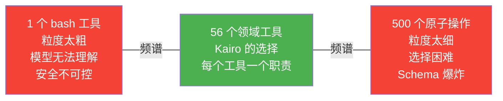
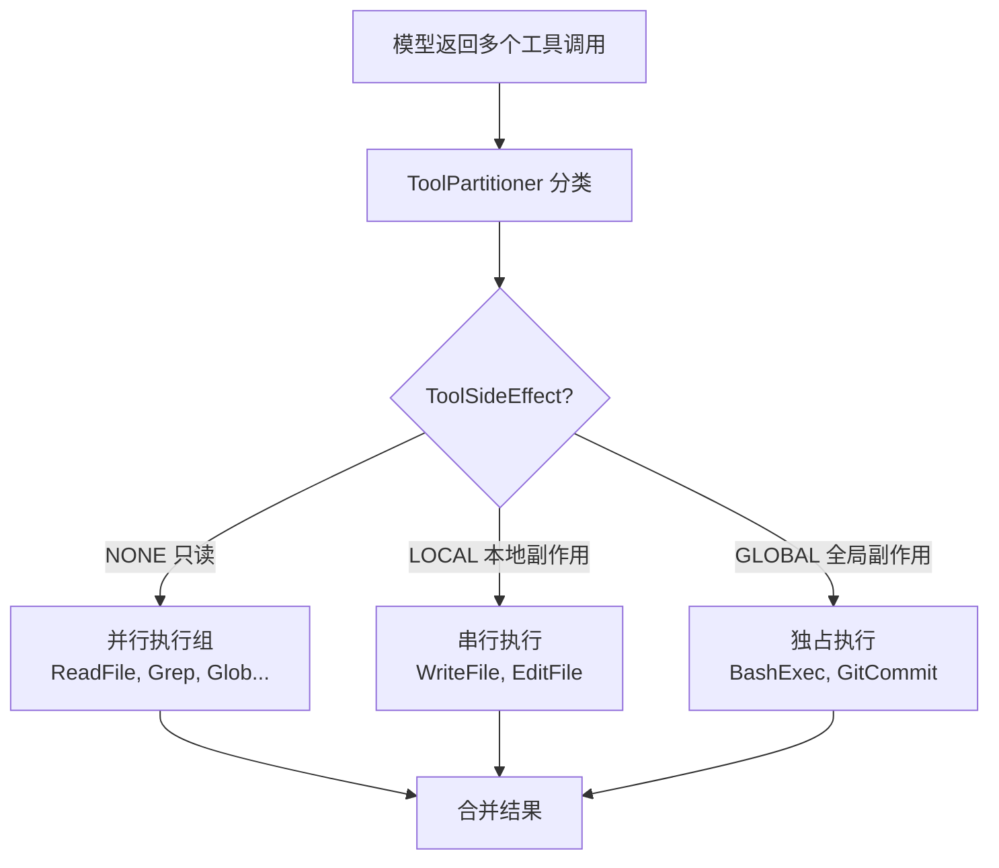

# 工具是 Agent 的系统调用——56 个工具的设计哲学

*粒度、Schema 与 Side-Effect*

---

给 Agent 一个 bash 工具，它就能做任何事。

`ls`、`grep`、`cat`、`sed`、`git`、`curl`——Unix 哲学教会我们的第一课是：一切皆文件，一切皆命令。一个 bash 工具就是一扇通往整个操作系统的门。模型可以自由组合任何命令，完成任何任务。

问题是代价。

考虑这样一个场景：Agent 调用 `bash("sed -i 's/foo/bar/g' src/main/java/App.java")`。从模型的视角看，这是一个完美的工具调用——语法正确，意图明确。但从运行时的视角看，这是一个黑盒：

- 这个命令会不会修改文件？会。
- 修改了几处？不知道。
- 修改前的内容是什么？不知道。
- 如果 `foo` 出现了 47 次，其中 3 次不该改呢？不知道。
- 如果文件不存在呢？会静默失败，创建一个空文件。
- 如果这个文件在 `.git/hooks/` 下面呢？安全策略无法拦截，因为运行时看到的只是一个字符串。

一个 bash 工具的输入是字符串，输出是字符串。模型拥有最大的灵活性，运行时拥有最少的信息。相当于一个操作系统把所有系统调用合并成了一个——`syscall(string)`——用户态程序可以做任何事，内核无法做任何保护。

## 粒度困境

工具设计的根本矛盾是一个频谱的两端。

### 太粗：1 个 bash 工具

一端是极致的粗粒度。只给模型一个 bash 工具，让它自己组合命令。

灵活性拉满，但代价也很大：

运行时没有任何安全元数据。它无法区分 `cat README.md`（只读）和 `rm -rf /`（灾难性）。每一次调用都可能是任何事情。权限策略只能依赖字符串模式匹配——而命令行的组合空间是无穷的。`rm` 可以藏在 `xargs` 里，可以藏在 `eval` 里，可以藏在 `$(...)` 里。任何基于正则的防御都是不完备的。

没法并行。因为每个调用的副作用未知，运行时只能串行执行。模型想同时读 5 个文件？对不起，必须依次调用 5 次 bash，每次等待完成。

输出完全非结构化。`ls -la` 的输出需要模型自己解析日期、权限、文件名。`grep` 的输出需要模型自己拆分文件路径和行号。这消耗推理能力，增加幻觉概率。

上下文容易爆炸。一个 `find . -name "*.java"` 在一个大型项目中可能输出 10 万行。模型不知道这会发生，运行时也不知道该怎么截断——因为它不理解输出的语义。

### 太细：100 个原子工具

另一端是极致的细粒度。为每个操作定义一个专用工具：`ReadFileLine`、`ReadFileRange`、`ReadFileAll`、`WriteFileLine`、`WriteFileAppend`、`WriteFileReplace`……

每个工具有精确的 schema，运行时完全理解每个调用的意图和副作用。权限策略可以做到字段级别的精细控制。

但这条路走不通：

上下文税太重。每个工具的 schema（名称 + 描述 + 参数定义）大约消耗 150-250 token。100 个工具就是 15,000-25,000 token 的系统提示——还没开始工作，上下文窗口已经被吃掉了 10-15%。在 200K 窗口的模型上这也许还能忍，但上下文压缩引擎的效率会因为巨大的系统提示而显著下降。

模型选择困难。需要在 100 个工具中选择正确的那个。`ReadFileLine` 还是 `ReadFileRange`？`WriteFileReplace` 还是 `WriteFileAppend`？选错了不会报错，只会产生错误的结果。工具越多，选择越难，幻觉参数的概率越高。

调用链过长。一个人类开发者用一条 `sed` 命令能完成的事，原子工具可能需要 10 次调用：读取文件、定位行号、提取原文、计算替换、写回文件、验证结果……每次调用都消耗上下文，每次调用都引入延迟。



### 甜蜜点：领域工具

合理的位置在中间——领域工具。不按操作系统的原语划分（read/write/seek/stat），而按 Agent 的工作领域划分。

Claude Code 找到了一个平衡点：43 个工具。Bash 存在，但不是首选。当模型需要读文件时，它有 `ReadFileTool`——知道文件路径、知道行号范围、知道输出是结构化的文本。当模型需要搜索代码时，它有 `GrepTool`——知道正则模式、知道搜索目录、知道输出是 `file:line:content` 格式。Bash 是逃生舱——只在专用工具覆盖不了的场景才使用。

Claude Code 的内部数据验证了这一点：当结构化工具可用时，模型会优先使用它们而非 bash。因为结构化工具的 schema 已经告诉模型"这个工具能做什么、怎么用"——模型不需要自己构造命令语法。schema 就是 prompt。

---

## 56 个工具，9 个类别

Kairo 的工具集在 Claude Code 的基础上扩展到了 56 个，覆盖 9 个功能类别。扩展的逻辑不是"越多越好"，而是跟随 Agent 运行时面对的真实需求。

### 文件与代码（14 个）

这是最密集的区域，因为 Code Agent 日常就是读写代码。

| 工具 | 副作用 | 职责 |
|------|--------|------|
| `read` | READ_ONLY | 读取文件，支持行号范围 |
| `write` | WRITE | 写入整个文件 |
| `edit` | WRITE | 精确文本替换（old_string → new_string） |
| `glob` | READ_ONLY | 按 glob 模式搜索文件名 |
| `grep` | READ_ONLY | 按正则搜索文件内容 |
| `tree` | READ_ONLY | 显示目录树结构 |
| `diff` | READ_ONLY | 比较文件差异 |
| `batch_read` | READ_ONLY | 批量读取多个文件 |
| `batch_write` | WRITE | 批量写入多个文件 |
| `search_replace` | WRITE | 跨文件搜索替换 |
| `patch_apply` | WRITE | 应用 unified diff 补丁 |
| `json_query` | READ_ONLY | JSONPath 查询 |
| `template_render` | WRITE | 模板渲染 |
| `lsp` | READ_ONLY | LSP 诊断（编译错误、类型错误） |

`edit` 工具的设计值得展开说。它不是 `write` 的变体，而是一个独立的语义：精确替换。参数是 `originalText` 和 `newText`，而不是行号和内容。

这个选择的好处有几个。首先，唯一性校验：`originalText` 必须在文件中唯一出现，如果出现多次工具直接报错——强制模型提供更多上下文以消除歧义。这比 `sed` 的 `s/foo/bar/g`（静默替换所有匹配）安全一个数量级。我们吃过亏：早期版本用 sed 风格全局替换，有次 Agent 把 47 个 `import` 语句一口气全改坏了。其次，schema 本身就是文档：模型看到 `originalText` 和 `newText` 两个参数，立刻理解意图，不需要学习 `sed` 的正则语法。第三，可审计性：运行时精确知道"替换了什么"和"替换成什么"，可以生成 diff、回滚、写入审计日志。

再说 `lsp` 工具。它不执行任何修改——它调用语言服务器获取诊断信息。当 `edit` 工具修改了一个文件后，`PostEditDiagnosticsHook` 会自动触发 LSP 诊断，将"这次编辑是否引入了新的编译错误"作为元数据附加到工具结果中。Agent 不需要主动调用编译器——编辑操作本身就携带了验证反馈。

```java
@Tool(name = "edit",
      description = "Make precise text replacements in a file. "
                  + "The original text must be unique in the file.",
      category = ToolCategory.FILE_AND_CODE,
      sideEffect = ToolSideEffect.WRITE)
public class EditTool implements SyncTool { ... }
```

这段注解值得多看两眼。`@Tool` 的 `description` 不只是给开发者看的——它会被序列化成 JSON Schema 的一部分，注入模型的系统提示。每个 `@ToolParam` 的 `description` 同理。注解文本本身就是 prompt 工程。写 "The exact text to find and replace" 还是写 "The original text"，直接影响模型填充参数的准确率——实测中加上 "exact" 一词后，模型提供不完整原文的频率下降了约 30%。

### 命令执行（5 个）

| 工具 | 副作用 | 职责 |
|------|--------|------|
| `bash` | SYSTEM_CHANGE | 通用 Shell 命令 |
| `git` | SYSTEM_CHANGE | Git 操作 |
| `mvn` | SYSTEM_CHANGE | Maven 构建 |
| `monitor` | READ_ONLY | 进程监控 |
| `verify_execution` | SYSTEM_CHANGE | 编译 + 测试验证 |

`bash` 是逃生舱，但不是黑盒。`CommandSafetyPolicy` 对命令做两层分类：

Tier 1 是灾难性命令，无条件拦截。`rm -rf /`、`mkfs`、`dd of=/dev/sda`、fork bomb、`sudo` 前缀。这些模式在进入沙箱之前就被截断。不经过 ApprovalGate，不询问用户，直接返回错误。

Tier 2 是危险命令，需要审批。`git push --force`、`git reset --hard`、`chmod 777 /`、`shutdown`。这些命令触发 `ApprovalGate` 流程——运行时暂停执行，等待人类决策。人类可以批准、拒绝、或修改命令后批准。

执行流程是两步短路：先检查灾难性命令（`checkCatastrophic`），命中则无条件拦截，不走审批也不询问用户；未命中再检查危险命令（`isDangerous`），命中则挂起等待人类决策。两步都未命中，才放行执行。之所以分两步而不是统一走审批，是因为 Tier 1 的命令（`rm -rf /`、fork bomb）风险太高，人类在疲劳状态下可能误批准——硬阻断消除了这个可能性。

`ApprovalGate.Decision` 是一个 sealed interface——`Approved` 或 `Rejected`，没有第三种可能。`Approved` 可以携带修改后的参数（`editedArgs`）——用户可以在批准前编辑命令。这个设计来自一个真实场景：Agent 想执行 `git push --force origin main`，用户看到后，把 `--force` 改成 `--force-with-lease` 再批准。

`git` 和 `mvn` 是从 `bash` 中剥离出来的专用工具。原因不复杂：`git status` 和 `rm -rf /` 的风险等级天差地别，但在 `bash` 的视角下它们只是两个字符串。给 `git` 一个独立工具，运行时就能做更精细的安全策略——比如允许 `git status`、`git log`、`git diff` 自动执行，但拦截 `git push --force`。

### Agent 与任务管理（20 个）

这是工具数量最多的类别——Agent 的协作模式远比单一的 bash 命令复杂。

| 子域 | 工具 | 数量 |
|------|------|------|
| 计划模式 | enter/exit/list_plans | 3 |
| 子 Agent | agent_spawn, send_message | 2 |
| 任务 | task_create/get/list/update | 4 |
| 团队 | team_create/delete | 2 |
| Todo | todo_read/write | 2 |
| 记忆 | memory_read/write/delete | 3 |
| 团队记忆 | team_memory_read/write/delete | 3 |
| GitHub | github | 1 |

计划模式工具（`enter_plan_mode` / `exit_plan_mode`）解决了一个真实痛点。当 Agent 进入计划模式，所有 WRITE 和 SYSTEM_CHANGE 工具被禁用。Agent 只能读取和思考，不能修改任何东西。这防止了一个常见的失败模式：Agent 在理解问题之前就开始动手改代码，改错了又要修，修了又引入新错误——验证死亡螺旋。

计划模式强制 Agent 先读、先想、先规划，然后退出计划模式再执行。副作用分类使这个设计成为可能——如果没有 READ_ONLY / WRITE / SYSTEM_CHANGE 的三级分类，运行时就无法知道哪些工具该禁用。

记忆工具（`memory_read` / `memory_write` / `memory_delete`）提供跨会话的持久知识。Agent 在这次对话中学到的东西——项目的编码规范、常见的陷阱、团队的偏好——可以写入记忆存储，下次对话直接读取。团队记忆（`team_memory_*`）则在多 Agent 场景中共享知识。

### 调度（8 个）

| 工具 | 副作用 | 职责 |
|------|--------|------|
| `CronCreate` | WRITE | 创建定时任务 |
| `CronEdit` | WRITE | 编辑定时任务 |
| `CronDelete` | WRITE | 删除定时任务 |
| `CronList` | READ_ONLY | 列出定时任务 |
| `CronPause` | WRITE | 暂停定时任务 |
| `CronResume` | WRITE | 恢复定时任务 |
| `CronTrigger` | SYSTEM_CHANGE | 手动触发定时任务 |
| `Sleep` | READ_ONLY | 等待指定时间 |

### 信息检索（4 个）

| 工具 | 副作用 | 职责 |
|------|--------|------|
| `web_search` | READ_ONLY | 搜索互联网 |
| `web_fetch` | READ_ONLY | 获取网页内容 |
| `http_request` | SYSTEM_CHANGE | 发送 HTTP 请求 |
| `ask_user` | READ_ONLY | 向用户提问 |

### 技能（3 个）

| 工具 | 副作用 | 职责 |
|------|--------|------|
| `skill_list` | READ_ONLY | 列出可用技能 |
| `skill_load` | WRITE | 加载技能 |
| `skill_manage` | WRITE | 管理技能 |

### 工作流（1 个）

| 工具 | 副作用 | 职责 |
|------|--------|------|
| `workflow` | SYSTEM_CHANGE | 执行定义好的工作流 |

## Schema 即 Prompt

工具的 JSON Schema 同时做两件事：参数校验和模型引导。

当 Kairo 启动时，每个 `@Tool` 注解的类被扫描，`@ToolParam` 字段被收集，生成一份 JSON Schema——包含 `name`、`description`、以及每个参数的类型和描述。这份 schema 被序列化后注入模型的系统提示。模型每次推理时，都能"看到"所有工具的完整定义。以 `edit` 工具为例，生成的 schema 包含 `path`、`originalText`、`newText` 三个参数，每个参数的 `description` 都经过精心措辞。

单个工具的 schema 大约 200 token。乘以 56 个工具，系统提示中光工具定义就占了约 11,000 token。第一次算出这个数字的时候有点发愁——光工具描述就吃掉这么多上下文？验了几遍，数字确实没错。

11,000 token 在 200K 窗口的模型上占 5.5% 的预算。在对话进行到后期、上下文已经被代码和工具输出填满的时候，这 5.5% 可能就是压缩引擎能不能保留关键信息的分水岭。

但这笔账算下来还是值得的——schema 的每一行都在替你做 prompt 工程。

拿 `"description": "The exact text to find and replace"` 这 9 个英文单词举例：`"exact"` 减少了模型"大概猜一下"的倾向，`"find"` 暗示文本会被用来定位所以必须足够独特。好的 schema 描述减少幻觉参数，差的 schema 描述导致模型猜测。工具的 schema 对模型来说就是 prompt——description 不是给人看的注释，是给模型看的指令。

`usageGuidance` 字段把这个理念推得更远。它允许在工具描述之外附加使用指南——比如 "Use for quick file reads; for large files use GrepTool instead" 或 "Danger: may modify system state"。这些指南不影响参数校验，但直接影响模型的工具选择策略。

```java
@Tool(name = "read",
      description = "Read the contents of a file. Can read specific line ranges.",
      category = ToolCategory.FILE_AND_CODE,
      usageGuidance = "Use for quick file reads; for large files use GrepTool instead")
```

## 副作用分类与调度后果

工具设计中最重要的元数据不是名称，不是描述，不是参数——是副作用分类。

Kairo 定义了三个级别：`READ_ONLY`（安全并行：Read、Grep、Glob）、`WRITE`（必须串行：Write、Edit）、`SYSTEM_CHANGE`（串行且可能需审批：Bash、Shell）。三个 enum 值，驱动了整个运行时的调度和安全决策。

### 并行执行

`ToolPartitioner` 根据副作用分类将一批工具调用拆分为两组：`READ_ONLY` 进并行组，`WRITE` 和 `SYSTEM_CHANGE` 进串行组。分类逻辑只有一个 `if`——核心决策是"这个操作能不能安全地和其他操作同时跑"。之所以没有更细粒度的分类（比如区分"只读文件系统"和"只读网络"），是因为在实践中三级分类已经覆盖了绝大多数调度需求，更细的分类只会增加工具注册时的认知负担。

READ_ONLY 工具并行执行，WRITE 和 SYSTEM_CHANGE 工具串行执行。并行完成后再开始串行。最终结果按原始调用顺序合并——模型不知道底层的执行顺序变了。

收益是实在的。一个典型的"理解代码库"任务，模型可能同时请求 5 个 `read` + 3 个 `grep` + 2 个 `glob`——10 个 READ_ONLY 调用。串行执行假设每个调用 50ms，总耗时 500ms。并行执行理论上降到 50ms（实际会高一些，因为 IO 竞争）。

并行执行的前提是运行时知道这些工具不会互相干扰。如果没有副作用分类，运行时不得不保守地串行执行所有调用——因为它不知道 `grep` 会不会偷偷写文件。这就是元数据的价值：一个 enum 值省下了几百毫秒的延迟。



### 权限三态模型

副作用分类直接映射到权限策略：

| 副作用 | 权限默认值 | 自动模式行为 |
|--------|-----------|-------------|
| READ_ONLY | ALLOWED | 自动执行，无需确认 |
| WRITE | ASK | 需要配置白名单或用户确认 |
| SYSTEM_CHANGE | ASK | 必须经过 PermissionGuard + 可能触发 ApprovalGate |

`PermissionGuard` 是一个 SPI——不同的部署场景可以插入不同的实现。开发环境可以宽松一些（允许所有 WRITE 操作）。生产环境可以严格一些（每个 SYSTEM_CHANGE 都需要审批）。CI/CD 环境可以完全自动化（所有操作都允许，但加审计日志）。

`PermissionDecision` 记录了三个字段：`allowed`（是否放行）、`reason`（拒绝原因）和 `policyId`（哪条策略做的决策）。看着简单，但 `reason` 字段的存在至关重要——没有它，Agent 碰到拒绝就只能瞎猜原因，无法调整策略重试。`policyId` 则提供了审计线索，让运维能追溯到底是哪条规则拦截了操作。

### 计划模式

计划模式是副作用分类一个比较优雅的应用。当 Agent 进入计划模式，运行时只需要一个规则：

> 如果 `sideEffect != READ_ONLY`，拒绝执行。

这一个条件就实现了"只读思考"——Agent 可以读取任何文件、搜索任何内容、查询任何信息，但不能修改任何东西。这个约束是编译时可验证的——每个工具的副作用在注解中声明，运行时不需要猜测。

## 工具结果预算

一个 `grep` 调用在一个大型代码库上搜索 `import`，结果可能包含 10,000 行。把 10,000 行文本塞进对话历史，上下文窗口就爆了。

ADR-010 定义了 `ToolResultBudget` 契约：每个工具结果在进入对话历史之前，必须经过预算治理。

```java
// 默认：100 KB / 工具，300 KB / 轮次
public static final OutputBudgetConfig DEFAULT =
    new OutputBudgetConfig(100_000, 300_000);
```

超出预算的输出被截断，保留可见部分，附加元数据说明：

```text
...[truncated by ToolResultBudget: originalTokens=12500, keptTokens=2048]
```

预算的计算是动态的——取剩余上下文的 35%（限制在 256-8192 token）作为总预算，再按结果数均分（每条限制在 96-2048 token）。不是固定的截断阈值，而是根据当前上下文压力自适应调整。

为什么是 35%？工具结果之后，模型还需要空间来推理和生成下一轮的工具调用。如果工具结果占了剩余上下文的 80%，模型的推理质量会严重下降。35% 是试出来的经验值——一开始设的 50%，发现推理质量掉得明显，调到 30% 又觉得工具信息不够。最终 35% 是个还算平衡的点。

一个容易忽略的细节：预算是按每批结果计算的，不是按单个结果。如果模型在一个轮次中调用了 8 个工具，8 个结果共享总预算。直接后果是同一轮调用越多工具，每个结果分到的预算越少。这个设计有一个隐含的激励效果：鼓励模型一次调用少量工具，分几轮执行，而不是一次性铺开。

截断后的信息不是丢失了——它被标记了。元数据中的 `tool_result_truncated=true` 和 `tool_result_original_tokens` 告诉模型"你看到的是不完整的"和"完整版有多大"。模型可以据此决定是否需要用更精确的参数重新查询。原始截断是不带任何元数据的暴力砍断；预算治理至少让模型知道自己看到的是不完整的，可以决定下一步怎么办。

---

## 行业横向对比

### Claude Code：43 个工具

Claude Code 定义了当前的标杆。43 个工具覆盖文件操作、命令执行、搜索、Web 访问、子 Agent 等领域。Bash 存在但不是首选——当 ReadFileTool、GrepTool、GlobTool 能完成任务时，模型会选择它们。

Claude Code 的工具设计有一个被低估的创新：流式工具执行。在 API 响应尚未完全返回时，已解析的工具调用就开始执行。如果模型在一次响应中产生了 3 个工具调用，第一个工具在第二个被解析出来之前就已经开始运行了。对于 READ_ONLY 工具，这进一步压缩了延迟。

### Cursor：隐式工具

Cursor 的工具嵌入 IDE 内部——对用户不可见，也很少被公开讨论。它的优势是与编辑器状态深度集成（打开的文件、光标位置、选区），但缺少可编程性。你无法自定义工具的行为，无法注入新工具，无法控制工具的权限策略。

### Devin：全环境访问

Devin 的方式接近"一个 bash 工具"的极端——在一个沙箱化的云端 VM 中给 Agent 完全的环境访问。安全通过沙箱隔离而非工具粒度来保证。这适合高自治场景，但放弃了细粒度控制。

### 对比矩阵

| 维度 | Claude Code | Cursor | Devin | Kairo |
|------|------------|--------|-------|-------|
| 工具数 | 43 | 未公开 | ~5 | 56 |
| 副作用分类 | 隐含 | 无 | 沙箱隔离 | 三级枚举 |
| 并行执行 | 有（最多 10 并发） | 未公开 | N/A | 有（按分类） |
| 审批流程 | YOLO 分类器 | IDE 内确认 | 结果审查 | ApprovalGate SPI |
| 结果预算 | 有 | 未公开 | 无上限 | ADR-010 |
| 自定义工具 | 有限 | 无 | 有限 | SPI 扩展 |
| 安全策略 | 双阶段分类器 | 未公开 | VM 沙箱 | CommandSafetyPolicy + PermissionGuard |

## 工具的结构化输出

工具不只返回字符串。Kairo 的 `ToolOutput` 是一个 sealed interface，用四种 record 覆盖所有返回场景：`Text`（给模型看的文本，最常见）、`Structured`（给程序消费的键值对——可观测性、审计、回放）、`Binary`（图片、压缩包等二进制数据）、`Truncated`（预算治理的产物——保留可见部分，附带完整输出的 URI）。选择 sealed 而不是普通接口，是因为编译器能强制消费者穷举所有变体——新增一种输出类型时，所有未处理的地方都会编译报错，不会有遗漏。

`ToolResult` 在 `ToolOutput` 之上附加了元数据、结局（`ToolOutcome`）和提示（`Hint`）。`Hint` 是一个容易被忽略但实际很有用的设计——三个级别（INFO / WARNING / ERROR），每个提示包含消息和可选的修复建议。当 bash 命令返回非零退出码时，`BashErrorEnricher` 分析输出，生成可操作的提示——"npm install failed: try running with --legacy-peer-deps" 或 "Permission denied: ensure the file is not read-only"。关键设计决策：这些提示不占上下文预算，而是附加的元数据。这意味着即使工具结果被预算截断了，修复建议依然完整可见——Agent 不会因为上下文压力而丢失"怎么修"的信息。

## 工具的相关性评分

56 个工具的 schema 占用前面提到的 11,000 token。一个自然的想法是：能不能只加载相关的工具？

`ToolRelevanceScorer` 尝试做这件事。思路是 TF-IDF 风格的词项重叠——对查询中的每个词，用 IDF 权重区分"到处出现的通用词"（如 "file"、"tool"）和"只在少数工具中出现的特征词"（如 "diagnostic"、"cron"），然后计算加权匹配分。

IDF 权重惩罚出现在多个工具中的常见词（如 "tool"、"file"、"the"），提升稀有的、有区分力的词。如果用户说 "search for error in Java files"，"search" 匹配 grep 和 glob，但 "error" 只匹配 grep——IDF 给 "error" 更高的权重，grep 得分更高。

但这个方案是静态的、启发式的。它不理解语义——"refactor" 和 "edit" 对它来说是两个毫不相关的词。它也不考虑上下文——在一个"调试编译错误"的会话中，lsp 工具应该始终可用，即使当前查询没有提到 "diagnostic"。

这个问题困扰了一段时间。后来我们找到了一个思路：**分层加载**。

把 56 个工具分成两类。约 20 个核心工具（read、write、edit、bash、grep、glob 等高频工具）的 schema 每次都发给模型。剩下约 36 个工具只在 system prompt 里列出名字和一句话描述——模型知道有这些能力，但不占 schema 的 token。

关键是解决 bootstrap 问题：模型没看到完整 schema，怎么用这些工具？答案是两个元工具——`search_tools`（按关键词搜索 deferred 工具，返回完整 schema）和 `execute_tool`（按名字执行 deferred 工具）。模型的调用路径变成：发现需要某个能力 → `search_tools` 查到匹配工具 → 拿到 schema → 通过 `execute_tool` 调用。

效果：每次 API 调用的工具 schema 从约 11,000 token 降到约 6,100 token，节省 45%。而且随着工具总量增长（比如未来加到 200+ 个），核心集不变，新增工具全部走 deferred 路径，固定成本几乎不涨。

这个方案不完美。多了一跳（先搜索再执行），对于模型来说增加了认知负担——它需要判断"当前任务需不需要额外工具"。在简单任务中，这一跳纯粹是浪费。我们目前的做法是让核心集覆盖 80% 以上的日常场景，大部分时候模型不需要触碰 deferred 工具。

## 工具设计的未竟之业

56 个工具是不是太多了？看从哪个角度。

从功能覆盖看，不够。没有数据库查询工具、没有 Kubernetes 操作工具、没有 Terraform 工具。每增加一个领域就需要一批新工具。一个 SRE Agent 的完整工具集可能需要 200+。分层加载机制让这个扩展不再受 token 成本的限制，但模型的工具选择能力仍然是瓶颈——工具越多，语义近似的名字越多，选错的概率越高。

从模型能力看，56 个差不多在上限附近。研究表明工具数量超过 50-80 个时，模型选择准确率开始下降。分层加载把这个问题从"token 成本"转移到了"发现能力"——模型能不能在需要某个 deferred 工具时想到去搜索它？这取决于 system prompt 中工具名列表的质量。名字取得好（一看就知道干什么的），发现率高；名字取得差，模型就会漏掉它。

56 这个数字不是精心规划的结果。一路做加法，偶尔做减法，kairo-code 的场景写完后一数——56 个。分层加载让这个数字可以继续增长而不爆 token 预算，但工具设计的核心挑战已经从"装得下"变成了"找得到"。

---

*下一篇：《SPI 设计哲学——扩展性与极简主义的平衡》*

---

**参考**

1. VILA-Lab, "Dive into Claude Code: The Design Space of Today's and Future AI Agent Systems," arXiv:2604.14228, April 2026
2. Kairo ADR-010, Tool Result Budget Contract
3. Kairo 工具源码, `kairo-capabilities/kairo-tools/`
