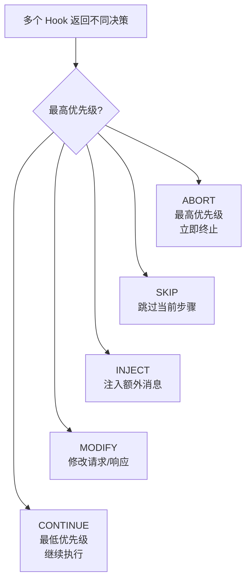

# Hook——Agent 的治理层

*从通知型回调到决策型治理*

---

Agent 改完了 20 个文件，准备收工。

它已经完成了所有修改：重构了 `UserService`，调整了 `OrderService` 的接口签名，更新了 `PaymentService` 的错误处理逻辑。三个服务，六十多次工具调用，模型推理了十五轮。看起来没什么问题。

偏偏就在 Agent 准备返回最终答案的那一刻，一个 Hook 在 `PRE_COMPLETE` 阶段触发了。它扫描了整个会话的工具调用历史，发现了一个问题：

> "你修改了 UserService、OrderService、PaymentService，但没有更新它们的测试文件。UserServiceTest、OrderServiceTest、PaymentServiceTest 均未触及。请补充测试后再结束。"

Agent 被迫继续工作。

这条检查消息是一个**实时干预**——在 Agent 犯下"完成但不完整"这个错误之前，把它拉回来。不是日志，不是事后审计，是在错误发生之前的强制纠正。

这就是我们希望 Hook 做到的事：参与决策，而不只是旁观。

## 通知型回调的困境

Claude Code 有一套 Hook 系统。在 `settings.json` 中，你可以为 29 种事件名配置脚本。当事件发生时，脚本被执行。这些事件覆盖面很广：`PreToolUse`、`PostToolUse`、`SessionStart`、`Stop`、`Notification`、`SubagentStart`......几乎 Agent 生命周期的每个关键节点都有对应的事件。

一个典型的 Claude Code hook 配置：

```json
{
  "hooks": {
    "PreToolUse": [
      {
        "matcher": "Bash",
        "command": "echo \"Tool: $TOOL_NAME, Input: $TOOL_INPUT\" >> /tmp/audit.log"
      }
    ]
  }
}
```

脚本可以做两件事：记录日志，或者以非零退出码阻止操作。

这已经比没有 hook 强得多了。有了它，你可以审计每一次工具调用，可以阻止危险命令的执行。只是如果你试图做更多——比如修改工具的参数、比如注入一条新指令让 Agent 改变方向——你会发现自己碰壁了。

脚本的影响力是二元的：允许，或者拒绝。

现实世界的治理需求远不止于此。考虑这些场景：

- Agent 要执行 `rm -rf ./build/`，你不想阻止它，但希望自动加上 `--dry-run` 先看看会删什么——**你需要修改参数**
- Agent 正在处理用户数据，工具输入中包含了手机号和身份证号——你不想阻止调用，但需要在执行前**脱敏**
- Agent 调用了一个已知不稳定的外部 API，你想跳过这次调用但不终止整个会话——**你需要跳过而非中止**
- Agent 完成了代码修改但忘了跑测试——你需要在它结束前**注入一条指令**把它拉回来
- 你在做 A/B 测试，想让一半的会话使用不同的模型参数——**你需要在推理前修改配置**

通知型回调对这五个场景束手无策。

问题出在一个概念鸿沟上：**"发生了什么"** 和 **"该怎么办"** 之间的距离。通知型回调告诉你发生了什么——工具被调用了，会话开始了，Agent 要结束了。但它不给你决定该怎么办的能力。你能看到里面在发生什么，但你伸不进手去。

Kairo 的 Hook 系统试图把这个能力补上。

---

## 五种决策：从 CONTINUE 到 INJECT

Kairo 的每一个 Hook 处理器返回的不是 `void`，不是 `boolean`，而是一个 `HookResult<T>`。这个结果携带了一个 `Decision`——五种决策值之一，Agent 运行时**必须遵守**。

```java
public enum Decision {
    CONTINUE(0),   // 放行
    INJECT(1),     // 注入
    MODIFY(2),     // 改写
    SKIP(3),       // 跳过
    ABORT(4);      // 终止
}
```

每个决策值有一个优先级数字。当多个 Hook 对同一事件返回不同决策时，优先级高的胜出。数字反映了决策的破坏力——放行最温和，终止最激烈。



### CONTINUE：默认放行

最简单的决策。"一切正常，继续执行。"

```java
@HookHandler(HookPhase.PRE_ACTING)
HookResult<PreActingEvent> onPreActing(PreActingEvent event) {
    auditLog.record(event.toolName(), event.input());
    return HookResult.proceed(event);
}
```

大多数 Hook 在大多数时候返回 CONTINUE。它看起来和"没有 Hook"一样，但语义不同——每一次 CONTINUE 都意味着有人审查过了，只是选择放行。

通知型回调能做到这一步。接下来的四种决策，是它覆盖不到的。

### SKIP：跳过但不中断

"不要执行这个工具调用，但 Agent 循环继续。"

场景：Agent 试图调用一个已知在维护中的外部 API。你不想让整个会话因为一个工具失败而崩溃，也不想让 Agent 浪费时间等超时。SKIP 让它绕过去。

```java
@HookHandler(HookPhase.PRE_ACTING)
HookResult<PreActingEvent> onPreActing(PreActingEvent event) {
    if (isUnderMaintenance(event.toolName())) {
        return HookResult.skip(event, "Service under maintenance, skipping");
    }
    return HookResult.proceed(event);
}
```

Agent 收到一个"工具被跳过"的信号，它可以选择换一种方式达成目标，或者在回复中说明该服务暂时不可用。会话没有断。

SKIP 和 ABORT 的区别，类似操作系统中 SIGCONT 和 SIGKILL 的区别。一个说"这条路走不通，试试别的"，另一个说"全部停下"。

### ABORT：立即终止

"整个 Agent 会话到此为止。"

最激烈的决策，留给最严重的场景：安全违规、成本失控、数据泄露风险。

```java
@HookHandler(HookPhase.PRE_ACTING)
HookResult<PreActingEvent> onPreActing(PreActingEvent event) {
    if (detectsSqlInjectionPattern(event.input())) {
        return HookResult.abort(event, "SQL injection pattern detected in tool input");
    }
    return HookResult.proceed(event);
}
```

ABORT 有一个特殊的语义：它会**短路整个 Hook 链**。当一个 Hook 返回 ABORT 时，后续的 Hook 不再执行——收到 ABORT 立即返回，不再遍历后续 handler。这个设计是单向的：安全决策只能升级，不能降级。和操作系统中 MAC（强制访问控制）的思路一致——你不希望一个宽松的审计 Hook 有机会把前面的安全裁定覆盖掉。

### MODIFY：改写参数

"继续执行，但用我修改过的参数。"

这是通知型回调和决策型 Hook 之间最明显的分界。通知型回调只能说"我看到了这些参数"；MODIFY 可以说"把这些参数换掉"。

```java
@HookHandler(HookPhase.PRE_ACTING)
HookResult<PreActingEvent> onPreActing(PreActingEvent event) {
    if ("Bash".equals(event.toolName())) {
        Map<String, Object> modified = new HashMap<>(event.input());
        String command = (String) modified.get("command");
        if (command.startsWith("rm ") && !command.contains("--dry-run")) {
            modified.put("command", command + " --dry-run");
            return HookResult.modify(event, modified);
        }
    }
    return HookResult.proceed(event);
}
```

Agent 以为自己执行了 `rm -rf ./build/`，实际上执行的是 `rm -rf ./build/ --dry-run`。它看到了"将要删除"的文件列表，但没有一个文件真的被删除。如果列表看起来正确，Agent 可以在下一轮去掉 `--dry-run` 再执行。

MODIFY 的另一个典型场景是 PII 脱敏。Agent 要调用一个搜索工具，输入中包含用户的手机号。一个 PII Hook 在 `PRE_ACTING` 阶段拦截，把手机号替换为 `[REDACTED]`，然后放行。Agent 不知道参数被改过——它只看到工具返回了结果。

还有 A/B 测试的用法。在 `PRE_REASONING` 阶段，一个实验 Hook 根据会话 ID 的哈希值决定使用 `claude-4-sonnet` 还是 `claude-4-opus`，修改模型调用参数。Agent 本身完全不感知——它只是在两个实验组中分别表现出不同的行为，供你事后分析。

### INJECT：注入指令，强制多一轮

INJECT 是 Kairo Hook 系统中最独特的决策值。在其他 Agent 框架中，我没有见过等价物。第一次在内部 demo 上演示的时候，有同事说"这不就是给 Agent 派了个监工？"——说得其实挺准确。

它的语义是："继续执行，但在对话历史中注入一条消息，强制 Agent 再进行一轮 ReAct 迭代。"

回到开篇的场景。Agent 修改了三个 Service，准备返回最终答案。此时 `PRE_COMPLETE` 阶段的 Hook 触发：

```java
@HookHandler(HookPhase.PRE_COMPLETE)
HookResult<PreCompleteEvent> onPreComplete(PreCompleteEvent event) {
    List<String> modifiedFiles = extractModifiedFiles(event);
    List<String> missingTests = findMissingTestFiles(modifiedFiles);
    
    if (!missingTests.isEmpty()) {
        String message = "你修改了以下文件但未更新对应的测试：\n"
            + String.join("\n", missingTests)
            + "\n请补充测试后再结束。";
        return HookResult.inject(event, Msg.of(MsgRole.USER, message), "QualityGate");
    }
    return HookResult.proceed(event);
}
```

`HookResult.inject()` 做了三件事：

1. 把一条 `USER` 角色的消息插入对话历史
2. 阻止 Agent 在这一轮返回最终答案
3. 强制 Agent 进入下一轮 ReAct 循环，处理这条新消息

从 Agent 的视角看，它收到了一条"来自用户"的新指令："你忘了测试。"于是它继续工作——打开测试文件，编写断言，运行测试套件。直到所有测试通过，它再次尝试结束，`PRE_COMPLETE` Hook 再次触发，这次检查通过，返回 CONTINUE，Agent 才真正完成。

INJECT 不局限于质量门控。几个其他用途：

- **安全审查**：在一个高风险工具调用完成后，注入"请重新审视你刚才的操作是否合理"
- **上下文补充**：在推理开始前，注入相关的文档或 API 规范
- **引导纠偏**：当 Agent 偏离了预期的技术方案时，注入"请回到最初的设计，不要引入新的抽象"

INJECT 的优先级（1）低于 MODIFY（2）和 SKIP（3），所以如果另一个 Hook 要求跳过或修改，INJECT 不会阻止它。不过 INJECT 的优先级高于 CONTINUE（0），也就是说任何 INJECT 都会覆盖默认的放行。

一个微妙的设计点：INJECT 注入的是 `USER` 角色的消息，而不是 `SYSTEM` 角色。这是刻意的选择。USER 消息在模型的注意力中权重更高，Agent 更倾向于严格遵循。如果用 SYSTEM 消息，Agent 可能会"参考"但不一定"执行"。质量门控需要的是命令，不是建议。

---

## 30 个生命周期点：Agent 的中断向量表

操作系统有中断向量表——256 个入口点，覆盖硬件中断、软件异常、系统调用。每个入口对应一段处理逻辑。处理器在执行指令的过程中，随时可能被中断打断，跳转到向量表中的某个位置执行处理程序，然后返回。

Kairo 的 `HookPhase` 枚举有 30 个值，分布在 9 个领域。


**主循环（10 个点）**——Agent ReAct 循环的骨架：

| 阶段 | 触发时机 | 典型用途 |
|------|---------|---------|
| `SESSION_START` | 会话开始 | 初始化计数器、加载用户偏好 |
| `SESSION_END` | 会话结束 | 汇总统计、清理资源 |
| `PRE_REASONING` | 模型调用前 | 注入上下文、修改模型参数 |
| `POST_REASONING` | 模型响应后 | 记录推理内容、检测异常 |
| `PRE_ACTING` | 工具执行前 | 参数校验、PII 脱敏、权限检查 |
| `POST_ACTING` | 工具执行后 | 结果审计、副作用追踪 |
| `PRE_COMPACT` | 上下文压缩前 | 标记不可压缩的关键信息 |
| `POST_COMPACT` | 上下文压缩后 | 验证压缩没有丢失关键内容 |
| `TOOL_RESULT` | 工具返回结果 | 结果过滤、格式规范化 |
| `PRE_COMPLETE` | Agent 准备结束 | 质量门控、完整性检查 |

**用户交互（3 个点）**——用户输入进入 Agent 之前的拦截层：

| 阶段 | 触发时机 |
|------|---------|
| `USER_PROMPT_SUBMIT` | 用户提交 prompt |
| `USER_PROMPT_EXPANSION` | 命令展开为 prompt |
| `NOTIFICATION` | Agent 发送通知 |

**权限域（2 个点）**——权限系统的切面：

| 阶段 | 触发时机 |
|------|---------|
| `PERMISSION_REQUEST` | 权限对话框出现 |
| `PERMISSION_DENIED` | 工具调用被拒绝 |

**工具扩展（2 个点）**——处理工具执行的异常路径：

| 阶段 | 触发时机 |
|------|---------|
| `POST_TOOL_FAILURE` | 工具调用失败 |
| `POST_TOOL_BATCH` | 一批并行工具调用完成 |

**子 Agent（2 个点）**、**多 Agent 协作（3 个点）**、**环境感知（4 个点）**、**生命周期扩展（2 个点）**、**工作树（2 个点）**——每个领域都有自己的事件集合，覆盖 Agent 运行时可能需要干预的各个角落。

30 个点。第一版的 Hook 设计只有 3 个事件——PreTool、PostTool、OnError，连推理前后的拦截点都没有，回头看简直太天真了。现在的 30 个点是从真实的治理需求中一个一个长出来的，不是事先规划的结果。说实话，我也不确定 30 个是不是最终数字——如果未来出现新的治理盲区，还会继续长。

## 决策合并：当多个 Hook 意见不同

一个 `PRE_ACTING` 事件经过三个 Hook：审计 Hook 返回 CONTINUE，PII Hook 返回 MODIFY，安全 Hook 返回 CONTINUE。最终决策是什么？

MODIFY。因为 MODIFY 的优先级（2）高于 CONTINUE（0）。

另一个场景：PII Hook 返回 MODIFY，安全 Hook 返回 ABORT。最终决策？

ABORT。优先级 4 胜出。而且 ABORT 直接短路——PII Hook 的 MODIFY 结果被丢弃。

合并规则只有三条：ABORT 优先且不可覆盖；其余按优先级数值取高者；Modified input 取最后一个写入者，Injected message 取第一个注入者。

"最后写入者赢"和"第一注入者赢"看起来不对称，但这是有意的设计。MODIFY 通常是累积性的——PII Hook 脱敏后，安全 Hook 可能还要做进一步修改，后者应该看到前者的结果。INJECT 则相反——第一个注入的消息定义了 Agent 的下一步方向，后续注入可能产生冲突的指令。宁可只听第一个声音，也不让 Agent 被矛盾的指令困住。

## 有状态的 Hook：HookSessionContext

到目前为止讨论的 Hook 都是无状态的：每次触发，独立判断，不记得上一次发生了什么。

但很多治理场景需要状态。"累计成本超过 5 美元时中止"——需要跨多次 Hook 调用累加成本。"连续失败 3 次后降级到备用模型"——需要记住之前失败了几次。"用户在本次会话中已经确认过一次安全警告，不要重复询问"——需要记住用户的选择。

v0.11 引入了 `HookSessionContext` SPI：一个 per-session 的键值存储，Hook 处理器可以通过第二个参数自动获取。

```java
@HookHandler(HookPhase.POST_REASONING)
HookResult<PostReasoningEvent> onPostReasoning(
        PostReasoningEvent event, 
        HookSessionContext ctx) {
    int count = ctx.incrementCounter("reasoning_calls");
    if (count > 50) {
        return HookResult.inject(event, 
            Msg.of(MsgRole.USER, "已推理 " + count + " 轮，请尽快收敛。"),
            "TurnLimiter");
    }
    return HookResult.proceed(event);
}
```

接口就四个方法：

| 方法 | 语义 |
|------|------|
| `get(key, type)` | 读取类型安全的值 |
| `set(key, value)` | 写入值（null 删除键） |
| `incrementCounter(key)` | 原子递增，返回新值 |
| `getCounter(key)` | 读取计数器当前值 |

`incrementCounter` 是原子操作——因为并行工具执行时，多个 Hook 可能同时触发，竞态条件是真实存在的。`DefaultHookSessionContext` 的实现使用 `ConcurrentHashMap` + `AtomicInteger`，在高并发下保证正确性。

有了 `HookSessionContext`，Hook 可以建立累积性的治理策略：渐进式的成本控制、基于历史的异常检测、跨调用的模式识别。没有它，每一次 Hook 调用都是失忆的。

## 治理 Hook 套件：开箱即用的会话守卫

理论上，你可以为每个治理需求手写 Hook。实践中，80% 的场景被四种模式覆盖。v0.12 的 Governance Hook Pack 把它们封装好了：

```java
Agent agent = AgentBuilder.create()
    .hooks(GovernanceHookPack.defaults())
    .build();
```

四个守卫，分别管一个维度。

**MaxTurnsGuard**——轮次上限。在 `POST_REASONING` 阶段触发。默认阈值：20 轮警告（"开始收尾"），30 轮强制（"立即停止"）。防止 Agent 在一个任务上无限循环。

**ContextSizeGuard**——上下文水位。在 `PRE_REASONING` 阶段触发。默认阈值：40k token 警告，70k token 临界。使用启发式 token 估算器实时评估对话长度。当上下文膨胀到危险区间时，注入"请精简回复"的指令。

**ToolCallBudgetGuard**——工具调用预算。在 `TOOL_RESULT` 阶段触发。默认阈值：60 次警告，100 次强制。防止 Agent 疯狂地调用工具而不推进实际进度。

**RepetitiveToolGuard**——重复工具检测。在 `POST_REASONING` 阶段触发。当同一个工具被连续调用 4 次以上时，注入"考虑换个方法"的提示。这不同于 `LoopDetector`（那是检测完全相同的输入/输出循环）——`RepetitiveToolGuard` 检测的是工具级别的固化：Agent 反复 `grep` 同一个关键词，换着姿势但找不到答案。

四个守卫共享一个设计模式——`GuardHook<E>` 抽象基类的双阈值 + fire-once 机制：每个阈值只触发一次 INJECT。第一次到达警告线时注入"开始收尾"，之后即使持续超限也不再重复——避免对话历史被守卫消息淹没。Force 阈值同理，到了直接注入"立即停止"。

fire-once 的设计来自一个真实的翻车：早期版本没有这个限制，Agent 每轮都收到"你已超过预算"的注入消息，对话历史的 30% 都是守卫消息，Agent 把更多精力花在"回应警告"而不是"完成任务"上。

三种预设覆盖不同的运行模式：

| 预设 | 轮次 | 上下文 | 工具调用 | 重复 |
|------|------|--------|---------|------|
| `defaults()` | 20/30 | 40k/70k | 60/100 | 4 |
| `strict()` | 10/15 | 25k/40k | 30/50 | 3 |
| `relaxed()` | 50/80 | 80k/120k | 150/250 | 6 |

`strict` 用于自动化管线——无人值守的 CI/CD Agent，必须严格控制资源消耗。`relaxed` 用于长时间交互式会话——开发者坐在终端前，与 Agent 持续对话数小时。`defaults` 是大多数场景的平衡点。这些阈值不是拍脑袋定的，是从很多次"Agent 又跑飞了"的事故复盘中慢慢摸出来的。

守卫还有一个 `interactive` 参数：在交互式模式下，轮次和工具预算守卫可以被抑制——因为有人类在看着，Agent 不太可能真正失控。但 `ContextSizeGuard` 不受此影响——上下文溢出是物理限制，人在不在场都一样。

## Plugin 桥接：29 个事件名的统一

Claude Code 的 plugin 生态中，hooks.json 使用驼峰命名：`PreToolUse`、`PostToolUse`、`SessionStart`、`Stop`。Kairo 的 `HookPhase` 使用下划线大写：`PRE_ACTING`、`POST_ACTING`、`SESSION_START`、`PRE_COMPLETE`。

两套命名需要一个翻译层。`HookEventMapper` 维护了一张 29 条的映射表，把 Claude Code 的驼峰事件名转换为 Kairo 的 `HookPhase`。大多数映射是直觉性的（`PreToolUse` → `PRE_ACTING`），但 `"Stop" → PRE_COMPLETE` 值得说一下——Claude Code 中的 "Stop" 事件，语义是"Agent 的主循环即将返回最终答案"，这正是 Kairo 的 `PRE_COMPLETE`。名字不同，概念对齐。

有两个 Claude Code 事件在 Kairo 中没有直接对应的 `HookPhase`：`Elicitation` 和 `ElicitationResult`。它们被路由到了 `NOTIFICATION` 作为近似替代。这是个务实的降级方案——等未来 SPI 扩展时再给它们独立的阶段。

桥接的价值在于：Claude Code 生态中已有的 plugin hooks.json 可以在 Kairo 运行时中直接生效，而且获得了更丰富的决策能力。一个原本只能"exit 1 阻止"的 Claude Code hook 脚本，在 Kairo 中可以通过 `HookExecutor` 返回结构化的 `HookResult`，支持 MODIFY、SKIP、INJECT 等操作。

## 企业治理的真实案例

把五种决策和 30 个生命周期点组合起来，能构建出什么样的治理策略？

**合规审计（CONTINUE + 日志）**。在 `PRE_ACTING` 和 `POST_ACTING` 阶段各注册一个 Hook，记录每一次工具调用的名称、参数、结果和耗时。返回 CONTINUE——不干预执行，只忠实记录。这满足了金融行业"所有 AI 操作可追溯"的监管要求。

**分级成本控制（INJECT → ABORT）**。利用 `HookSessionContext` 的计数器能力，在 `TOOL_RESULT` 阶段累加每次模型调用和工具执行的成本估算。到 3 美元时 INJECT"请注意成本控制"；到 5 美元时 ABORT"成本超限，会话终止"。两级阈值，渐进式干预。

**内容安全过滤（MODIFY）**。在 `PRE_ACTING` 阶段扫描所有工具输入中的敏感数据——信用卡号、社会安全号、API 密钥。检测到后不中止，而是 MODIFY 替换为占位符。Agent 继续工作，但不会把敏感数据传给外部工具。

**灰度发布验证（SKIP）**。Agent 在执行部署任务时，`PRE_ACTING` Hook 检查目标环境。如果是生产环境且当前是灰度阶段，SKIP 掉直接部署的工具调用，改为返回"请先在预发环境验证"的信息。

**代码质量门控（INJECT at PRE_COMPLETE）**。这是开篇场景的完整版。Agent 准备结束时，Hook 检查：是否所有修改的源文件都有对应的测试更新？是否运行了 `mvn test`？是否有新增的 linter 警告？任何一项不满足，INJECT 一条具体的改进指令。Agent 被拉回来继续工作，直到所有质量标准通过。

---

## 复杂性的诚实账单

30 个生命周期点 x N 个 Hook 处理器 = 潜在的延迟放大器。

每个 Hook 的执行时间被累加到 Agent 的每一轮迭代中。`DefaultHookChain` 使用 `totalDurationNanos` 原子计数器追踪总耗时，`HookChainStats` 提供 per-phase 的统计快照。在生产环境中，我观察到 Hook 链在正常情况下增加 1-5ms 的延迟——相对于模型调用的数秒级延迟可以忽略。但如果某个 Hook 里做了网络调用、数据库查询或复杂计算，延迟会急剧膨胀。

外部 Hook（command 类型，启动子进程执行脚本）更糟糕。每次触发需要 fork 进程、等待执行、解析输出。`DefaultHookChain` 对外部 Hook 的异常做了 `onErrorResume` 处理——失败降级为 CONTINUE 而非传播错误。结果就是一个行为异常的外部脚本可能在静默失败的同时拖慢每一轮迭代。这个降级策略我现在也拿不准是不是最优解——也许应该让外部 Hook 的失败更显式地暴露出来。

更深层的问题是可预测性。当 Agent 的行为由 5 个 Hook 共同决定时，调试"为什么 Agent 在这一步停了"需要追溯整条 Hook 链的决策过程。`DefaultHookChain` 为此提供了 `snapshot()` 方法，返回 `HookChainStats`——每个阶段触发了多少次、每种决策出现了多少次、有多少次失败、总耗时多少。但说实话，在一个有 10 个 Hook、30 个阶段的系统中，可观测性工具本身就成了需要维护的复杂度。

还有一个始终存在的设计张力：Hook 太多会让 Agent 的行为变得难以预测——每一步都可能被修改、跳过或注入新指令；Hook 太少又无法满足企业级的治理需求。Governance Hook Pack 的三种预设试图在这个张力中找到平衡，但我不觉得有标准答案——最终取决于你的具体场景和你愿意承受的调试成本。

我做了一个务实的选择：所有 Hook 都是可选的。框架零 Hook 也能运行。你按需添加，每添加一个都清楚它的代价。这好过"默认开启所有治理，你按需关闭"——因为后者的代价是隐性的，你不知道自己关闭了什么，直到出问题。

Hook 能治理 Agent 运行中的每一步决策——但如果进程本身崩了呢？长时间运行的任务需要的不是更细的决策控制，而是不同层面的韧性。

*下一篇：《长任务与进程隔离——Worktree、Checkpoint 与持久化执行》*

---

**参考**

1. Claude Code hooks documentation, hooks.json schema
2. Kairo ADR-019, Hook API Consolidation
3. Kairo HookPhase enum, `kairo-api/src/main/java/io/kairo/api/hook/HookPhase.java`
4. Kairo GovernanceHookPack, `kairo-core/src/main/java/io/kairo/core/hook/GovernanceHookPack.java`
