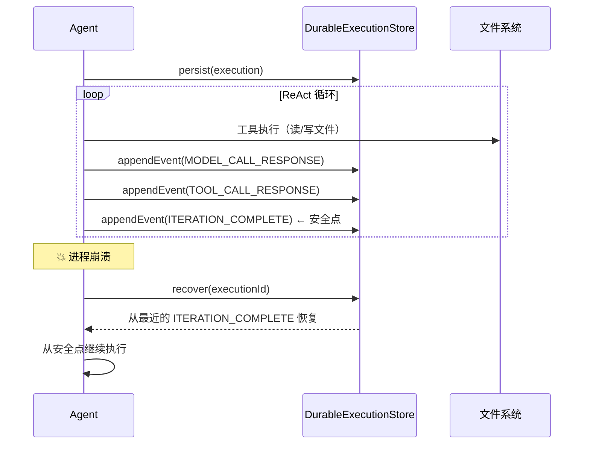
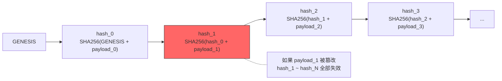
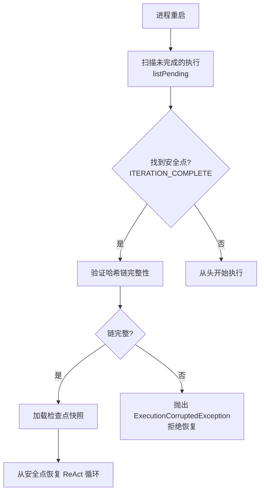

# 长任务与进程隔离——Worktree、Checkpoint 与持久化执行

*当一个重构任务执行了 30 分钟*

一个大规模重构任务。127 步工具调用，30 分钟执行时间。第 98 步，网断了。

第一次遇到这种情况的时候，我盯着半写完的文件发了十分钟呆。

所有进度丢失。Agent 不记得它做过什么，文件系统里留下了半完成的修改。17 个文件被改了一半——有的方法签名更新了但调用者还没改，有的旧文件删了但新文件没写完。`git status` 显示一片红色，但你不知道哪些修改是正确的、哪些是中间状态。

如果你曾经在 Claude Code 中跑过一个 20 分钟的大任务——迁移框架版本、重构模块边界、或者给整个项目加一层中间件——你多半经历过那种紧张感。终端右上角的 token 计数器在跳动，每一步工具调用都在消耗上下文。你不敢关笔记本盖子，不敢让屏幕锁定，不敢断 Wi-Fi。因为一旦进程中断，30 分钟的工作就回到了起点。

在前面的文章中，我讨论了 SPI 极简主义和 Hook 治理层的设计。这篇文章转向另一个维度的挑战：长任务。上下文压缩引擎帮助维持了记忆，但压缩只解决了"窗口不够大"的问题。长任务还要面对三个不同的敌人。

---

## 长任务的三个敌人

### 敌人一：上下文溢出

127 步工具调用，每步平均产生 1000 token 的输出。这是 127K token 的对话历史。加上系统提示、用户消息、Agent 自身的推理过程，总量轻松突破 200K。没有压缩引擎，窗口在第 30 步左右就会被填满。

在长任务场景下，压缩引擎会被反复触发：Snip 阶段在第 20 步左右开始工作，Micro 在第 40 步，Collapse 在第 60 步。到第 80 步，Auto 阶段的 LLM 摘要已经被调用了 3 次。每一次压缩都在丢失信息。

这里有一个容易被忽视的问题：**压缩的累积损失**。单次压缩丢失 5% 的信息，看起来无所谓。但三次压缩后，信息保留率是 0.95^3 = 85.7%。五次后是 77.4%。Agent 在第 100 步时，对前 30 步的记忆已经变得模糊——它知道自己"做过一些重构"，但具体改了什么方法、为什么那样改，细节已经被压缩掉了。

这是信息论的硬约束，压缩引擎设计得再好也绕不过去。有损压缩的累积效应就是这样。

### 敌人二：进程中断

网络断了。终端被关了。笔记本进入了睡眠模式。机器重启了。

Agent 的全部状态——对话历史、当前推理链、工具执行队列——都在内存里。进程死了，状态就消失了。这和操作系统的进程崩溃完全一样：没有 checkpoint 的进程，崩溃后只能从头启动。

更麻烦的是文件系统的半成品状态。Agent 在第 98 步中断时，可能正在执行一个涉及三个文件的原子修改：删除旧接口、创建新接口、更新实现类。如果它刚删完旧接口，还没创建新的——代码库就处于一个 broken 状态。编译不通过，但你不知道该回滚到哪里。

CLI Agent 没有 Web 服务的多副本和请求重放能力。它是一个单进程、单会话、单操作者的程序。进程死了，就是全部归零。

### 敌人三：并行冲突

一个大型重构任务可以拆分成子任务并行执行。但两个 Agent 同时修改同一个文件会发生什么？

第一个 Agent 在 `UserService.java` 的第 50 行插入了一个新方法。第二个 Agent 在同一个文件的第 48 行修改了一个已有方法。两个 Agent 都认为自己的修改是正确的——因为它们各自读到的是修改前的版本。当两份修改合并时，行号错位，代码结构被破坏。

Claude Code 的 amux 模式（多 Agent 并行执行）和 Cursor 的 Background Agent 都面临同样的挑战。当并行度从 1 增加到 10，冲突的概率不是线性增长的——它按修改文件数的组合数增长。

---

## Worktree 隔离 = 进程隔离

操作系统是怎么解决并行冲突的？

虚拟地址空间。每个进程有自己的虚拟地址空间——进程 A 写入地址 0x1000 不会影响进程 B 的地址 0x1000。它们在物理上可能共享内存（共享库、mmap），但在逻辑上是完全隔离的。进程通过 IPC（进程间通信）来交换数据。

Agent 的等价物是 **Git Worktree**。

Git worktree 允许在同一个仓库中创建多个独立的工作目录。每个 worktree 有自己的分支、自己的文件状态、自己的 HEAD 指针。Agent A 在 `worktree-a/` 目录中修改文件，Agent B 在 `worktree-b/` 目录中修改文件——它们永远不会直接冲突，因为它们操作的是不同的物理文件。

```bash
# 创建两个独立的 worktree
git worktree add ../worktree-agent-1 -b refactor/extract-service
git worktree add ../worktree-agent-2 -b refactor/update-tests

# Agent 1 在 worktree-agent-1/ 中工作
# Agent 2 在 worktree-agent-2/ 中工作
# 两者互不干扰

# 工作完成后，通过 PR 合并
git merge refactor/extract-service
git merge refactor/update-tests
```

这个映射挺精确的：

| 操作系统概念 | Agent 等价物 |
|-------------|-------------|
| 进程的虚拟地址空间 | Agent 的独立 Worktree |
| 进程间通信（IPC） | Git merge / PR review |
| 共享内存 | 共享的 Git 仓库（.git 目录） |
| fork() 创建子进程 | `git worktree add` 创建新工作目录 |
| wait() 收集子进程结果 | merge 收集各 worktree 的修改 |
| 进程退出 | `git worktree remove` 清理工作目录 |

### Claude Code 的做法

Claude Code 通过 worktree 支持并行工作。配合 amux（一个终端复用器），用户可以启动 10 个 Claude Code 实例，每个实例在自己的 worktree 中独立工作。工作完成后，各自创建 PR，通过代码审查合并到主分支。

```bash
amux start --agents 10 --worktree-per-agent
# 每个 Agent 获得：
#   1. 独立的 worktree 目录
#   2. 独立的 Git 分支
#   3. 独立的终端会话
#   4. 独立的上下文窗口
```

这种架构的好处在于：Git 本身就是一个分布式协调协议，天然支持：

- **并行修改**：每个分支是独立的修改流
- **冲突检测**：merge 时自动检测文件级和行级冲突
- **原子合并**：merge 要么完全成功，要么完全失败
- **版本回退**：任何合并都可以 revert

Git 解决这个问题已经用了 20 年。我们没必要再发明一个协调协议。

### Kairo 的做法：WorkspaceProvider SPI

Kairo 通过 `WorkspaceProvider` SPI 抽象了工作空间的生命周期。每个 Agent 可以获得一个独立的 `Workspace`，它本质上就是一个隔离的工作目录。

```java
@Stable(since = "1.1.0")
public interface WorkspaceProvider {
    Workspace acquire(WorkspaceRequest request);
    void release(String workspaceId);
}
```

`Workspace` 对象提供了工作目录的根路径、类型标识和元数据：

```java
public interface Workspace {
    String id();
    Path root();
    WorkspaceKind kind();
    Map<String, String> metadata();
}
```

`WorkspaceKind` 枚举定义了三种工作空间类型：

- `LOCAL`：本地文件系统目录——当前已实装，最简单也最快
- `REMOTE_GIT`：从远程 Git 仓库 checkout 的本地目录——metadata 携带 `git.remote`、`git.branch`、`git.commit`
- `EPHEMERAL`：短生命周期的临时目录，通常由 `ExecutionSandbox` 支撑——进程重启后可能失效

实际使用时，`WorkspaceProvider` 为每个 Agent 或子任务分配独立的 Workspace。文件工具（ReadFile、WriteFile）通过 `ToolContext` 解析路径时，使用的是 `Workspace.root()` 而不是 JVM 的当前工作目录。`ExecutionSandbox` 在启动子进程时，将 `Workspace.root()` 挂载为沙箱的 `workspaceRoot`。

```java
@Stable(since = "1.1.0")
public interface ExecutionSandbox {
    SandboxHandle start(SandboxRequest request);
}
```

`ExecutionSandbox` 抽象了命令执行的后端。默认的 `LocalProcessSandbox` 封装了 `ProcessBuilder`，适用于单机部署。但接口设计允许替换为容器、微虚拟机或远程执行后端——Agent 写的 `bash` 命令不需要知道它实际在哪里执行。

这两个 SPI 组合在一起，就形成了完整的进程隔离栈：

1. `WorkspaceProvider.acquire()` 创建隔离的文件空间（= `fork()` 创建虚拟地址空间）
2. `ExecutionSandbox.start()` 在隔离空间中执行命令（= 进程在自己的地址空间中运行）
3. `WorkspaceProvider.release()` 清理工作空间（= 进程退出后回收资源）
4. Git merge 合并结果（= IPC 收集子进程输出）

## Checkpoint 与恢复——DurableExecutionStore SPI

进程隔离解决了并行冲突。但进程中断呢？

操作系统提供了两种机制来应对进程崩溃：

1. **Checkpoint/Restore**：定期保存进程状态的快照，崩溃后从最近的快照恢复
2. **Journaling**：记录操作日志，崩溃后通过日志重放恢复状态

Kairo 选择了后者——事件日志（event log）加检查点（checkpoint）的混合方案。这是 ADR-011 定义的 `DurableExecutionStore` SPI。

### 根本抽象

```java
@Stable(since = "1.0.0")
public interface DurableExecutionStore {
    Mono<Void> persist(DurableExecution execution);
    Mono<DurableExecution> recover(String executionId);
    Flux<DurableExecution> listPending();
    Mono<Void> appendEvent(String executionId, ExecutionEvent event);
    Mono<Void> updateStatus(String executionId, ExecutionStatus status, 
                            int expectedVersion);
    Mono<Void> delete(String executionId);
}
```

五个操作，对应五种需求：

- `persist`：Agent 启动时，创建一条执行记录
- `appendEvent`：每个关键步骤，追加一条事件
- `recover`：进程重启后，恢复中断的执行
- `listPending`：启动时扫描所有未完成的执行，决定是否恢复
- `updateStatus`：更新执行状态（RUNNING / PAUSED / COMPLETED / FAILED / RECOVERING）



### 什么被记录了

`DurableExecution` 是聚合根，它的核心是一个有序的事件列表。每个事件是一个 `ExecutionEvent`，包含六个字段：

```java
public record ExecutionEvent(
    String eventId,
    ExecutionEventType eventType,
    Instant timestamp,
    String payloadJson,
    String eventHash,
    int schemaVersion
) { }
```

事件类型（`ExecutionEventType`）覆盖了 ReAct 循环的全部关键步骤：

| 事件类型 | 含义 |
|---------|------|
| `MODEL_CALL_REQUEST` | 向 LLM 发送了一次推理请求 |
| `MODEL_CALL_RESPONSE` | 收到了 LLM 的推理响应 |
| `TOOL_CALL_REQUEST` | 发起了一次工具调用 |
| `TOOL_CALL_RESPONSE` | 收到了工具调用的结果 |
| `CONTEXT_COMPACTED` | 执行了一次上下文压缩 |
| `ITERATION_COMPLETE` | 完成了一个完整的 ReAct 迭代 |

这六种事件完整描述了 Agent 在每一步做了什么。`ITERATION_COMPLETE` 比较特殊——它是一个"安全点"（safe point），标记了一个完整迭代的结束。恢复时，系统从最近的 `ITERATION_COMPLETE` 事件开始重放。

### 哈希链——防篡改的事件日志

每个事件的 `eventHash` 不是独立计算的。它是一个链式哈希：

```text
hash_0 = SHA256("GENESIS" + canonical_json_payload)
hash_n = SHA256(hash_{n-1} + canonical_json_payload)
```



每个事件的哈希依赖于前一个事件的哈希。直接后果是：如果事件日志中的任何一条记录被篡改——修改了内容、删除了记录、或者插入了伪造的记录——后续所有事件的哈希都会失效。

恢复时，系统首先验证整条哈希链。如果验证失败，抛出 `ExecutionCorruptedException`，拒绝恢复。宁可让 Agent 从头开始，也不从一个被污染的状态恢复——基于错误状态恢复可能造成更大的损害。

思路和区块链类似，但 Kairo 不需要分布式共识——只需要单节点的防篡改日志。SHA-256 链就够了。

### 恢复协议

当进程重启时，恢复分四步：



1. **找到安全点**：在事件日志中查找最近的 `ITERATION_COMPLETE` 事件
2. **验证完整性**：从创世事件到安全点，逐条验证哈希链
3. **加载快照**：读取 `checkpoint` 字段中序列化的状态快照
4. **恢复执行**：从安全点对应的迭代索引恢复 ReAct 循环

如果没有 `ITERATION_COMPLETE` 事件（Agent 在第一次迭代完成之前就崩溃了），执行从头开始。没有部分恢复——因为一个不完整的迭代没有"安全"的恢复点。

### 幂等性：恢复时的副作用问题

恢复最困难的部分不是恢复状态，而是处理副作用。

Agent 在第 98 步执行了一个 `bash` 命令：`mkdir -p src/main/java/com/example/service`。然后崩溃了。恢复后，Agent 从第 97 步的安全点重新执行第 98 步——又执行了一次 `mkdir -p`。

这次没问题——`mkdir -p` 是幂等的。目录存在不报错，不存在就创建。

但如果第 98 步是 `curl -X POST http://api.internal/deploy`？重复执行一次部署——后果不可预测。

ADR-011 定义了 at-least-once 语义下的幂等性合约：

```text
idempotencyKey = SHA256(executionId + ":" + iterationIndex + ":" + toolCallIndex)
```

每个工具调用有一个确定性的幂等键，由执行 ID、迭代索引和调用索引推导。工具实现者通过两个注解声明自己的幂等性：

- `@Idempotent`：安全重放。恢复时重新执行，传入相同的幂等键。工具实现者负责 check-before-execute 或 upsert 语义
- `@NonIdempotent`：不安全重放。恢复时跳过执行，直接返回事件日志中缓存的结果

**默认策略是保守的**：没有注解的工具被视为 `@NonIdempotent`——宁可返回旧结果，也不冒险重复执行。

```java
// 一个幂等工具的实现
@Idempotent
public class ReadFileTool implements Tool {
    // 读文件是天然幂等的——读两次结果一样
    public Mono<ToolResult> execute(ToolContext ctx) {
        return readFile(ctx.arg("path"));
    }
}

// 一个非幂等工具的实现
@NonIdempotent
public class HttpPostTool implements Tool {
    // POST 请求可能有副作用——不能安全重放
    public Mono<ToolResult> execute(ToolContext ctx) {
        return httpPost(ctx.arg("url"), ctx.arg("body"));
    }
}
```

### 并发控制：乐观锁

`DurableExecution` 带有一个 `version` 字段，用于乐观锁。每次状态更新必须传入期望的版本号：

```java
Mono<Void> updateStatus(String executionId, ExecutionStatus status, 
                        int expectedVersion);
```

如果当前版本不匹配（说明有其他线程或进程修改了同一条记录），更新失败。调用者重试。

事件日志（`kairo_execution_events` 表）是 append-only 的——只有 INSERT，没有 UPDATE 或 DELETE。追加操作不需要锁。这把并发瓶颈限制在了执行记录的状态更新上，而不是高频的事件追加上。

### 两种实现

v0.8 提供了两种 `DurableExecutionStore` 实现：

1. **`InMemoryDurableExecutionStore`**：`ConcurrentHashMap` 后端，用于测试。快、确定性、不需要数据库
2. **`JdbcDurableExecutionStore`**：JDBC 后端，Flyway 管理 schema 迁移，用于生产

生产部署使用 JDBC 实现，schema 很直接：

```sql
CREATE TABLE kairo_executions (
    execution_id VARCHAR(64) PRIMARY KEY,
    agent_id VARCHAR(128) NOT NULL,
    status VARCHAR(20) NOT NULL,
    version INT NOT NULL DEFAULT 0,
    created_at TIMESTAMP NOT NULL DEFAULT CURRENT_TIMESTAMP,
    updated_at TIMESTAMP NOT NULL DEFAULT CURRENT_TIMESTAMP
);

CREATE TABLE kairo_execution_events (
    event_id VARCHAR(64) PRIMARY KEY,
    execution_id VARCHAR(64) NOT NULL 
        REFERENCES kairo_executions(execution_id),
    event_type VARCHAR(50) NOT NULL,
    schema_version INT NOT NULL DEFAULT 1,
    payload_json TEXT NOT NULL,
    event_hash VARCHAR(64) NOT NULL,
    created_at TIMESTAMP NOT NULL DEFAULT CURRENT_TIMESTAMP
);
```

两张表。一张存执行记录（带乐观锁），一张存事件日志（append-only）。没有 ORM，没有 JPA，就是 JDBC + Flyway。

---

## Claude Code 怎么处理长任务

Claude Code 应对长任务的策略可以总结为四点：

**子 Agent 隔离上下文**。Claude Code 可以启动子 Agent（subagent），每个子 Agent 有独立的上下文窗口。大任务可以拆分：主 Agent 负责规划，子 Agent 负责执行。每个子 Agent 的上下文消耗不会污染主 Agent 的窗口。

**Session 快照恢复**。Claude Code 支持 session 的保存和恢复。会话状态被序列化到磁盘（`~/.claude/` 下的文件），重启后可以加载。但这不是 checkpoint/restore——它保存的是上下文快照，不是执行状态。恢复后，Agent 知道之前的对话内容，但不知道自己"正在做什么"。

**Worktree 并行**。配合 amux，Claude Code 支持多实例并行工作，每个实例在独立的 worktree 中。这是目前最成熟的 Agent 并行方案。

**但没有 durable execution**。如果 Claude Code 的进程被杀死——不是优雅退出，是 `kill -9`——上下文就丢了。快照文件可能还在，但快照的时间点和崩溃的时间点之间的工作丢失了。特别是：如果崩溃发生在一系列文件修改的中间，文件系统处于不一致状态，而 Agent 没有任何信息来判断"哪些修改已完成、哪些还没有"。

Kairo 要补的就是这个缺口：从"会话可恢复"到"执行可恢复"。

## ResourceConstraint SPI——长任务的资源治理

长任务还有另一面：如果它不中断，它可能永远不停。

一个 Agent 被指令重构一个模块。它开始修改文件、运行测试。测试失败了。它修复了一个地方，另一个地方又挂了。修了那个，又出现新的编译错误。它陷入了验证死亡螺旋——每一轮修复消耗上下文，但代码库没有在收敛。

50 次迭代。10 万 token 消耗。$20 的 API 费用。代码库的状态比开始时更差。

没有资源限制的 Agent，和没有 `ulimit` 的 Unix 进程差不多——一个失控的进程可以吃掉所有的内存和 CPU。

ADR-012 定义了 `ResourceConstraint` SPI，为 Agent 的资源消耗设置边界。

```java
@Stable(since = "1.0.0")
public interface ResourceConstraint {
    Mono<ResourceValidation> validate(ResourceContext context);
    ResourceAction onViolation(ResourceValidation validation);
}
```

每个 `ResourceConstraint` 实现检查一个维度的约束。`ResourceContext` 提供了检查所需的全部输入：

```java
public record ResourceContext(
    int iteration,          // 当前迭代次数
    long tokensUsed,        // 累积 token 消耗
    Duration elapsed,       // 已运行的墙钟时间
    AgentState agentState   // 当前 Agent 状态快照
) { }
```

当约束被触发时，`ResourceAction` 定义了四个级别的响应：

| 级别 | 行为 | 类比 |
|------|------|------|
| `ALLOW` | 未违规，继续执行 | 进程在资源限制内 |
| `WARN_CONTINUE` | 记录警告，继续执行 | 进程接近 ulimit |
| `GRACEFUL_EXIT` | 完成当前迭代后退出 | SIGTERM——给进程清理的机会 |
| `EMERGENCY_STOP` | 立即中止 | SIGKILL——不等待，直接终止 |

三个内置约束覆盖了最常见的场景：

```java
// 迭代次数限制 —— 防止无限循环
MaxIterationConstraint  → GRACEFUL_EXIT

// Token 预算限制 —— 防止费用失控
TokenBudgetConstraint   → GRACEFUL_EXIT

// 超时限制 —— 防止任务无限挂起
TimeoutConstraint       → EMERGENCY_STOP
```

注意 `GRACEFUL_EXIT` 和 `EMERGENCY_STOP` 的区别。迭代次数和 token 预算使用 `GRACEFUL_EXIT`——允许 Agent 完成当前迭代、保存状态、写入 checkpoint。但超时使用 `EMERGENCY_STOP`——因为超时通常意味着某些东西卡住了（死锁、网络悬挂），继续等待已经没有意义。

**组合语义**：多个约束按注册顺序依次评估，最严重的 action 胜出。第一个 `EMERGENCY_STOP` 触发短路——后续约束不再评估。所有的 `ResourceValidation` 结果都被收集（即使短路），用于可观测性。

用户可以注册自定义约束：

```java
@Bean
public ResourceConstraint costLimitConstraint() {
    return new ResourceConstraint() {
        public Mono<ResourceValidation> validate(ResourceContext ctx) {
            double cost = estimateCost(ctx.tokensUsed());
            boolean violated = cost > 10.0; // $10 上限
            return Mono.just(new ResourceValidation(
                violated, 
                "Cost limit: $" + cost + " / $10.00",
                Map.of("cost_dollars", cost)
            ));
        }
        public ResourceAction onViolation(ResourceValidation v) {
            return ResourceAction.GRACEFUL_EXIT;
        }
    };
}
```

这个 SPI 体现了渐进响应的思路——不是二元的"停或不停"，而是四个级别的分级响应。一个接近预算限制的 Agent 先收到 `WARN_CONTINUE`，有机会加速完成；真正超限时才被 `GRACEFUL_EXIT`。只有在极端情况下才被 `EMERGENCY_STOP`。

## 操作系统同构：进程生命周期

长任务的完整生命周期和操作系统的进程生命周期几乎可以一一对应。

### 启动

操作系统：`fork()` + `exec()` 创建新进程，分配虚拟地址空间，加载程序镜像。

Kairo：创建 `DurableExecution`（persist），分配独立 `Workspace`（acquire），启动 ReAct 循环。

### 运行

操作系统：进程在 CPU 时间片中执行。内核在上下文切换时保存/恢复寄存器。页面错误时触发页面替换。

Kairo：Agent 在迭代中执行。每个 `ITERATION_COMPLETE` 事件写入事件日志。上下文压力上升时触发压缩引擎。

### 检查点

操作系统：CRIU（Checkpoint/Restore In Userspace）冻结进程，序列化所有状态到磁盘。

Kairo：`DurableExecution.checkpoint` 保存序列化的状态快照。事件日志提供到安全点的完整执行记录。

### 中断与恢复

操作系统：进程收到信号（SIGTERM / SIGKILL）。SIGTERM 允许清理；SIGKILL 立即终止。恢复通过 CRIU restore 或 journaling。

Kairo：`ResourceConstraint` 的 `GRACEFUL_EXIT` 对应 SIGTERM，`EMERGENCY_STOP` 对应 SIGKILL。恢复通过 `DurableExecutionStore.recover()` + 哈希链验证 + 从安全点重放。

### 资源限制

操作系统：`ulimit` 限制进程的资源消耗（文件描述符、内存、CPU 时间）。cgroups 在容器级别做更细粒度的限制。

Kairo：`ResourceConstraint` 链限制 Agent 的资源消耗（迭代次数、token 预算、墙钟时间）。自定义约束可以加入成本、合规等维度。

### 退出与清理

操作系统：进程退出后，内核回收虚拟内存、关闭文件描述符、通知父进程。

Kairo：执行完成后，`updateStatus(COMPLETED)`、`WorkspaceProvider.release()` 清理工作空间、Git merge 收集结果。

## 任务完成保障——不完成就不停

长任务最隐蔽的失败模式不是崩溃，而是**早退**。

Agent 改了三个文件，觉得任务完成了，输出一段总结就停了。但还有两个文件没改。用户以为任务完成，跑了测试才发现——编译不过。

这种"自以为完成"的早退，在 SWE-bench 的评测中暴露得尤为明显。我跑过一个 pytest 的修复用例（`pytest-dev__pytest-5787`），Agent 38 秒就退出了，产出是空 diff——它读了报错信息，觉得"需要更多上下文"，然后就停了。不是崩溃，不是超时，是模型自己决定"我做不了，算了"。

另一个极端是 `sphinx-doc__sphinx-8548`：Agent 跑了 51 分钟，在同一组文件上反复阅读和思考，始终没产出 patch。不是循环——每次读的角度略有不同。但也不是进展——51 分钟后还是零修改。

这两个案例代表了长任务的两类早退：**过早放弃**和**过度探索**。

### AgentContinuationStrategy：模型说停的时候再想想

Kairo 的做法是 `AgentContinuationStrategy`——一个可插拔的 SPI，在模型每次准备停下来时（输出了文本但没有工具调用），被 ReAct 循环咨询：

```java
public interface AgentContinuationStrategy {
    Mono<ContinuationDecision> decide(ContinuationContext ctx);
}
```

返回五种决策：`Pass`（无意见）、`Terminate`（允许停止）、`Nudge`（注入消息强制继续）、`CompactAndRetry`（压缩上下文后重试）、`Escalate`（不可恢复的错误）。

三个内置策略按优先级链式执行：

**FinishReasonRecoveryStrategy**（最高优先级）。当模型输出被截断（`StopReason.MAX_TOKENS`）时，注入提示："你的上一条回复因长度限制被截断了。从断点处直接继续，不要重复已说的内容。"最多重试 3 次。

**PendingTodoNudgeStrategy**。检查会话中是否有未完成的 TODO 或未执行的计划步骤。如果有，注入："还有未完成的任务。继续执行计划。每一轮回复必须至少调用一个工具。不要只输出文本——现在就调用工具。"这个策略没有 per-session nudge 上限——对长任务来说，todo 没做完就是没做完，不该因为"催了太多次"就放弃。跑飞的防护交给 LoopDetector 和迭代预算。

**RecentToolActivityStrategy**。检测模型"中途停下来叙述"的行为。如果最近 3 轮还在积极调用工具，突然输出了一段不到 200 字符的纯文本——大概率不是真的完成了，而是模型在"喘口气"。注入："你刚才工具调用的节奏很好。继续执行——不要停下来叙述。现在就调用下一个工具。"

三个策略组合成 `CompositeContinuationStrategy`，配合两道全局守卫：Plan 模式下直接放行（Plan 模式本来就只读不写），迭代预算耗尽时强制停止。

### 一个翻车的故事

kairo-code 最初集成了完整的 `CompositeContinuationStrategy`（PendingTodoNudge + RecentToolActivity 全开）。结果在 Web 会话中出了大问题——Agent 进入了"无限催促循环"：模型输出一段总结，Nudge 策略说"你还没做完，继续"，模型被迫再输出一段，Nudge 又说"还没完"......循环不止。代码注释写的是 `"一直不停止"（infinite nudge loop）`。

最终 kairo-code 禁用了通用的 continuation strategy，只保留了 `PendingBackgroundTaskStrategy`——它专门解决一个特定问题：父 Agent 在子 Agent 还在后台跑的时候不能停。它不是"催"模型继续，而是阻塞等待子任务完成通知（最长 300 秒），然后把通知注入对话。

这个经历暴露了一个我之前没想清楚的问题：**任务完成保障的难点不在于"检测未完成"，而在于"区分真的没完成和模型认为自己完成了"。** 如果模型认为自己完成了但 Nudge 不同意，模型不会去做新的事——它会重复总结上一轮做过的事。这就变成了循环，而不是进展。

PRE_COMPLETE Hook（`HookPhase.PRE_COMPLETE`，类比 Claude Code 的 `preventContinuation`）提供了另一个介入点。和 Continuation Strategy 不同，Hook 可以注入具体的指令——不是笼统地说"你还没做完"，而是"你修改了 UserService 但没更新它的测试文件，请补充"。具体的指令比笼统的催促有效得多。这也是我们目前更倾向的方案。

### 自动恢复检测

CLI 启动时，`AutoResumeDetector` 扫描最近 24 小时内的会话 JSONL 文件。如果发现某个会话没有 `session_end` 标记——说明上次是非正常退出（崩溃、断网、终端关闭）。它会提示用户："发现中断的会话，是否恢复？"

恢复逻辑从 JSONL 重建对话历史，通过 snapshot 机制注入到新会话中。Agent 回到断点位置，带着之前的全部上下文继续工作。配合 DurableExecutionStore 的 checkpoint，大部分已执行的工具调用不需要重放。

## 分布式的前瞻

以上所有机制——Worktree 隔离、DurableExecution 持久化、ResourceConstraint 治理——目前都运行在单机上。但设计时预留了分布式的扩展点。

**事件总线的传输替换**。Kairo 的事件总线（kairo-event-stream）是 transport-agnostic 的，零 Spring 依赖。当前的默认传输是 Reactor Sink（进程内）。替换为 Redis Streams 或 Kafka，事件就可以跨节点传播。Agent A 在节点 1 发出事件，Agent B 在节点 2 收到通知。

**DurableExecution 天然跨节点**。`JdbcDurableExecutionStore` 后端是数据库——数据库本身就是跨节点的。进程在节点 1 崩溃，节点 2 的进程调用 `listPending()` 找到未完成的执行，调用 `recover()` 接管。乐观锁确保同一条执行不会被两个节点同时恢复。

**Worktree 可以在远程机器上**。`WorkspaceKind.REMOTE_GIT` 已经在枚举中预留。未来的 `RemoteGitWorkspaceProvider` 会在远程机器上执行 `git worktree add`，通过 SSH 或 API 管理工作目录。Agent 在本地推理，但工具执行可以发生在远程——通过 `ExecutionSandbox` 的远程实现。

**Git 作为协调层**。无论 Agent 运行在本地还是远程、单节点还是多节点，它们的工作成果最终都通过 Git 分支汇聚。Git 不关心贡献者是人还是机器、在本地还是在云端。这使得 Git 成为 Agent 协调的天然基础设施。

## 断点之后的空白

下面是几个我们还没有很好解决的问题，诚实地列出来。

### Checkpoint 粒度问题

每次工具调用后都做 checkpoint？那是 127 次序列化操作。每次序列化都要写数据库、计算哈希。如果每次 checkpoint 需要 50ms，127 次就是 6.35 秒的纯开销——对于一个 30 分钟的任务来说可以接受，但对于一个 5 分钟的任务就意味着 2% 的性能损失。

只在会话结束时做 checkpoint？那中间的所有进度都会丢失。一个 30 分钟的任务在第 29 分钟崩溃，前 29 分钟的工作全部白费。

Kairo 当前的策略是在每个 `ITERATION_COMPLETE` 事件后做 checkpoint。一个 ReAct 迭代通常包含一次模型调用和若干次工具调用。换算下来，checkpoint 的频率大约是"每个推理-行动周期一次"——粒度比每次工具调用粗，但比每次会话细。

这个选择谈不上最优。理想的 checkpoint 频率应该是自适应的——根据任务的复杂度、工具调用的成本、恢复的代价动态调整。一个只读取文件的迭代不值得 checkpoint；一个修改了 10 个文件的迭代必须 checkpoint。但自适应的 checkpoint 策略本身就是一个研究问题，我还没有好的启发式规则来判断"这次迭代值不值得 checkpoint"。

### 文件系统漂移问题

从 checkpoint 恢复 Agent 状态相对简单。但恢复文件系统的状态要难得多。

Agent 在第 50 步修改了文件 A。在第 80 步修改了文件 B（依赖文件 A 的修改）。在第 98 步崩溃。checkpoint 在第 95 步——Agent 恢复到第 95 步的状态。但文件系统上，第 96、97、98 步的修改还在。Agent 不知道这些修改已经发生了。

更糟糕的是：在崩溃后、恢复前的这段时间里，用户可能手动修改了文件。或者另一个 Agent 修改了文件。Agent 恢复时看到的文件系统状态，和它 checkpoint 时的文件系统状态不同——但它不知道哪里不同。

这就是文件系统漂移问题。数据管道（data pipeline）没有这个困扰——它处理的是不可变的数据集。但 Code Agent 处理的是可变的文件系统。checkpoint 保存了 Agent 的"脑"，但没有保存 Agent 的"世界"。

一个可能的方向是在每个 checkpoint 时同步保存文件系统的 Git commit hash。恢复时，先将文件系统 reset 到那个 commit，再恢复 Agent 状态。代价是 checkpoint 后到崩溃前的文件修改会丢失——除非它们已经被 committed。而 Agent 不一定在每一步都做 commit。

这是一个开放问题。完美的解决方案可能需要类似 ZFS 快照或 Docker layer 的文件系统级别的 checkpoint 机制。在 CLI 工具的场景下，这种重量级方案是否值得，我还没想清楚。

### 恢复后的上下文重建

即使完美地恢复了 Agent 状态和文件系统状态，Agent 恢复后的上下文窗口也是"空"的——因为之前的对话历史在旧进程的内存里，新进程只有 checkpoint 中的序列化状态。

恢复策略需要重建上下文：把 checkpoint 中的摘要注入为系统消息，告诉 Agent "你之前做了什么、做到了哪里、下一步计划是什么"。但这个摘要是事件日志的二次压缩——信息密度远低于原始的对话历史。

Agent 恢复后的行为质量，必然低于没有中断时的行为质量。这个代价没法消除，只能最小化。和操作系统从 checkpoint 恢复进程后 CPU 缓存是冷的一个道理——性能会暂时降低，直到缓存重新预热。

## 一个完整的生命周期

用一个具体的例子把所有概念串起来。

**任务**：重构 `UserService`，提取出 `AuthService` 和 `ProfileService`。

**第 0 步：启动**
```text
DurableExecutionStore.persist(execution)
WorkspaceProvider.acquire(request) → worktree: feature/extract-services
```
Agent 获得独立的 worktree，DurableExecution 记录被创建。

**第 1-30 步：分析与规划**
- 读取 `UserService.java`（5000 token）
- 分析依赖图：grep 所有调用者
- 制定拆分方案
- 每个 `ITERATION_COMPLETE` 追加事件、更新 checkpoint
- 第 20 步：Snip 压缩触发，清除旧的 grep 输出

**第 31-80 步：执行重构**
- 创建 `AuthService.java`、`ProfileService.java`
- 修改 `UserService.java`，提取方法
- 更新 8 个调用者文件
- 运行测试、修复失败
- 第 40 步：Micro 压缩触发
- 第 60 步：Collapse 压缩触发
- `ResourceConstraint` 检查：iteration=60, tokensUsed=85K → `ALLOW`

**第 81-95 步：验证与修复**
- 运行全量测试，3 个测试失败
- 修复遗漏的导入声明
- 重新运行测试
- 第 90 步：Auto 压缩触发（LLM 摘要）
- `ResourceConstraint` 检查：iteration=90, tokensUsed=145K → `WARN_CONTINUE`

**第 96 步：崩溃**
- Agent 正在修改 `AuthControllerTest.java`
- 网络中断。进程被杀。

**恢复**
```text
DurableExecutionStore.listPending() → [execution-abc]
DurableExecution exec = store.recover("execution-abc");
// 验证哈希链：hash_0 → hash_1 → ... → hash_95 ✓
// 最近的 ITERATION_COMPLETE：第 95 步
// 加载 checkpoint：恢复 Agent 状态到第 95 步
store.updateStatus("execution-abc", RECOVERING, exec.version());
```

Agent 恢复到第 95 步的状态。第 96 步对 `AuthControllerTest.java` 的半成品修改还在文件系统上——但 Agent 从 checkpoint 知道它还没有完成这个修改，会重新执行。

**第 96-100 步：完成剩余工作**
- 重新修改 `AuthControllerTest.java`
- 运行测试：全部通过
- `store.updateStatus("execution-abc", COMPLETED, ...)`
- `WorkspaceProvider.release(workspaceId)`
- 在 worktree 分支上创建 PR

---

Worktree 给了 Agent 安全的并行空间。DurableExecution 给了 Agent 崩溃后恢复的能力。ResourceConstraint 给了 Agent 资源消耗的边界。这三者组合在一起，让长任务从"祈祷别中断"变成了"中断了也能恢复"。

还有很多未解决的问题——checkpoint 粒度的自适应、文件系统漂移的处理、恢复后的上下文质量。但至少，进程崩溃不再意味着一切归零。这个底线有了。

---

*下一篇：《Session 是 Agent 的进程——会话生命周期与状态管理》*

**参考**

1. ADR-011: DurableExecutionStore SPI Design, Kairo Architecture Decision Records
2. ADR-012: ResourceConstraint SPI Design (Execution Constraint), Kairo Architecture Decision Records
3. VILA-Lab, "Dive into Claude Code: An Empirical Study on a Production AI Coding Agent," arXiv:2604.14228, April 2026
4. Git Documentation, "git-worktree - Manage multiple working trees," git-scm.com
5. CRIU Project, "Checkpoint/Restore In Userspace," criu.org
