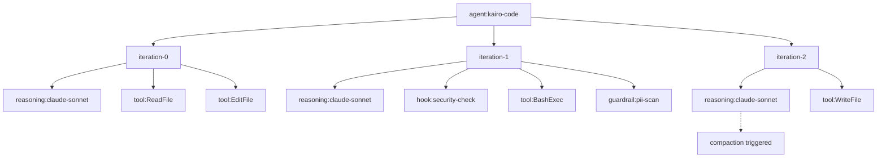
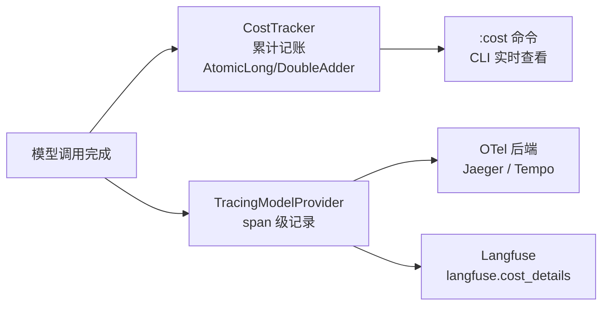

# 可观测性——Agent 的 strace 和 /proc

*当 Agent 的输出"不太对"，你怎么查？*

---

一个 Coding Agent 修了三个 bug，跑完测试说"全部通过"。你打开代码一看——修是修了，但方式很蠢：第一个 bug 用了一个 O(n²) 的循环解决一个可以 O(1) 查表的问题，第二个 bug 直接 catch Exception 吞了错误，第三个 bug 正确。

你想知道：Agent 在想什么？它看到了什么信息？做了什么决策？在哪一步走偏的？

如果这是一个微服务，你打开 Jaeger，看 trace，看日志，问题一目了然。但 Agent 不是微服务——它的"请求"是一段持续几十分钟的多轮推理，中间穿插了几十次工具调用、多次上下文压缩、若干次模型重试。标准的 HTTP trace 看不了这种东西。

Agent 需要自己的可观测性基础设施。这就是操作系统里 `strace` 和 `/proc` 文件系统的等价物——不是告诉你"服务健不健康"，而是告诉你"这个进程内部到底在干嘛"。

---

## Agent 可观测性和服务可观测性的区别

微服务的可观测性围绕三根支柱：Metrics（聚合数值）、Logging（离散事件）、Tracing（因果链路）。Agent 也需要这三根，但有几个根本性的不同。

**时间尺度不同。** 微服务的一次请求通常在毫秒到秒级完成。Agent 的一次"请求"可能跑半小时、经历 100+ 次工具调用。你需要的不是请求级的 trace，而是迭代级的——每一轮 ReAct 循环（推理 → 行动 → 观察）都是一个值得追踪的单元。

**成本是一等公民。** 微服务的可观测性很少关注单次请求花了多少钱。Agent 不一样——每次模型调用都在烧 token，每个 token 都有价格。一个跑偏的 Agent 十分钟能烧掉 50 美元。成本追踪不是"有了更好"，是必须实时可见的。

**因果链更深。** 微服务的 trace 通常是 request → handler → database → response。Agent 的 trace 是 agent → iteration-0 → reasoning → tool-call-1 → tool-call-2 → iteration-1 → reasoning → compaction → tool-call-3 → ...。嵌套层级和分支数都远多于普通服务。

**有隐私风险。** Agent 处理用户代码、执行 shell 命令、可能接触到 API key 和密码。这些内容如果原样写进 trace 或日志，就是数据泄漏。可观测性管线本身需要 PII 脱敏。

---

## Tracing：跟着 ReAct 循环走

Kairo 的 tracing 设计遵循一个原则：**span 的层级结构必须和 Agent 的执行结构一一对应。** 不是按 HTTP 请求拆 span，而是按 ReAct 循环的每一步拆。

span 树长这样：

```text
agent:kairo-code                           ← 根 span：一次完整的 Agent 调用
  ├── iteration-0                          ← 第一轮 ReAct 循环
  │     ├── reasoning:claude-sonnet-4-6  ← 模型推理
  │     ├── tool:ReadFile                  ← 工具调用
  │     └── tool:EditFile                  ← 工具调用
  ├── iteration-1
  │     ├── reasoning:claude-sonnet-4-6
  │     ├── hook:security-check            ← Hook 介入
  │     ├── tool:BashExec
  │     └── guardrail:pii-scan             ← 护栏检查
  ├── iteration-2
  │     ├── reasoning:claude-sonnet-4-6
  │     │     └── [compaction triggered]    ← 压缩事件
  │     └── tool:WriteFile
  ...
```



每个 span 类型对应 `Tracer` SPI 上的一个工厂方法：

```java
@Stable(since = "1.0.0")
public interface Tracer {
    Span startAgentSpan(String agentName);
    Span startIterationSpan(Span parent, int iteration);
    Span startReasoningSpan(Span parent, String modelName);
    Span startToolSpan(Span parent, String toolName);
    Span startHookSpan(Span parent, String hookName);
    Span startGuardrailSpan(Span parent, String policyName);
    // ...
}
```

`Tracer` 在 v0.3 标记为 `@Stable`，接口形状冻结了。实现可以换，接口不变。

### 三种实现

**`NoopTracer`**——零开销的默认实现。所有方法返回 `NoopSpan.INSTANCE`，没有任何分配。不装可观测性依赖的时候就用这个，Agent 运行时感受不到 tracing 的存在。

**`StructuredLogTracer`**——开发和测试用。每个 span 结束时往 SLF4J 打一条 INFO 日志，包含 span 名、耗时、属性。不需要外部基础设施，`tail -f` 就能看。

**`OTelTracer`**——生产用。接入 OpenTelemetry SDK，span 通过 OTLP 导出到 Jaeger、Grafana Tempo 或其他 OTel 后端。同时兼容 Langfuse——每个推理 span 上同时写 `gen_ai.usage.*`（OTel GenAI 语义约定）和 `langfuse.observation.*`（Langfuse 的自有 schema）。

### 上下文怎么传播

Agent 全栈都是 Reactor 响应式的，不能用 ThreadLocal。span 上下文通过 Reactor 的 `contextWrite` / `deferContextual` 传递：

1. `DefaultReActAgent.call()` 创建根 span，写入 Reactor Context
2. `ReActLoop.runSingleIteration()` 读取父 span，创建 iteration 子 span，覆盖 Context
3. `TracingModelProvider` 读取父 span，创建 reasoning 子 span
4. `DefaultToolExecutor` 读取父 span，创建 tool 子 span

`TracingModelProvider` 是一个装饰器——`AgentBuilder` 在构建时自动把用户传入的 `ModelProvider` 包一层。用户不需要手动处理 tracing，构建器帮你做了。

### SessionAwareTracer：给每个 span 盖章

`SessionAwareTracer` 也是一个装饰器，套在任何 `Tracer` 实现外面。它做一件事：在每个 span 上打 `session.id` 和 `user.id` 标签（同时打 Langfuse 格式的 `langfuse.session.id` 和 `langfuse.user.id`）。

这让你在 Jaeger 或 Langfuse 里能按 Session 维度筛选 trace——看一个用户的完整交互历史，而不是在几千条 trace 里大海捞针。

---

## Metrics：Agent 的仪表盘

Tracing 看个体，Metrics 看总体。Kairo 通过 Micrometer 暴露运行时指标，接 Prometheus + Grafana 就能画图。

核心指标分四组：

### Agent 调用

| 指标 | 类型 | 说明 |
|------|------|------|
| `kairo.agent.calls.active` | Gauge | 当前正在执行的 Agent 调用数 |
| `kairo.agent.calls.total` | Counter | 总调用数（按 agentName + success 分 tag） |
| `kairo.agent.call.duration` | Timer | 调用耗时分布 |

这三个指标来自 `AgentCallMetrics`，它实现了 `AgentCallObserver` 接口——一个 push-based 的回调，Agent 开始和结束时各 fire 一次。

### Agent 状态

| 指标 | 类型 | 说明 |
|------|------|------|
| `kairo.agents.active` | Gauge | 活跃 Agent 实例数 |
| `kairo.agents.running` | Gauge | 正在执行任务的 Agent 数 |
| `kairo.agents.idle` | Gauge | 空闲 Agent 数 |

来自 `AgentMetrics`，读的是 `AgentHealthRegistry` 的状态。可以做告警：`kairo.agents.active` 接近 `KAIRO_SESSION_POOL_SIZE` 时预警。

### Hook 链

| 指标 | 类型 | 说明 |
|------|------|------|
| `kairo.hooks.fired.total` | Counter | Hook 触发总数（按 phase + decision 分 tag） |
| `kairo.hooks.failures.total` | Counter | Hook 失败总数 |
| `kairo.hooks.duration` | Timer | Hook 执行耗时 |

这组指标帮你发现 Hook 性能问题——如果某个 Hook 的 P99 延迟突然升高，它可能在拖慢整个 Agent 的响应。

### 熔断器

| 指标 | 类型 | 说明 |
|------|------|------|
| `kairo.circuit_breaker.state` | Gauge | 当前状态（0=closed, 1=half-open, 2=open） |
| `kairo.circuit_breaker.trips_total` | Counter | 熔断触发次数 |
| `kairo.circuit_breaker.resets_total` | Counter | 恢复次数 |

熔断器状态翻转是高优告警信号——模型或工具的错误率已经高到触发保护了。

Micrometer 是 `<optional>` 依赖。不引入的话所有 metrics 退化为 no-op，不影响运行。

---

## 成本追踪：token 就是钱

Agent 的成本管理比微服务复杂得多。微服务跑在固定的基础设施上，成本是月度账单。Agent 的成本是每次对话的 token 消耗，实时变动、直接和用户行为挂钩。

`CostTracker` SPI 做累计记账：

```java
@Experimental("CostTracker SPI v0.10")
public interface CostTracker {
    void recordUsage(String model, ModelResponse.Usage usage);
    UsageSummary summary();
    void reset();
}
```

`DefaultCostTracker` 用 `AtomicLong` 和 `DoubleAdder` 做线程安全的累加。每次模型调用后，`ReActLoopContext` 里的 `CostTracker` 实例自动记录 input/output/cacheRead/cacheCreation token 数和估算的美元成本。

价格估算由 `ModelPricing` 处理，内置了 6 个提供商的定价表：

| 提供商 | 覆盖的模型 |
|--------|-----------|
| Anthropic | Haiku → Opus 4 |
| OpenAI | GPT-3.5 → GPT-5 |
| GLM（智谱）| GLM-4, 4.5, 5.1（CNY → USD，汇率 0.14） |
| Qwen（通义）| turbo, plus, max |
| DeepSeek | chat, coder |
| Gemini | 2.0-flash → 2.5-pro |

一个值得注意的细节：cache token 的定价不是简单的 input 价。Anthropic 的 cache-read token 按 input 价的 10% 计费，cache-creation token 按 125% 计费。`ModelPricing` 内置了这个逻辑。其他提供商如果有不同的 cache 定价模型，目前的估算会有偏差——这个定价表是硬编码的，没有动态更新机制。

成本数据有两条出路：`CostTracker.summary()` 给 CLI 的 `:cost` 命令用，span 级的 token/cost 属性给 Langfuse 和 OTel 后端用。



---

## Session 级指标：看一次完整对话

上面的 metrics 是全局聚合的。但调试具体问题时，你需要看**单次会话**的数据。

`AgentMetricsCollector` 维护一个 1000 条的环形缓冲区，每个 `AgentSessionMetrics` 记录了：

- 会话标识（agentId、agentName）
- 时间范围（startTime、endTime、durationMs）
- 资源消耗（totalTokensUsed、totalIterations、totalToolCalls）
- 工具明细（toolCallCounts，按工具名分 breakdown）
- 结果（succeeded、failureReason）

`AgentMetricsSummary` 在这 1000 条上做聚合：总调用次数、成功率、平均 token 消耗、平均迭代数。

Spring Boot Actuator 暴露了三个端点：

- `/actuator/agent` — Agent 名字、状态、工具列表
- `/actuator/agent-metrics` — 聚合摘要 + 最近 20 条会话详情
- `/actuator/agent-progress` — 当前正在跑的 Agent 的实时进度（迭代数、百分比、已用时间、token 数）

这些端点在生产环境里最实际的用途是：用户反馈"Agent 的回答很慢"时，你不用猜——打开 `/actuator/agent-progress` 就能看到它在第几轮迭代、已经用了多少 token、执行了哪些工具。

---

## PII 脱敏：可观测性管线本身的安全

Agent 的 trace 和日志里天然包含敏感信息——用户代码、shell 命令输出、可能还有 API key 和密码。如果 trace 原样导出到外部系统（Jaeger、Grafana Cloud），就是数据泄漏。

Kairo 在三个层面做脱敏：

**异常消息清洗。** `OTelTracer.sanitizeExceptionMessage()` 用正则匹配 email 地址和 API key 格式的字符串，替换为占位符，然后截断到 1024 字符。异常消息经常包含意外的敏感信息——比如数据库连接字符串、HTTP 响应体。

**span 属性白名单。** `OTelSpan.setAttribute()` 只接受在 `GenAiSemanticAttributes.allMappings()` 中注册过的 key。未注册的 key 直接丢弃并打 warning 日志。这防止了开发者不小心往 span 上写高基数的用户数据（比如把整个代码文件内容当 attribute 写进去）——这种事在 OTel 社区里不少见。

**事件导出脱敏。** `KairoEventOTelExporter` 在把事件转为 OTel LogRecord 之前，用可配置的正则对所有属性值做一轮 redaction。安全域（`KairoEvent.DOMAIN_SECURITY`）的事件全量导出，其他域走采样比率。

说实话，这套脱敏不算完善——正则匹配 API key 只能覆盖已知格式（`sk-*`、`key-*` 等），自定义格式的 secret 会漏。但至少兜住了最常见的泄漏路径。

---

## 行业做法

### Claude Code：纯本地日志

Claude Code 的可观测性基本是零——没有 tracing、没有 metrics、没有 Langfuse 集成。你能看到的就是终端输出。调试主要靠翻 `~/.claude/` 下的 JSONL 会话文件。

这和它"纯本地、无服务端"的定位一致。但对于需要在生产环境运行的 Agent 来说，这个方案不够。

### LangSmith / Langfuse：Agent 专用的 APM

LangSmith（LangChain 生态）和 Langfuse（开源替代）是目前最成熟的 Agent 可观测性方案。它们理解 LLM 调用的语义——不只是看 HTTP 请求，而是解析 prompt、completion、token 用量。

Kairo 选择了同时兼容 OTel（通用）和 Langfuse（Agent 专用）。`TracingModelProvider` 在每个推理 span 上同时写两套属性：`gen_ai.usage.*`（OTel GenAI 语义约定）和 `langfuse.observation.*`（Langfuse schema）。一套数据，两个后端都能收。

### OTel GenAI 语义约定

OpenTelemetry 社区在 2025 年底开始推 GenAI 专用的语义约定——`gen_ai.usage.input_tokens`、`gen_ai.request.model` 这些标准化的 attribute key。Kairo 的 `GenAiSemanticAttributes` 注册了 19 个映射，覆盖 token 用量、工具执行、模型身份、压缩事件、cache 命中等维度。

这套约定还在演进中，但方向是对的——如果所有 Agent 框架都用同一套 attribute key，跨框架的比较和监控工具就能做起来。

---

## 没解决的问题

**推理过程的可观测性。** 目前的 tracing 只覆盖了"Agent 做了什么"（调了哪个工具、花了多少 token），但看不到"Agent 在想什么"。模型的推理过程（thinking）是一个黑盒——你知道它输入了什么、输出了什么，但不知道中间的决策路径。有些提供商（Anthropic）支持导出 thinking token，但怎么结构化地记录和展示推理过程，我们还没想清楚。

**压缩对推理质量的影响量化。** 压缩引擎每次触发都在丢信息。但丢的信息对后续推理到底有多大影响？目前没有量化手段。理想状态是：每次压缩后记录一个"信息保留度"指标，和后续的任务成功率做关联。但"信息保留度"怎么定义和测量，本身就是一个开放问题。

**成本异常检测。** `CostTracker` 做的是累计记账，但不做异常检测。一个跑偏的 Agent 可能在十分钟内烧掉 100 美元的 token。需要一个实时的成本速率监控——当 token 消耗速率超过阈值时主动告警甚至中断执行。Hook 系统可以做这件事（`PreModelCall` 里检查 `CostTracker.summary()`），但框架还没有提供开箱即用的实现。

**跨 Agent 的关联追踪。** 单 Agent 的 trace 已经做好了。但多 Agent 场景下（Expert Team、A2A 协作），Leader 和 Worker 之间的因果关系怎么在 trace 里体现？需要跨 Agent 传递 trace context（类似微服务的 W3C Trace Context），目前还没有实现。

---

可观测性是那种没做好的时候你不觉得缺，出了问题的时候你恨不得什么都能看到的东西。Agent 的调试比微服务难，因为你面对的不是确定性的代码路径，而是一个概率性的推理过程——同样的输入，不同的模型温度可能走出完全不同的路径。在这种非确定性系统里，trace 和 metrics 不是"锦上添花"，是你理解系统行为的唯一可靠途径。

*下一篇：《从 CLI 到桌面——kairo-code 的诞生》*

---

**参考**

1. [OpenTelemetry GenAI Semantic Conventions](https://opentelemetry.io/docs/specs/semconv/gen-ai/) — AI/LLM 专用的标准化 attribute key
2. [Langfuse](https://langfuse.com/) — 开源 Agent 可观测性平台
3. [Micrometer](https://micrometer.io/) — JVM metrics facade
4. OWASP, "Agentic AI Top 10 Threats," 2026 Edition — Agent 安全威胁中的数据泄漏风险
