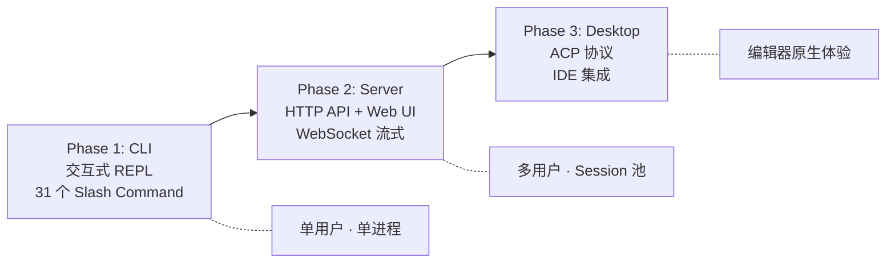

# 从 CLI 到桌面——kairo-code 的诞生

*用自己的框架构建一个 Coding Agent*

框架如果不被真实产品验证，很容易变成自娱自乐。

我知道这话听着像老生常谈。但当你真的把自己写的框架拿来构建一个生产级应用时，你会发现它是一面相当残忍的镜子。框架层面觉得"优雅"的 SPI 设计，到了应用层面可能根本不够用，或者多出了不必要的复杂度。

Kairo 从第一天起就不只是一个框架。我同时在构建一个完整的 Coding Agent——kairo-code。它有 56 个工具、支持 4 家模型厂商、提供 CLI 和桌面两种交互形态、具备多 Agent 协作能力。做这件事的目的是回答一个问题：**Kairo 这个框架，能不能承载一个 Claude Code 量级的应用？**

如果不能，框架的 SPI 设计就需要改。如果能，框架才有底气说自己是"Agent 操作系统"。

## 三个阶段的进化

kairo-code 不是一开始就有桌面应用的。它经历了三个阶段，每个阶段暴露了框架的不同短板。



### 第一阶段：CLI（REPL）

最简单的形态。一个终端循环：读取用户输入，发送给 Agent，把结果打印到终端。

```bash
java -jar kairo-code-cli.jar
```

```text
Kairo Code v0.1.0
Model: claude-sonnet-4-20250514
Working directory: /home/user/project

> 创建一个 Calculator Java 类，包含加减乘除方法，并编写 JUnit 5 测试。
```

不需要 Web 服务器，不需要数据库，不需要 Docker。一个 JVM 进程，一个 API Key，你就有了一个能读写文件、执行命令、运行测试的 Coding Agent。

CLI 阶段暴露了框架的第一批问题。

最直接的是流式输出。Agent 的推理过程可能持续 30 秒。如果用户看不到中间过程——只是盯着一个没有反应的光标——体验是不可接受的。框架的 `Agent` 接口只有 `Mono<Msg> call(Msg)`，返回的是最终结果。我不得不通过 Hook 的 `PostReasoning` 和 `PostToolExecute` 事件来拦截中间输出，手动推送到终端。

这是 kairo-code 发现的第一个框架缺陷：**Agent 接口缺少 streaming API**。一个 `Flux<AgentEvent> callStream(Msg)` 才是 Coding Agent 真正需要的契约。这个 issue 被记录在 Dogfood Log 里，优先级 P1。

另一个问题是工具审批。CLI 模式下，`ConsoleApprovalHandler` 用 `System.in` 读取用户输入。但 Java 的 `System.in` 读取在某些终端下无法被取消——线程会永久阻塞在 `readLine()` 上，导致资源泄漏。kairo-code 侧先用 JLine3 的非阻塞输入绕过了这个问题，然后把 bug 报回框架。

Dogfooding 的日常就是这个循环：发现问题 → 在应用侧 workaround → 把问题报回框架 → 框架修复 → 应用侧移除 workaround。

CLI 阶段的 REPL 循环映射到 Kairo 的 ReAct 引擎：

```text
用户输入
    │
    ▼
命令分发 ──── 斜杠命令？ ──── 本地处理（/plan、/clear、/exit）
    │
    │（自然语言）
    ▼
Agent.call(userMessage)
    │
    ▼
┌─────────────────────────────────────────────┐
│           ReAct 循环（kairo-core）            │
│                                             │
│   推理 ──► 工具选择 ──► 执行                  │
│    ▲                       │                │
│    └────── 观察 ◄──────────┘                │
│                                             │
│   重复直到：产生答案 / 达到最大迭代次数          │
└─────────────────────────────────────────────┘
    │
    ▼
流式输出 ──► 终端渲染器
```

每一次迭代：模型产生思考和工具调用，`DefaultToolExecutor` 执行工具（受权限守卫约束），工具结果作为观察追加到上下文。如果上下文超出 token 预算，6 阶段压缩引擎自动介入（详见第二篇）。整个过程是 kairo-core 的 `ReActLoop` 在驱动，kairo-code 只做了一件事：把结果渲染到终端。

框架承担了绝大部分基础设施工作，应用层只关心交互。这是我们希望看到的分工。

### 第二阶段：Server（Bridge SPI + WebSocket）

CLI 够用，但 IDE 集成需要更多。

VS Code 扩展、JetBrains 插件——它们不是终端。它们需要与 Agent 建立双向通信：发送请求、接收流式响应、查询 Agent 状态、中断正在执行的任务。HTTP 请求-响应不够，单向 SSE 也不够。

框架此时只有单向的事件流——`kairo-event-stream` 模块提供了 transport-agnostic 的事件总线，`kairo-event-stream-sse` 提供了 SSE 传输。但 IDE 集成需要的是双向的 WebSocket 会话：客户端发送 prompt，服务端流式返回 Agent 事件；客户端发送中断信号，服务端优雅取消当前任务。

Bridge SPI 就是在这个需求下催生的——kairo-code 催生的第一个新 SPI。Bridge SPI 定义了 5 个操作目录——IDE 请求（打开文件、执行命令、应用编辑）被转换为 Kairo Agent 调用，结果通过 WebSocket 流式回传。`kairo-event-stream-ws` 作为 WebSocket 传输层实现了 Bridge SPI 的默认 impl。

```text
┌──────────────┐     WebSocket      ┌───────────────────┐
│   VS Code    │◄──────────────────►│                   │
│   扩展        │                    │  kairo-code-server │
│              │                    │  （Bridge SPI）     │
└──────────────┘                    │                   │
                                    │  ┌─────────────┐  │
┌──────────────┐     WebSocket      │  │ kairo-code-  │  │
│  JetBrains   │◄──────────────────►│  │   core       │  │
│   插件        │                    │  └─────────────┘  │
└──────────────┘                    └───────────────────┘

┌──────────────┐     stdio (ACP)
│     Zed      │◄──────────────────► kairo-code-cli（ACP 模式）
└──────────────┘
```

kairo-code-server 模块就是 Bridge SPI 的产物——一个 WebSocket 服务器，暴露编程 Agent 的全部能力给外部客户端。

### 第三阶段：Desktop（React 桌面工作台）

Server 阶段解决了 IDE 集成，但我还想要一个独立的桌面应用——不依赖任何 IDE，自成一体的 Coding Agent 工作台。

桌面应用使用 React + Tailwind + Zustand 构建，布局借鉴了 VS Code 的经验：

- **活动栏**（Activity Bar）：左侧图标导航
- **主侧边栏**（Primary Sidebar）：文件浏览器、搜索、源代码管理
- **编辑区**（Editor Area）：多标签页，代码预览
- **聊天侧边栏**（Chat Sidebar）：Agent 对话主界面
- **底部终端**（Terminal）：直接执行命令

桌面应用引入了几个 CLI 没有的交互模式：

**Expert Team Canvas**——多 Agent 协作的实时可视化。当你让 kairo-code 执行复杂任务时，它可以派生子 Agent：一个负责规划（plan），一个负责代码生成（generate），一个负责代码评审（evaluate）。三个 Agent 通过 `TeamCoordinator` SPI 协调，Canvas 实时展示它们的对话流和依赖关系。

**自进化侧边栏**——Agent 从每次会话中学习。每次会话结束后，kairo-code 通过 Hook 系统检测用户偏好和反馈信号，自动写入 `.kairo/memory/`。下次会话启动时，这些记忆被注入 system prompt，Agent 的行为逐渐适应用户的工作习惯。

**三种审批模式**——Manual（每次都问）、Auto-safe（只有写操作才问）、YOLO（全部自动批准）。底层是 Hook 的 `PreToolExecute` 事件和 `PermissionGuard` 的组合——框架提供机制，应用定义策略。

桌面阶段对框架的考验最深：它要求框架同时支持命令行和图形界面两种交互范式，同时支持单 Agent 和多 Agent 两种运行模式，同时支持单项目和多项目两种工作空间。每一个"同时"都在检验 SPI 的抽象有没有泄漏。

## 56 个工具，11 个类别

kairo-code 的工具数量从最初的 6 个增长到 56 个。每一个工具都在使用 Kairo 的某个 SPI——工具是框架能力的具象化。

| 类别 | 工具 | 对应的 Kairo SPI |
|------|------|-----------------|
| 文件操作（13 个） | Read、Write、Edit、Glob、Grep、Tree、Diff、BatchRead、BatchWrite、SearchReplace、PatchApply、JsonQuery、TemplateRender | ToolExecutor + WorkspaceProvider（路径穿越防御） |
| 命令执行（5 个） | Bash、Monitor、Mvn、Sleep、VerifyExecution | ExecutionSandbox SPI（LocalProcessSandbox 默认实现） |
| Web（4 个） | WebFetch、WebSearch、Http、OpenApiHttp | ToolExecutor + OpenAPI Tool Registration |
| Git（2 个） | Git、Github | ToolExecutor |
| 交互（1 个） | AskUser | Human-in-the-Loop 审批 |
| 技能（3 个） | SkillList、SkillLoad、SkillManage | SkillStore SPI + SkillRegistry |
| Agent 操作（11 个） | AgentSpawn、SendMessage、TeamCreate、TeamDelete、TaskCreate、TaskGet、TaskList、TaskUpdate、TodoRead、TodoWrite、Workflow | TeamCoordinator SPI + MessageBus + A2A Protocol |
| 计划模式（3 个） | EnterPlanMode、ExitPlanMode、ListPlans | ToolSideEffect 分类（PLAN 模式下 WRITE 工具被阻止） |
| 记忆（6 个） | MemoryRead、MemoryWrite、MemoryDelete、TeamMemoryRead、TeamMemoryWrite、TeamMemoryDelete | MemoryStore SPI |
| 定时任务（7 个） | CronCreate、CronDelete、CronEdit、CronList、CronPause、CronResume、CronTrigger | Cron 模块 |
| 代码智能（1 个） | Lsp | LspService SPI（snapshotBaseline + notifyChange + diagnosticsSince） |

这张表有一个隐含的信息：kairo-code 没有发明任何新的工具执行机制。所有 56 个工具都通过 `DefaultToolExecutor` 执行，都遵守读写分区（READ_ONLY 并行 / WRITE 串行），都受熔断器保护，都经过 Hook 生命周期的 `PreToolExecute` / `PostToolExecute` 拦截。

kairo-code 做的是装配——把 Kairo 框架的 SPI 组装成一个可运行的编程 Agent。和任何应用使用框架的方式完全一致。

```java
// kairo-code-core 的 Agent 装配——不修改框架，只配置和组装
kairo-code-core
  ├── kairo-core          （ReAct 引擎、上下文压缩、模型提供者）
  ├── kairo-tools         （17+ 框架级工具，扩展到 56 个）
  ├── kairo-mcp           （MCP 协议，连接外部工具服务器）
  ├── kairo-multi-agent   （A2A 协议、TeamCoordinator、MessageBus）
  ├── kairo-skill         （技能注册与加载）
  ├── kairo-plugin        （插件系统，Claude Code 格式兼容）
  └── kairo-observability （OpenTelemetry 追踪，可选）
```

如果 kairo-code 需要修改框架内部才能实现某个功能，那说明框架的 SPI 设计有问题——这时候我改的是框架，不是在应用层打补丁。

## 四个被 kairo-code 逼出来的 SPI

这可能是 dogfooding 最有价值的产出——不是 kairo-code 本身，而是它催生的框架能力。

### 1. WorkspaceProvider SPI

kairo-code 需要多项目切换。用户在项目 A 工作一小时，然后 `cd ../project-b` 继续工作。Agent 必须知道"当前工作空间"在哪里——文件路径的相对解析、安全边界的定义、`.kairo/` 配置目录的位置，都依赖于工作空间根目录。

框架原本没有"工作空间"的概念。`ToolExecutor` 接收路径参数，直接操作文件系统。没有根目录，没有路径穿越防御，没有项目边界。

kairo-code 的需求逼出了 `WorkspaceProvider` SPI——路径解析、路径穿越防御、工作空间元数据查询。Agent 的所有文件操作都通过 WorkspaceProvider 中转，确保不会越过项目边界。

### 2. Bridge SPI

前面已经说过。IDE 集成需要双向通信，框架只有单向事件流。kairo-code 的 VS Code 和 JetBrains 集成需求直接催生了 Bridge SPI 和 `kairo-event-stream-ws` 模块。

这个 SPI 的设计经历了两次迭代。第一版是紧耦合的——WebSocket 的 session 管理直接写在传输层里。第二版抽象出了 Bridge SPI 作为传输无关的接口，WebSocket 只是它的一个实现。如果未来需要 gRPC 传输，只需要新增一个实现，不需要改 Agent 代码。

### 3. ACP（Agent Client Protocol）

Zed 编辑器的集成需求更特殊。Zed 不想通过 WebSocket 连接服务器——它想把 kairo-code 作为子进程启动，通过 stdin/stdout 上的 JSON-RPC 通信。这和 Language Server Protocol 的通信方式一样。

框架没有这个能力。于是 `AcpAgent` SPI 诞生了——定义了 `initialize`、`session.new`、`session.prompt` 三个 JSON-RPC 方法，让编辑器通过 stdio 驱动 Kairo Agent。这是一个 `@Experimental` 的 SPI，还在 MVP 状态，但它至少证明了 Kairo 的 Agent 可以被进程间通信驱动，不局限于 HTTP/WebSocket。

### 4. LspService SPI

这个是最有意思的。

kairo-code 在编辑代码后，需要知道：**这次编辑是否引入了新的错误？**

不是"代码里有没有错误"——那是 LSP 已经能做的事。而是"编辑前有 3 个错误，编辑后有 5 个错误，新增了 2 个"。这需要在编辑前拍快照（baseline），编辑后做 diff。

框架没有这个能力。于是 `LspService` SPI 出现了，提供三个方法：`snapshotBaseline`（编辑前快照）、`notifyChange`（通知编辑发生）、`diagnosticsSince`（返回新增的诊断信息）。配套的 `LanguageServerRegistry` 按文件扩展名路由到对应的语言服务器。

这个 SPI 不是给模型用的——它是给工具实现挂载的。Write 工具和 Edit 工具在执行后调用 `diagnosticsSince`，把"是否引入新错误"作为工具结果的一部分返回给 Agent。Agent 不需要显式调用 LSP——诊断信息自动附加在编辑结果中。

四个 SPI 有一个共同点：它们都是被需求逼出来的，不是事先设计好的。没有 kairo-code 的真实场景驱动，这些抽象不会存在。坐在那里想是想不到"编辑器想通过 stdio 驱动 Agent"这种需求的——只有当你真的去集成 Zed 时才会发现框架缺了什么。

## 与 Claude Code 的同与异

kairo-code 不是 Claude Code 的克隆。但它深受 Claude Code 的影响——我逆向研究了 Claude Code 的架构，理解了它的设计选择，然后在 Kairo 框架上重新实现了基本范式。

**相同的地方：**

- **ReAct 循环**：推理 → 工具选择 → 执行 → 观察，重复直到产生答案。这是 Coding Agent 的基本范式，两者完全一致。
- **工具权限三态模型**：ALLOWED / ASK / DENIED。Claude Code 的实现和 Kairo 的 `PermissionGuard` 在概念上同构。
- **Plan 模式**：进入规划阶段时，写操作工具被禁止。Agent 只能读取和分析，产出计划文档。两者都用 `ToolSideEffect` 分类来实现这一约束。
- **技能系统**：Markdown 格式的可扩展能力，运行时注入 system prompt。Claude Code 的 Skill 文件和 Kairo 的 `SkillDefinition` 在文件格式上是兼容的。
- **上下文压缩**：Claude Code 5 层管线，Kairo 6 阶段引擎，基本思路一致——渐进压缩，按信息密度从低到高的顺序删除。
- **插件系统**：Kairo 读取 Claude Code 格式的插件文件（`plugin.json`、`SKILL.md`、`hooks.json`、`.mcp.json`），schema 共享。

**不同的地方：**

| 维度 | Claude Code | kairo-code |
|------|------------|------------|
| 运行时语言 | TypeScript | Java（全链路 JVM） |
| 模型支持 | 仅 Anthropic Claude | Claude + GPT + GLM + Qwen |
| 治理能力 | 29 个 Hook 事件 | 30 个 Hook 生命周期点 × 5 种决策值 |
| 可扩展性 | 闭源，不可扩展 | SPI 驱动，所有能力可替换 |
| 自进化 | 无 | 会话学习 + 记忆积累 + Hook 行为优化 |
| 多 Agent | Leader-Worker（磁盘 IPC） | TeamCoordinator SPI + A2A 协议 + 进程内 MessageBus |
| 部署方式 | 云端 + CLI | 本地自托管（JAR / 桌面应用） |

核心差异可以用三个词概括：**Same Models. Governable.**

你可以用同样的基础模型——Claude Sonnet、Claude Opus。但在 kairo-code 中，你拥有治理权。30 个 Hook 生命周期点、5 种决策值、中间件管道、熔断器、循环检测——这些是你作为运营者控制 Agent 行为的手段。

在 Claude Code 中，如果你想在每次 Bash 工具执行前检查命令是否包含 `rm -rf`，你只能依赖 Claude Code 内置的安全分类器。在 kairo-code 中，你写一个 Hook：

```java
@PreToolExecute
public HookDecision guardDangerousCommands(ToolCall call) {
    if ("Bash".equals(call.toolName())) {
        String cmd = call.arguments().get("command").asText();
        if (cmd.contains("rm -rf")) {
            return HookDecision.abort("Dangerous command blocked: " + cmd);
        }
    }
    return HookDecision.continueExecution();
}
```

"可治理"说白了就是：不是信任模型一定会做对的事，而是在机制层面兜底。

## Web UI 的故事

桌面应用的 UI 不是 Java 写的。它用 React + Tailwind CSS + Zustand 构建，通过 WebSocket 与 kairo-code-server 通信。

布局借鉴了 VS Code 的成熟模式：

- **左侧活动栏**：文件浏览器、搜索、源代码管理、自进化、Hook 配置五个入口
- **主内容区**：聊天 Agent 界面，支持 Markdown 渲染、代码语法高亮、工具调用可视化
- **底部面板**：终端输出、工具统计仪表盘
- **右侧面板**（可选）：Expert Team Canvas

Expert Team Canvas 值得单独说一下。当 kairo-code 使用多 Agent 模式时——比如 plan-generate-evaluate 三 Agent 协调——Canvas 会实时展示：

- 每个 Agent 的当前状态（推理中 / 等待工具 / 完成）
- Agent 之间的消息传递（谁把什么发给了谁）
- 任务依赖图（哪些任务在等待哪些前置任务）

这不是装饰。调试多 Agent 系统最大的痛苦是"看不见发生了什么"——三个 Agent 在后台并发执行，你只看到最终结果。如果结果不对，你不知道是哪个 Agent 在哪一步出了问题。Canvas 让整个协作过程可见。

会话管理也做了不少工作：多标签页（同时进行多个对话）、跨会话搜索（在历史会话中搜索关键词）、快照持久化（通过 `AgentSnapshot` 序列化 Agent 状态，关闭后重新打开可以恢复）。这些功能底层都依赖 Kairo 框架的 `FileSessionStorageProvider` 和 `SnapshotStore` SPI。

浅色和深色主题做了。审批模式的可视化切换做了。设置页面（模型选择、API Key 配置、集成管理）也做了。

坦白说，Web UI 的工作量超出了我最初的预期。一个 Coding Agent 的根本价值在于它的 Agent 能力，不在于 UI。但现实是，如果 UI 不好用，用户不会给你的 Agent 能力一个机会。这是产品工程和框架工程的区别——框架可以只关心 API 设计，产品必须关心用户的第一印象。

## kairo-assistant：另一面的验证

一个框架只被一种应用验证是不够的。

kairo-code 证明了 Kairo 能承载 Coding Agent。但 Coding Agent 有其特殊性——CLI 交互、文件读写、代码生成，这些场景对框架的考验集中在工具执行和上下文压缩上。换一个截然不同的领域会怎样？

kairo-assistant 是基于 Kairo 构建的第二个产品——一个 SRE 运维 Agent。不写代码，诊断故障。不操作文件，操作告警。不面向开发者，面向值班工程师。

50+ 个工具，横跨五大类：告警诊断（FullGC、CPU、内存、HSF 成功率）、变更管理（发布关联、灰度回滚）、容量规划（水位预测、扩缩容建议）、知识检索（文档搜索、历史故障匹配）、日常巡检（健康检查、指标采集）。每一个工具通过 `DefaultToolExecutor` 执行，遵守同样的读写分区、熔断保护、Hook 生命周期拦截——和 kairo-code 的 56 个工具走的是完全相同的通路。

但 kairo-assistant 对框架的考验角度不同。

**8 个 IM 通道**。DingTalk（Webhook + Stream Mode SDK 双模）、飞书/Lark、Slack、Telegram、Discord、Mattermost、Generic Webhook——运维 Agent 不活在终端里，它活在告警群里。值班工程师收到告警时，打开的不是 IDE，是聊天窗口。Agent 必须在那里等着。

8 个通道意味着 8 种消息格式、8 种认证方式、8 种限流策略。DingTalk 的消息卡片和 Slack 的 Block Kit 是两套完全不同的 UI 体系。Telegram 的 Markdown 子集和 Discord 的 Embed 是两种截然不同的富文本方案。如果每个通道都写一套 Agent 逻辑，代码量会爆炸。

Gateway/Channel 架构就是被这个痛点逼出来的。

**Channel SPI** 是瘦适配器——每个 IM 平台实现四个方法：`connect`（建立连接）、`disconnect`（断开连接）、`onInbound`（接收消息）、`send`（发送消息）。Channel 不管会话状态、不管路由逻辑、不管消息格式转换。它只做一件事：把 IM 平台的消息格式转成 Kairo 的 `InboundMessage`，把 Kairo 的 `OutboundMessage` 转成 IM 平台的消息格式。

**Gateway** 是 Channel 之上的编排层。路由——根据消息内容分发到不同的 Agent。会话管理——同一个用户在同一个群里的多轮对话共享上下文。流式回传——Agent 的推理过程实时推送到聊天窗口。Mirror——所有消息以 append-only NDJSON 格式持久化到 `MirrorStore`，用于事后的故障回放。Pairing——一条告警消息同时发到 DingTalk 和 Slack，两个通道的用户看到的是同一个 Agent 会话。

`PlatformCapabilities` 处理优雅降级。Telegram 不支持消息卡片？降级为纯文本加 inline keyboard。Discord 的 Embed 长度有限？自动拆分为多条消息。Generic Webhook 只能发 JSON？那就发 JSON，不做渲染。每个 Channel 实现声明自己的能力集，Gateway 据此决定消息的呈现策略。

用操作系统的类比来说，Channel 是网卡驱动，Gateway 是 TCP/IP 协议栈。

kairo-assistant 还验证了框架的另外两个能力。

**多 Agent 看板**。运维场景天然是多 Agent 的——一个 Agent 诊断 CPU 告警，另一个查关联变更，第三个检查上游依赖。`TeamCoordinator` SPI 管理任务依赖和 Swarm 拓扑，看板实时展示每个 Agent 的状态和进度。如果某个 Agent 连续失败，熔断器自动触发，任务被重新分配。

**Cron 调度**。值班不是等告警来了才反应——每天早上 9 点跑一次全量健康巡检，每周五下午生成容量报告，每月初汇总故障统计。`CronScheduler` 按 cron 表达式触发 Agent 任务，通过 `DeliveryTarget` 把结果投递到指定的 IM 通道和群组。本质上是定时执行 Agent，不是定时执行脚本——Agent 会推理、调用工具、产出结构化报告。

**React 管理控制台**。会话列表、Cron 任务管理、自进化历史、插件市场、使用量分析——运维团队需要看到 Agent 在干什么、干得怎么样、花了多少钱。控制台通过 OpenAI 兼容 API 与 kairo-assistant 通信——是的，kairo-assistant 暴露了一套 OpenAI 兼容端点，任何 OpenAI 客户端都可以直接对接。

**自进化**在运维场景尤其有价值。一次 FullGC 告警的诊断过程被 Hook 记录下来——查了哪些指标、调用了哪些工具、最终的根因是什么。下次同类告警出现时，Agent 不需要从零推理，它已经有了一个可复用的诊断技能。故障驱动学习，经验自动沉淀。

如果 kairo-code 证明了框架能承载 Code Agent，kairo-assistant 证明了同一个框架能承载形态完全不同的 Agent——从 CLI 到 8 通道 IM 集成，从编码到运维，SPI 的抽象层没有泄漏。至少到目前为止还没有。

## 流式执行：模型还在想，工具已经跑

传统的 Agent 执行流程是串行的：等模型吐完全部 token → 解析出工具调用 → 执行工具 → 把结果拼回去。整个过程像流水线上的批处理——前一步不完成，后一步不开始。

结果就是一个很别扭的等待：模型花 3 秒决定调用 `Read` 工具读一个文件，但你需要等它把后续 200 个 token 的推理文本全部生成完毕，才能开始读那个文件。文件读取本身只需要 5 毫秒，但用户感知到的延迟是 3 秒 + 5 毫秒。3 秒在等模型想完，5 毫秒在干活。

Kairo 的做法不同。

`StreamingToolDetector` 是中枢。它使用 `Flux.scan` 配合可变的 `DetectorState`，从模型的 SSE 流中增量检测完整的 tool_use 块。不等全部 token 到齐，不等响应结束。每到达一个 `TOOL_USE_END` 事件块，对应的工具调用立即被发射到下游执行——此时模型可能还在流式输出第二个、第三个工具调用。

配合 `ToolPartitioner`，效果更进一步。`ToolPartitioner` 在流式阶段就对检测到的工具做读写分类。如果一个工具是 `READ_ONLY` 的——比如 `Read`、`Glob`、`Grep`——它的执行可以与模型的后续流式输出并行。写操作仍然等待完整响应后串行执行，保证一致性。但读操作——占工具调用的 60% 以上——不需要等。

边界情况不少。

**空工具调用 ID**。某些模型 provider 在流式块中不附带 tool call ID。`DetectorState` 退化到"最老的活跃工具"策略——按时间戳排序，假设最先开始的工具最先结束。不完美，但比崩溃好。

**重复的 TOOL_USE_END**。OpenAI 兼容 provider 偶尔对同一个工具发送两次结束信号。`completedToolIds` 集合跟踪已完成的工具 ID，重复的结束事件被静默忽略。

**工具名延迟到达**。有时工具名不在第一个流式块里，而是在后续块中才出现。`DetectorState` 用占位符缓冲这些"无名工具"，等名字到达后再补全。如果名字始终没来，占位符被用作工具名——下游的 `DefaultToolExecutor` 会因为找不到注册的工具而返回错误，而不是静默吞掉。

用户感知到的差异很大。原来的体验：模型思考 3 秒（无反馈）→ 工具开始执行（终端突然冒出一堆输出）。现在的体验：模型开始思考 → 几百毫秒后第一个工具已经在跑 → 推理文本和工具执行交替出现。Agent 感觉像是在"边想边做"，而不是"想完再做"。

操作系统里的类比是 DMA（Direct Memory Access）。传统方式是 PIO（Programmed I/O）——CPU 发起 I/O 请求，然后轮询等待设备完成，期间什么也干不了。DMA 是 CPU 发起请求后继续执行指令，设备独立完成数据传输，完成后中断通知 CPU。在 Kairo 里，模型是 CPU，工具是 I/O 设备。`StreamingToolDetector` 就是 DMA 控制器——让模型和工具并行工作，而不是串行等待。

这个优化用户不会意识到具体机制，但体验上的差异是实打实的。

## dogfooding 的代价

### Dogfooding 的价值

一个数字值得记录：**Kairo 框架 80% 的 API 是被 kairo-code 的需求驱动出来的。**

不是先设计一个完美的 SPI，再让应用来使用它。而是先在 kairo-code 中发现需求——"我需要双向通信"、"我需要工作空间隔离"、"我需要编辑后的错误 diff"——然后回到框架层面设计 SPI。

这种"需求前置"的设计方式产出了 4 个新 SPI（WorkspaceProvider、Bridge、ACP、LspService），暴露了 2 个框架 bug（streaming API 缺失、ConsoleApprovalHandler 资源泄漏），催化了 1 个新传输模块（kairo-event-stream-ws）。

如果没有 kairo-code，这些东西不会存在。

### 代价

不过 dogfooding 的代价也很实在：你在同时维护两个产品。

Kairo 框架的 SPI 变了，kairo-code 的装配层就得跟着改。kairo-code 发现了新需求，Kairo 框架就得新增 SPI——然后所有已有的测试都要验证新 SPI 没有破坏老行为。两个项目的迭代周期相互耦合，每一次框架重构都有两倍的影响半径。

从 v0.1.0 到 v0.12.0，Kairo 经历了 31 个 Maven 模块、30 个 ADR、2500+ 个测试。kairo-code 同步迭代了 4 个模块、56 个工具、CLI + Server + Desktop 三种交互形态。工程量是单独做一个产品的两倍不止。

### 一件挺讽刺的事

kairo-code 是用 Kairo 框架构建的，但它也是用 Claude Code 帮忙写的。

用一个 Coding Agent 来构建另一个 Coding Agent——听着挺奇怪。但没什么深刻的理由，纯粹实用主义。Claude Code 是目前最好用的 Coding Agent 工具，我当然会用它来加速开发。

不过这也形成了一个有意思的验证目标：如果 kairo-code 有一天达到了 Claude Code 的能力水平，那它应该能用来构建下一个版本的自己。这是自举（bootstrapping）——编译器用自己编译自己，Agent 用自己构建自己。

还没到那个点。但方向是明确的。

## 模块全景

kairo-code 由四个模块组成，职责边界清晰：

```text
kairo-code/
├── kairo-code-cli         — REPL 界面、终端渲染、命令分发
├── kairo-code-core        — Agent 配置、工具装配、技能加载、会话管理
├── kairo-code-server      — Bridge SPI 服务器（WebSocket），用于 IDE 集成
└── kairo-code-examples    — 示例配置和用法演示
```

**kairo-code-core** 是核心。它不包含任何 Agent 逻辑——Agent 逻辑全在 kairo-core 中。kairo-code-core 做的是装配：用合适的模型提供者、工具集、技能和 Hook 构建一个 `DefaultReActAgent`。把 56 个工具注册到 `DefaultToolRegistry`。从工作空间和用户级目录加载 Markdown 技能。配置 `FileSessionStorageProvider` 实现对话持久化。

**kairo-code-cli** 是用户交互层。REPL 循环、Markdown 格式化、语法高亮、工具审批提示、斜杠命令解析——这些是终端体验的问题，不是 Agent 逻辑的问题。

**kairo-code-server** 是对外暴露层。WebSocket 端点、Bridge SPI 路由、IDE 客户端会话管理——这些是 I/O 边界的问题。

这种分层和 Kairo 框架自身的分层一致：API 层定义契约（kairo-api）、Core 层实现逻辑（kairo-core）、Capabilities 层提供能力（kairo-capabilities）、Transports 层处理 I/O（kairo-transports）。kairo-code 的四个模块是这种分层在应用层面的映射。

## 多模型支持

kairo-code 不绑定任何一家模型厂商。这是和 Claude Code 最明显的差异之一。

| 提供者 | 模型 | 集成方式 |
|--------|------|----------|
| Anthropic | Claude Opus、Sonnet、Haiku | 原生 `AnthropicModelProvider` |
| 智谱 AI | GLM-4 系列 | OpenAI 兼容适配器 |
| 阿里 DashScope | Qwen 系列 | OpenAI 兼容适配器 |
| OpenAI | GPT-4o、GPT-4 等 | OpenAI 兼容适配器 |

模型切换是透明的——`ModelProvider` SPI 抽象了模型调用的细节。kairo-code 只调用 `modelProvider.call(messages, config)`，不关心底层是 Anthropic 的原生 API 还是 OpenAI 兼容端点。

当然，不同模型的能力差异是客观存在的。Claude Sonnet 在代码理解和长上下文推理上表现最好，GLM-4 在中文场景下有优势，Qwen 在特定领域有差异化能力。kairo-code 的 `ModelCatalog` SPI 负责模型名 / 别名到 provider + 能力的解析——应用可以根据任务类型自动路由到最适合的模型。

多模型支持的价值在于自主权。你的 Agent 不应该被一家厂商的 API 绑定。模型会降价、会升级、会宕机。当某家厂商的 API 不可用时，你需要能够切换到备选模型。这是生产环境的底线需求。

## 量化验证：SWE-bench 与测评体系

kairo-code 的能力需要量化验证。我们用了 SWE-bench——当前 Code Agent 最权威的评测基准。它从真实的 GitHub issue 出发，要求 Agent 定位 bug、理解代码、生成 patch。每个用例都有对应的测试套件验证 patch 的正确性。

### SWE-bench Verified

kairo-code 接入了 SWE-bench 评测，通过外部 `kairo-code-eval` 仓库驱动。评测协议定义在 `external-runner-protocol.md` 中：CLI fat jar 模式执行，退出码语义明确（0=成功，1=配置错误，2=超时，130=中断），每次会话结束写 `KAIRO_SESSION_RESULT.json` 包含迭代次数、token 用量、耗时等指标。

跑 SWE-bench 暴露了两类典型失败模式。regression fixture 目前追踪了两个：

- `pytest-dev__pytest-5787`：Agent 38 秒退出，空 diff——过早放弃
- `sphinx-doc__sphinx-8548`：Agent 跑了 51 分钟，空 diff——过度探索

这两个案例直接推动了 Continuation Strategy 和 LoopDetector 的改进。38 秒早退的问题用 PendingTodoNudge 可以缓解；51 分钟过度探索的问题用无进展检测（第五层 LoopDetector）可以捕获。

### Cross-Executor 基准对比

除了 SWE-bench，kairo-code 还有一个交叉对比基准：在相同的 bug 修复任务上，同时运行 kairo-code 和 Claude Code CLI，对比退出码、耗时、测试通过率、工具调用次数、token 用量和估算成本。结果输出为 Markdown 报告。

这种 A/B 对比的目的不是证明"我们比 Claude Code 好"——实际上经常跑出来的结论是"我们在哪些方面还有差距"。当 kairo-code 在某个用例上比 Claude Code 多花了 3 倍 token 但结果相同，说明工具调用效率有优化空间。当 kairo-code 在某个用例上失败而 Claude Code 成功，regression fixture 就多了一个追踪项。

### SessionMetricsCollector

每次会话结束后，`SessionMetricsCollector` 收集结构化的指标：工具调用分布、冗余文件读取（同一个文件被读了几次）、无工具调用的空迭代次数、Hook 介入次数。这些指标写入 `KAIRO_SESSION_RESULT.json`，供测评 harness 分析。

冗余文件读取是一个有意思的效率信号。一个好的 Agent 应该记住它读过的文件内容——如果同一个文件被读了 3 次，说明上下文压缩在不该压缩的地方压缩了，或者 Agent 的推理链路有断裂。

### 进化基准

框架层面，`EvolutionBenchmarkRunner` 跑 N 轮基准挑战，每轮之间触发自进化。衡量的是：自进化的 skill 提取是否真的提升了后续轮次的成功率。`SkillEvalRunner` 配合 `TriggerDecider` 评估进化出的 skill 触发准确率。

坦白讲，测评体系还很粗糙。SWE-bench 的覆盖面有限（regression fixture 只有 2 个），交叉对比基准只在内部跑过几次，进化基准还没有持续集成。一个成熟的 Agent 框架应该有 CI 集成的每日测评、多维度的质量仪表盘、回归检测自动告警。这些都还是待建的基础设施。

---

kairo-code 的每一个需求，都在拷问 Kairo 的每一个 SPI："你够用吗？"不够就改。WorkspaceProvider 是这样来的。Bridge SPI 是这样来的。AcpAgent 是这样来的。LspService 是这样来的。

kairo-code 不完美。它的 Web UI 还有 bug 要修。它的多 Agent 协作还需要更多真实场景打磨。它的自进化机制还处于早期阶段。

但它是真实的。它每天在被使用。当前最困扰我们的技术问题是多 Agent 协作时的上下文同步——三个 Agent 并行工作，各自压缩了上下文，合并结果时信息丢失严重。TeamCoordinator 管理的是任务依赖，不是认知同步。这不是框架 SPI 能直接解决的，它是 Agent 协作范式本身的未解难题。

---

*下一篇：《多智能体的全貌——架构、可视化与真相》*

**参考**

1. VILA-Lab, "Dive into Claude Code: An Empirical Study on a Production AI Coding Agent," arXiv:2604.14228, April 2026
2. Kairo Code Documentation, https://github.com/CaptainGreenskin/kairo-code
3. Kairo Framework Architecture Decision Records (ADR-029, ADR-030), internal documentation
4. DuoCode Technology Blog, "The Harness That Makes the Model Useful: A Source-Level Study of Claude Code," March 2026
