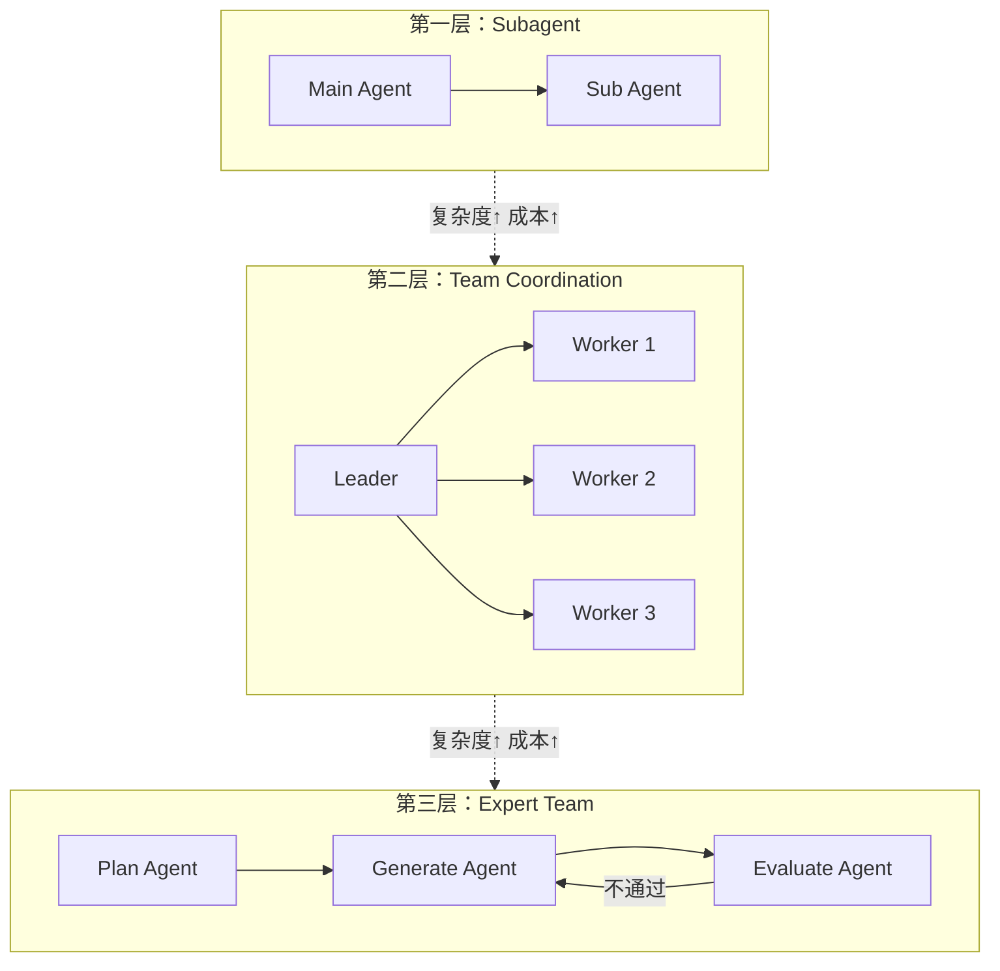
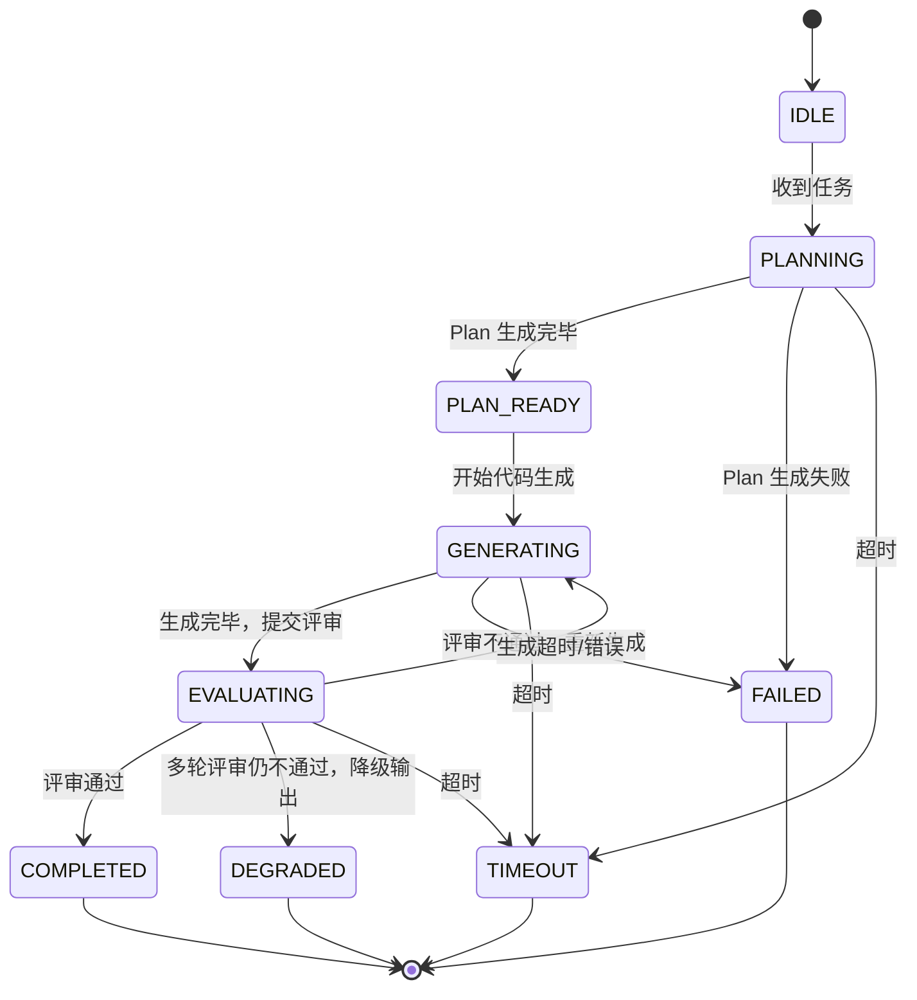
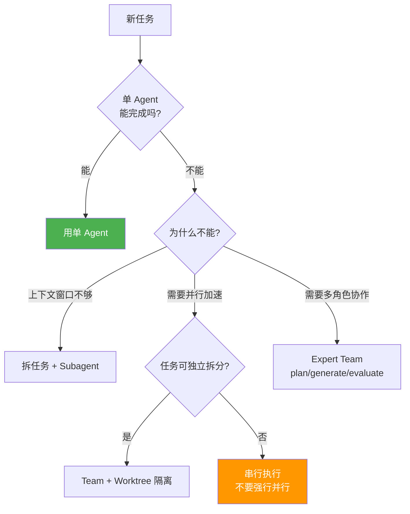

# 多智能体的全貌——架构、可视化与真相

*从 Subagent 到 Expert Team，从实时 Canvas 到成本方程*

"10 个 Agent 协作 = 10 倍产出"——这句话在 2026 年的 AI 融资 PPT 里几乎是标配。LinkedIn 上到处是 Multi-Agent 的 demo 视频：一群 Agent 在聊天窗口里讨论、争辩、投票，最后"协作"出一个结果。看起来挺壮观的。

但把它部署到生产环境之后，你会发现一个尴尬的事实：**那 10 个 Agent 花了 40% 的 token 在互相说话，而不是在干活。**

## 三层渐进式架构

从最简单的"委派一个子任务"到最复杂的"三阶段结构化编排"，多 Agent 协作有一个清晰的复杂度频谱。Kairo 把这个频谱组织成三层：

- **Layer 1: Subagent** — 上下文隔离。一个 Agent 委派任务给子 Agent，子 Agent 在独立的上下文窗口中工作。
- **Layer 2: Team** — 多 Agent 协调。多个 Agent 通过消息总线通信，Leader-Worker 架构，共享发现，避免冲突。
- **Layer 3: Experts** — 三阶段编排。Planner 制定计划、Generator 执行计划、Evaluator 评审结果。结构化的分工和质量控制。

每往上一层，能解决的问题更复杂，但引入的成本也更高。选哪一层，取决于你愿意为协调付出多少额外的 token。



### Layer 1: Subagent — 上下文隔离

一个 Agent 正在实现用户认证。它先搜索代码库，了解现有的安全配置——grep 了 20 个文件，读了 5 个关键的类，分析了依赖关系。这些搜索和分析产生了大约 50,000 token 的输出，但这些输出只有分析阶段需要。一旦得出结论，50,000 token 的原始输出就成了噪音，挤占后续推理的空间。

这就是上下文污染——中间产物淹没最终结论。

操作系统怎么解决类似的问题？`fork()`。子进程继承父进程的地址空间，但在自己的独立内存中工作，做完计算把结果返回给父进程，中间数据留在子进程里。

Subagent 做的是同一件事。父 Agent 委派一个任务——"搜索代码库，总结现有的安全配置"。子 Agent 在自己的上下文窗口中执行搜索、读取文件、分析代码，50,000 token 的中间输出全在子 Agent 的窗口里。最终返回一段 500 token 的摘要——100 倍的压缩比，而且是语义无损的，因为摘要是子 Agent 在完整上下文中生成的。

Kairo 通过 `SubagentRegistry` 和 `SubagentSpawner` SPI 实现。子 Agent 有明确的类型约束——五种内置类型（`SubagentType`），每种有预设的工具白名单：

| 类型 | 职责 | 工具集 |
|------|------|--------|
| `EXPLORE` | 快速只读搜索，定位代码符号 | bash, read, grep, glob, tree, diff, git |
| `PLAN` | 分析代码库，输出实施计划 | bash, read, grep, glob, tree, diff, git |
| `CODER` | 全读写能力，实现代码并运行测试 | 全部工具 |
| `REVIEWER` | 代码审查，发现 bug 和安全问题 | bash, read, grep, glob, tree, diff, git |
| `GENERAL_PURPOSE` | 通用多步任务 | 全部工具 |

子 Agent 的权限集是父 Agent 的子集，和操作系统的权限继承模型一样。搜索型子 Agent 只有只读工具，不能修改文件。

什么时候用 Subagent？我们的经验是：如果一个任务会产生大量你不需要留在主上下文中的输出，就用 Subagent。搜索代码库、运行测试套件、读取并总结大文件、分析依赖关系——这些都是典型场景。不过也有过度使用的时候，有些简单的 grep 操作，spawn 一个 Subagent 的开销反而比直接执行还大。判断标准是中间产物的规模，不是任务的重要性。

### Layer 2: Team — 多 Agent 协调

Subagent 之间是互相独立的——没有子 Agent 之间的通信，没有共享状态。多数时候这是优点，但有些任务确实需要协作。

一个大型重构涉及前端、后端和数据库三个领域。三个 Subagent 各自独立工作：前端 Agent 改了组件的 props 接口，后端 Agent 改了 API 的响应格式，数据库 Agent 改了表结构。它们互相不知道对方做了什么。结果？字段名不匹配，类型不兼容。三个 Agent 各自的工作都是正确的，但组合在一起是错的。

到这一步，独立的子进程不够了——你需要进程间通信（IPC）。

Kairo 的团队协调通过 `InProcessMessageBus` 和 `DefaultTeamManager` 实现。消息总线使用 Reactor 的 `Sinks.Many` 实现响应式消息推送，同时保留 `ConcurrentLinkedQueue` 作为可靠缓冲：

```java
public class InProcessMessageBus implements MessageBus {
    @Override
    public Mono<Void> send(String fromAgentId, String toAgentId, Msg message) {
        return Mono.fromRunnable(() -> {
            inboxes.computeIfAbsent(toAgentId, k -> new ConcurrentLinkedQueue<>())
                    .add(message);
            Sinks.Many<Msg> sink = sinks.get(toAgentId);
            if (sink != null) sink.tryEmitNext(message);
        });
    }

    @Override
    public Flux<Msg> receive(String agentId) {
        return sinks.computeIfAbsent(agentId,
            k -> Sinks.many().replay().limit(1024)).asFlux();
    }
}
```

与 Claude Code 的文件轮询（500ms 间隔的磁盘 IPC）相比，Kairo 的消息总线有三个关键差异：响应式推送（零延迟）、双模消费（响应式或拉取式）、背压保护（1024 条重放缓冲限制）。

每个团队自动获得独立的 `InProcessMessageBus` 实例。Agent 加入团队时自动注册到消息总线，离开时自动注销并清理资源。

跨进程、跨网络的通信通过 A2A 协议实现。`TeamAwareA2aClient` 提供团队上下文感知的 A2A 客户端，Agent 通过 `AgentCard` 发现彼此——类似于服务注册与发现。

不过通信本身不是团队协调的难点——消息总线已经解决了通信。真正棘手的是决策权怎么分配、产出质量谁来把关。`DefaultTaskDispatchCoordinator` 用任务板模型做分派，但纯粹的分派有一个问题：Agent 完成了任务，Coordinator 就标记为完成。输出质量呢？没人检查。

这就是 Layer 3 存在的理由。

### Layer 3: Experts — Plan-Generate-Evaluate

团队里每个人都能发消息，但如果没人拆需求、没人分任务、没人做 Code Review，五个工程师各自理解需求、各自实现，结果大概率是五份不兼容的代码。光有消息通道不够，你还需要计划、执行和评审三个环节。

Expert Team 的三阶段编排——Plan-Generate-Evaluate——就是为此设计的。

#### 状态机

`ExpertTeamStateMachine` 定义了严格的生命周期：

```text
IDLE → PLANNING → PLAN_READY → GENERATING ⇄ EVALUATING → COMPLETED / FAILED / DEGRADED / TIMEOUT
```

九个状态，每个状态转换都经过验证——非法转换触发 `IllegalStateException`。结合第六篇讨论的 Hook 治理体系（30 个生命周期点 × 5 种决策），多 Agent 编排的每一步都可以被拦截和治理。`EVALUATING → GENERATING` 这条回边是评审-修订循环：Evaluator 判定产出不合格，状态回到 GENERATING，同一个 Agent 带着评审反馈重新生成。循环有预算限制（`maxFeedbackRounds`），超出后根据风险等级决定是降级通过还是直接失败。



`PLAN_READY` 状态支持计划预览模式——Coordinator 先生成计划，等待人类确认后再执行。这是人机协同的接入点。

#### 三个阶段

**Plan（规划）。** `DefaultPlanner` 分析任务和团队成员，生成 `TeamExecutionPlan`——包含有序步骤、角色分配和依赖关系的执行图。步骤之间的依赖关系形成 DAG（有向无环图），`DagExecutor` 按依赖层级调度——无依赖的步骤并行执行，有依赖的步骤等待前置步骤完成。

Planner 支持两种失败模式：**FAIL_FAST**（默认，规划失败则终止）和 **SINGLE_STEP_FALLBACK**（退化为单步执行——把整个任务交给一个 Agent）。后者听起来像是认输，但实践中出乎意料地有用：有时候任务本身就不适合拆分，让 Planner 尝试之后退化回单步，比一开始就猜它不可拆分更稳妥。

**Generate（生成）。** `DefaultGenerator` 将每个步骤分派给绑定的 Agent。Agent 收到步骤描述、全局目标、当前轮次、前次评审反馈、上游步骤产出。生成过程通过 `ToolCallSink` 流式暴露每一次工具调用——读文件、写文件、执行 bash。

**Evaluate（评审）。** 每个步骤的产出必须经过 `EvaluationStrategy` 的评审，产出 `EvaluationVerdict`——四种判决：

- **PASS**：产出合格，推进到下一步。
- **REVISE**：产出需修改，反馈路由给执行 Agent，状态回到 GENERATING。
- **REVIEW_EXCEEDED**：修订预算耗尽，不允许静默通过。
- **AUTO_PASS_WITH_WARNING**：仅在 LOW 风险下允许——Evaluator 崩溃但调用方显式接受带警告通过。

两种评审策略：`SimpleEvaluationStrategy`（确定性规则，零成本，可审计）和 `AgentEvaluationStrategy`（LLM 裁判，语义级评估，有 token 成本）。选择由 `EvaluatorPreference` 和 `RiskProfile` 共同决定。这里有个微妙的 trade-off：确定性规则快且便宜，但只能检查表面问题（编译通过、测试通过）；LLM 裁判能做语义级评估，但引入了额外的不确定性——用一个模型来评判另一个模型的产出，评判本身也可能出错。我们目前的做法是对 HIGH 风险步骤默认用 Agent 评审，LOW 风险用 Simple 规则，MEDIUM 看具体场景。

#### 三级失败升级

Expert Team 中一个值得展开的设计是三级失败升级链（three-tier failure escalation），它决定了系统面对质量不达标时的行为：

1. **高级模型升级**：如果 `ExpertRoleRegistry` 为该角色配置了 modelOverride，用更强的模型重试一次。
2. **架构师仲裁**：如果配置了 `ArchitectArbitrator`，由"架构师" Agent 裁决——要么修改指令后再试（`REVISED_INSTRUCTION`），要么接受当前产出并附加说明（`ACCEPT_WITH_CAVEATS`）。
3. **风险分级降级**：升级链耗尽后，`RiskProfile` 做最终裁决——LOW 风险步骤降级通过（`DEGRADED`），MEDIUM/HIGH 风险步骤终止。

`DEGRADED` 这个终态只服务于 LOW 风险的自动通过路径——对于低风险步骤，"有产出但质量不完美"好于"完全没有产出"。对于高风险步骤，系统宁可终止也不允许不达标的产出进入最终结果。

升级链最多增加两次额外尝试，不会出现无限重试。

### 三层如何组合

三层可以组合使用。

一个例子：用户要求"给这个 Spring Boot 应用添加 JWT 认证"。Layer 3 启动——Planner 制定计划，三个步骤：后端安全配置、API 端点修改、前端路由守卫。Layer 2 通信——三个 Generator Agent 通过 MessageBus 共享关键决策，比如 JWT 的 header 名、token 格式、用户对象的字段名。Layer 1 隔离——每个 Generator Agent spawn EXPLORE 类型的 Subagent 搜索代码库，搜索结果留在 Subagent 的上下文中，只有摘要返回给 Generator。

Subagent 管上下文隔离，Team 管通信，Experts 管质量——各层各管一摊事。实际使用中，大部分任务只需要 Layer 1，少数需要到 Layer 2，能用到 Layer 3 的场景比我们预想的要少。

## Workflow：为什么没有 WorkflowEngine

到这里你可能会问：三层架构都有了，为什么 Kairo 没有一个显式的 `WorkflowEngine` SPI？

这个问题在 v0.4 的设计评审中就被提出来过。当时的选项是：引入一个 `WorkflowEngine` 接口，定义 `step`、`branch`、`join`、`retry` 等原语，让用户用声明式的方式编排多 Agent 流程。看起来很合理——Temporal、Inngest、LangGraph 都走的这条路。

我最终拒绝了。

第一个原因是 A2A 协议已经覆盖了 workflow 的通信语义。Agent 之间通过 MessageBus 异步通信，通过 TeamCoordinator 分派任务，通过 EvaluationStrategy 验证结果。step 就是一个 Agent 调用；branch 就是多个 Agent 并行工作在不同 worktree 上；join 就是 Evaluate Agent 合并检查；retry 就是评审返回 REVISE 后 Generator 重新执行。这些能力散布在 Team 和 Experts 层中，不需要另一套抽象来包装。

第二个原因是声明式 workflow 和 Agent 的自主性天然冲突。Workflow 引擎假设流程在启动前就完全确定，但 Agent 的价值恰恰在于它能根据中间结果动态调整——读了代码发现情况和预期不同，临时改变方案。把 Agent 塞进预定义的 DAG 里，等于封印了它最有价值的能力。Expert Team 的 Planner 生成的是一个初始计划，Evaluator 的反馈可以导致步骤重新执行甚至计划重新调整，这种弹性是刚性 DAG 做不到的。

第三个原因更务实：WorkflowEngine 会成为一个引力黑洞。一旦引入了 workflow 抽象，所有的编排需求都会被吸进去——定时触发、条件分支、异常处理、超时控制、断点续传。每一个都合理，但加在一起就是 Temporal。我不想在 Agent 框架里重新实现 Temporal。

拒绝不意味着不支持 workflow 场景。Workflow 的能力被分散到了已有的 SPI 中：

| Workflow 需求 | Kairo 的实现 |
|------|------|
| 步骤编排 | Expert Team Planner + DagExecutor |
| 并行执行 | Team + Worktree 隔离 |
| 条件分支 | EvaluationStrategy 判决路由 |
| 重试 | EVALUATING → GENERATING 回边 |
| 超时控制 | ResourceConstraint SPI |
| 断点续传 | DurableExecutionStore |
| 定时触发 | kairo-cron 模块 |
| 质量检查 | EvaluationStrategy (Simple + Agent) |

kairo-cron 模块值得单独说几句。定时任务在 Agent 场景中有独特的价值——每天凌晨跑一次安全扫描、每周生成一份依赖更新报告、每次 CI 失败时自动触发诊断 Agent。kairo-cron 实现了这个能力：`CronCreate`、`CronList`、`CronPause`、`CronResume`、`CronTrigger` 等 7 个工具，配合 `DeliveryTarget` 可以把结果推送到指定的 IM 通道（比如钉钉群的某个话题）。

说白了，Kairo 的 workflow 是"散装的"——需要编排的时候用 Expert Team，需要定时的时候用 Cron，需要持久化的时候用 DurableExecution，需要隔离的时候用 Worktree。每个零件都是独立的 SPI，自由组合。代价是学习曲线稍高——你得知道哪个零件解决哪个问题。好处是避免了一个 WorkflowEngine 成为所有编排需求的瓶颈。这个 trade-off 我们接受了，但不确定它适合所有团队。

### Workflow：确定性脚本编排 Agent 调用

拒绝 WorkflowEngine SPI 不等于拒绝 workflow 本身。相反，Kairo 实现了三层 workflow 能力，每层解决不同复杂度的编排需求。

#### 第一层：YAML Workflow（kairo-tools）

最简单的形态。在 `.kairo/workflows/` 下放一个 YAML 文件，定义一组顺序执行的工具调用：

```yaml
name: daily-security-scan
steps:
  - name: scan-dependencies
    tool: bash
    args: { command: "mvn dependency-check:check" }
  - name: verify-results
    tool: verify_execution
    args: { expectation: "no critical vulnerabilities" }
    continue_on_error: true
```

`WorkflowTool` 加载 YAML，逐步执行，返回每一步的状态和耗时。没有并行，没有 Agent 调用——纯粹是工具调用的宏录制。适合简单的自动化任务：CI 检查流程、部署前验证、日常巡检。

#### 第二层：Scripted Workflow（kairo-code-core）

参考 Claude Code 的 Workflow 模式设计。用户写一段 JavaScript 脚本，脚本在 GraalJS 沙箱中执行，通过全局函数编排 Agent 调用。

```javascript
export const meta = {
  name: 'code-review',
  description: '多维度代码审查',
  phases: [
    { title: 'Review' },
    { title: 'Verify' }
  ]
};

const DIMS = ['bugs', 'performance', 'security'];

const results = await pipeline(
  DIMS,
  d => agent(`审查代码中的 ${d} 问题`, {
    label: `review:${d}`, phase: 'Review'
  }),
  review => agent(`对抗性验证：${review}`, {
    label: `verify:${d}`, phase: 'Verify'
  })
);
```

`WorkflowScriptEngine` 提供三个编排原语：

- **`agent(prompt, opts)`**：通过 `ChildSessionSpawner` 启动子 Agent 会话。支持 `schema`（结构化输出）、`model`（模型覆盖）、`agentType`（子 Agent 类型）。通过 `Semaphore` 控制最大并发数，默认 `min(16, CPU核数-2)`，可通过 `KAIRO_WORKFLOW_MAX_CONCURRENCY` 配置。单个 workflow 最多 1000 个 Agent 调用——防止失控。
- **`parallel(thunks)`**：并行执行多个 Agent 调用，全部完成后返回结果数组。底层用 Java 虚拟线程 + `CompletableFuture`，4 小时超时。单个失败不影响其他——失败项返回 null，调用方用 `.filter(Boolean)` 过滤。
- **`pipeline(items, ...stages)`**：多阶段管线。每个 item 独立走完所有 stage，stage 之间没有 barrier——item A 可能已经在 stage 3 了，item B 还在 stage 1。wall-clock = 最慢单项链，不是各 stage 最慢项之和。

安全沙箱严格隔离：`allowIO(false)`、`allowNativeAccess(false)`、`allowCreateThread(false)`。`Date.now()` 和 `Math.random()` 被禁用——确保确定性，支持断点续传。`WorkflowRunJournal` 按 `sha256(prompt + opts)` 缓存 Agent 结果，resume 时未变化的调用直接返回缓存。

这个设计把两种智能分开了：编排智能是确定性的（脚本决定维度、顺序、合并规则），执行智能是模型驱动的（Agent 决定怎么审查、怎么验证）。分开之后各自的可控性都变好了——编排逻辑可以 code review，执行质量可以用 evaluation 把关。

#### Expert Team vs Scripted Workflow

| 维度 | Expert Team | Scripted Workflow |
|------|-------------|---------|
| 编排者 | Agent（Planner） | 人类（脚本） |
| 灵活性 | 高——Agent 动态调整计划 | 低——脚本确定性 |
| 可预测性 | 低——不确定 Planner 制定什么计划 | 高——脚本逻辑完全透明 |
| 适用场景 | 开放式任务（"重构这个模块"） | 结构化任务（"按 5 个维度审查代码"） |
| 成本控制 | 难——Planner 本身消耗 token | 精确——脚本决定 Agent 数量 |

两者不互斥。一个复杂任务可以用 Scripted Workflow 做顶层编排，每个 `agent()` 调用内部走 Expert Team 的 Plan-Generate-Evaluate。

#### Claude Code 的 Workflow 实践

Claude Code 自身是 Workflow 模式的好案例。它内置了几个典型 workflow：

**Code Review**：按维度扇出（bugs / performance / security），每个维度独立审查，然后对每个发现做对抗性验证（"试着反驳这个发现"），最后合并去重。维度列表、验证策略、合并规则都是确定性的，只有"怎么找 bug"交给 Agent。

**Deep Research**：多路搜索扇出，获取并阅读源材料，多个 Agent 独立交叉验证事实声明，最后综合成带引用的研究报告。这里面有个有意思的模式——对抗性验证（adversarial verification）：一个 Agent 声称 X 为真，另一个 Agent 专门去找反例。

这两个例子揭示了 Workflow 的核心价值：让人类的编排意图以代码形式固化下来。代码审查查哪些维度、研究走哪些验证步骤——这些不该让模型自由发挥。模型只在每一步的执行层面发挥智能。

Kairo 的 Scripted Workflow 参考了这个模式，三个编排原语（`agent`/`parallel`/`pipeline`）+ GraalJS 沙箱 + 断点续传的组合已经能覆盖大部分结构化编排场景。更复杂的模式——对抗性验证、循环直到收敛（loop-until-dry）、budget 感知的动态缩放——是接下来的方向。

## 让协作可见

5 个 Agent 同时在工作。你的屏幕上只有一个转圈的 loading 图标。30 分钟后，它们要么成功了，要么失败了——你不知道中间发生了什么。

多 Agent 系统最被低估的需求不是更好的编排，而是可观测性。你可以设计出最精妙的 plan-generate-evaluate 循环，但如果你看不见它在运行时的行为，你就没法调试它。

调试多 Agent 失败需要回答四个问题：WHO（谁做了什么）、WHAT（产出了什么）、WHEN（按什么顺序）、WHY（为什么做这个决策）。

### 事件驱动的可视化架构

Kairo 的可观测性架构分三层：

```text
ExpertTeamCoordinator → KairoEventBus (Reactor Sink) → WebSocket → Browser (React)
```

第一层，事件产生。`ExpertTeamCoordinator` 在每个重要节点发布 `TeamEvent`——13 种事件覆盖了完整的团队生命周期，从 `TEAM_STARTED` 到 `STEP_TOOL_CALL`（Agent 内部每一次工具调用）到 `EVALUATION_RESULT`（评估判决和反馈）再到 `TEAM_COMPLETED`。

其中 `STEP_TOOL_CALL` 和 `STEP_THINKING` 是高频事件（>100/秒）。Agent 执行过程中每调用一次工具就产生一个事件——你可以在前端实时看到每个 Agent 正在读哪个文件、写哪行代码、执行什么命令。这些高频事件是可视化中最有价值的部分——它们让你看到 Agent "正在做什么"而不只是"做完了什么"。

第二层，事件总线。`DefaultKairoEventBus` 基于 Reactor `Sinks.many().multicast().onBackpressureBuffer()` 实现，缓冲区 100,000 个事件。设计上的一个重要决定：发布者永远不会因为订阅者的问题而阻塞。`tryEmitNext` 失败时记录 drop 计数，不抛异常。

第三层，WebSocket 传输。客户端通过 query string 指定订阅的 domain 和 eventType，处理器只推送匹配的事件。可视化是事件的消费者，不参与编排本身——即使前端掉线，编排引擎完全不受影响。

### ExpertTeamCanvas

前端使用 Zustand 管理状态，`useExpertTeamHandler` hook 把原始 WebSocket 事件映射为 Store 更新。Canvas 采用 VS Code 风格分屏布局——左侧主聊天区域，右侧团队画布，默认 60:40。

画布内部三个区域：顶部全局状态栏（当前阶段、进度、经过时间）、中部 DAG 视图（步骤卡片 + 依赖边，颜色编码状态：灰色 pending、蓝色闪烁 running、黄色 evaluating、绿色 passed、红色 failed、橙色 revising）、底部事件流（实时滚动的工具调用和评估结果）。

Canvas 的更新是增量的——一个 `STEP_TOOL_CALL` 事件只会触发对应步骤卡片的 re-render，不会导致整个 DAG 重绘。在高频事件场景下（每秒 10+ 工具调用），精确订阅 + 局部更新是性能的命门。

### TeamReplay：事后分析的时间机器

实时可视化解决了"正在发生什么"。但调试更常见的场景是事后分析："为什么评估器在第二轮拒绝了专家 2 的输出？"

TeamReplay 基于事件溯源（Event Sourcing）模式。执行期间，Store 把每一个 `TeamEvent` 按时间顺序存入 `events` 数组。回放器的中枢是一个时间滑块——用户拖动到任意时间点，回放器从头逐一应用事件到初始状态，直到滑块对应的时间戳。DAG 视图随之更新。

这不是录像回放，是状态重建。你可以点击任何一个步骤卡片，展开查看它在那个时刻的完整上下文——工具调用列表、评估反馈、当前产出物。每个事件带有递增序列号（`seq`），即使毫秒精度不足以区分高频事件，回放器也能按正确顺序重建状态。工具调用结果在事件中被截断到 10,000 字符，避免大型输出撑爆事件总线——截断只影响事件传输，不影响 Agent 的实际执行。

### 可视化的边界

可视化不是免费的。一个活跃的 Agent 团队每秒可能产生 50+ 个事件，一个 `STEP_TOOL_CALL` 事件即使经过截断仍可能携带 10KB 的工具结果——每秒 500KB 的 WebSocket 流量。对于单个团队可接受，但如果同时运行 10 个团队、每个团队 5 个 Agent？这个问题我们还没有好的答案。

当前 Replay 依赖浏览器内存中的事件数组——刷新页面，Replay 数据就丢了。生产级的 Replay 需要服务端持久化，这在路线图中但尚未实现。更深层的挑战是因果关系可视化——当前展示的是时序和结构，但多 Agent 调试最需要的是因果（"评估器拒绝步骤 3 是因为步骤 1 的输出不一致"），这可能需要 LLM 辅助的根因分析。这些都是已知的短板。

Kairo 的 plan-preview 模式（`planOnly = true`）把可视化从被动观察变成了主动治理——协调器生成计划后发布 `PLAN_READY` 事件，用户在 Canvas 上审查计划后手动确认执行。用户不再是旁观者，而是计划的审批者。

## Agent 与世界的多通道连接

多智能体不只是 Agent 之间的协作——它也包括 Agent 与人之间的多通道连接。一个 Agent 在生产环境中不只服务一个用户、一个入口。DingTalk 群里的 SRE 需要它诊断告警，Slack 频道里的开发者需要它审查 PR，Telegram 上的值班人员需要它查看 cron 任务结果。Agent 的能力是一份，但它的"网络接口"是多份。

Kairo 用两层抽象来处理这个问题：Channel 和 Gateway。

**Channel SPI** 是单一 IM 平台的薄适配器。接口表面极小——`connect()`、`disconnect()`、`onInbound(handler)`、`send(envelope)`。一个 `DingtalkChannel` 实现处理钉钉的 Webhook 验签、消息格式转换、图片/文件上传；一个 `SlackChannel` 实现处理 Slack 的 OAuth、Block Kit 消息格式、线程回复语义。每个 Channel 只关心一件事：把特定平台的消息协议翻译成 Kairo 的统一消息模型，反过来也一样。

如果把 Agent 类比为进程，Channel 就是网卡驱动——每种硬件一个驱动，驱动只负责协议转换。

**Gateway** 是 Channel 之上的编排层——相当于 TCP/IP 协议栈。它处理的不是"怎么和 DingTalk 通信"，而是"当 5 个 Channel 同时活跃时，消息怎么路由、会话怎么隔离、流式响应怎么分发"。Gateway 提供五项能力：

1. **路由**（DeliveryRouter）：Agent 的输出应该发送到哪个 Channel？一个 cron 任务的诊断结果应该推送到 DingTalk 运维群，而不是 Slack 开发频道。路由规则可以基于消息类型、来源 Agent、目标用户组来配置。
2. **会话隔离**：DingTalk 上的用户 A 和 Slack 上的用户 B 同时与同一个 Agent 交互。Gateway 确保它们的会话上下文完全隔离——用户 A 的对话历史不会泄漏到用户 B 的上下文中。
3. **流式分发**：Agent 的流式输出（`Flux<ModelResponse>`）需要根据目标 Channel 的能力做适配。DingTalk 不支持真正的流式推送，需要缓冲后一次性发送；WebSocket Channel 可以逐 token 推送。Gateway 在统一的流式接口下封装了这些差异。
4. **镜像**（MirrorStore）：每条跨 Channel 的消息都被追加写入 NDJSON 格式的镜像日志——append-only，不可篡改。这是为事故复盘设计的：当一个 Agent 在凌晨三点对 DingTalk 群发送了错误的操作建议，你需要完整的消息链来回溯因果。MirrorStore 记录的不只是消息内容，还有来源 Channel、时间戳、会话 ID 和路由决策。
5. **配对**（Pairing）：将特定的 Agent 实例绑定到特定的 Channel 组合。一个"安全审计 Agent"只监听内部 Slack 频道，不暴露到 DingTalk 公共群。

为什么 Gateway/Channel 出现在多智能体这篇文章里？因为一个完整的多 Agent 系统不只有 Agent-to-Agent 通信——Expert Team 的 Planner Agent 需要在 `PLAN_READY` 状态时把计划推送到 Slack 等待人类审批；Evaluator Agent 需要把评审不通过的结果发送到 DingTalk 通知相关开发者。Gateway 让一个 Agent 同时服务多个平台上的用户，就像一个 Web 服务同时监听 HTTP 和 gRPC——能力是同一套，入口是多套。

多智能体的全貌，Agent-to-Agent 和 Agent-to-Human-via-Channel 缺一不可。

## 真相：何时该用，何时不该

### 炒作 vs 现实

多 Agent 的营销叙事有几个常见套路："群体智能"论援引蚂蚁群落，暗示 Agent 群体能涌现出超越个体的智能；"辩论提升质量"论让多个 Agent 互相辩论，声称最终结论更可靠；"无限扩展"论说需要更多产出就加更多 Agent。

这些类比有一个共同的盲点：蚂蚁的化学信号通信成本接近零，Agent 的自然语言通信成本是 token。这个差异不是细节，它从根本上改变了规模化的经济性。

2025-2026 年间多篇论文比较了"单个强模型直接解题"和"多个模型协作解题"的效果，结论出奇一致——如果参与辩论的每个模型都不知道正确答案，它们辩论一百轮也不会突然发现正确答案。单个强模型 + 好工具，在大多数场景下比多个弱模型互相辩论效果更好。

### 协调税

具体算笔账。5 个 Agent 协作完成一个任务，每个 Agent 每轮需要：读协调者指令（~500 token）、读其他 Agent 产出摘要（~4000 token）、执行工作（~2000 token 输出）、报告结果（~500 token）。每轮每个 Agent 消耗约 7000 token，其中 71% 花在沟通上。5 个 Agent 一轮总计 35,000 token，其中 25,000 是协调开销。

同一任务由单 Agent 完成只需约 10,000 token。N 个 Agent 之间的通信路径是 O(N^2) 的——每增加一个 Agent，协调成本是超线性增长的。

### 三个合法场景

**场景一：专业知识多样性。** 前端专家知道 React 19 Server Components 的陷阱，后端专家知道 Spring Boot 3.3 异步过滤器链的正确写法。多 Agent 的价值来源于专业知识的多样性，不是智能的乘法。一个检验方法：去掉任何一个 Agent 的专业 system prompt，看质量是否明显下降。如果没有明显变化，说明你的"专家"们其实没有差异化的知识。

**场景二：对抗性验证。** 一个 Agent 写代码，另一个 Agent 找 bug。独立 Agent 用全新上下文审查，没有"当局者迷"的认知锚定。Kairo 的 plan-generate-evaluate 循环就是这种对抗模式的结构化实现。关键是"独立"二字——同一个 Agent 先写后审，往往会对自己刚写的代码过于宽容。

**场景三：并行独立工作。** 10 个 Agent 各自重构一个独立模块，价值来源于并行性——同时工作比串行快。但"独立"才是前提——一旦有隐式依赖，就需要协调，就产生协调税。Kairo 的 `DagExecutor` 按 DAG 拓扑排序步骤，同一层并行，有依赖串行。判断标准也直接：wall-clock time 加速比超过 2 倍了吗？

### 三个浪费场景

**投票式代码审查。** 让 3 个同架构模型审查同一段代码然后投票。它们的判断高度相关——训练数据、推理模式几乎完全相同。用一个更强的模型做一次审查，比用三个弱模型投票更有效、更便宜。例外是三个不同架构的模型（Claude + GPT + Gemini），但那是"模型多样性"的价值，跟"多 Agent"其实是两回事。

**Agent 辩论 / 智囊团。** 多个 Agent 就一个技术方案"辩论"，最后总结结论。问题在于：Agent 之间的"同意"不是验证——三个模型都说方案 A 好，可能只是它们有相同的偏好。更麻烦的是 LLM 在多轮交互中有"讨好"倾向，会逐渐趋同。3 个 Agent 辩论 5 轮约 60,000 token，而一个强模型直接思考只需 5,000 token。12 倍成本，换来趋同的结论——这笔账算不过来。

**上下文装得下的单一任务。** 如果任务的所有必要信息可以放进单个上下文窗口，用多 Agent 几乎总是浪费。单 Agent 保持完整的状态一致性；多 Agent 需要通过消息传递同步，每次同步都有信息损失。一个文件的 bug 修复、一个函数的重构——用单 Agent 做，上下文足够，质量更高，成本更低。

### 成本方程

```text
Cost_single = N_steps * C_per_step
Cost_multi  = K_agents * M_steps_per_agent * C_per_step + C_plan + K*M*C_sync + C_merge
```

一个 20 步的中等重构任务，单 Agent 约 60,000 token。用 3 个 Agent 做：规划 8,000 + 执行 72,000 + 同步 24,000 + 汇总 10,000 = 114,000 token。多 Agent 花了将近 2 倍成本。

多 Agent 的 ROI 只在三种情况下为正：
1. 任务物理上无法放进单个上下文窗口
2. 并行节省的时间 > token 开销
3. 对抗验证避免的风险 > token 开销

其他情况下，用一个更强的模型做一次几乎总是更好的选择。

### Mixture-of-Agents：一个微妙的中间地带

在"完全单 Agent"和"复杂多 Agent 协作"之间，存在一种有趣的模式：Mixture-of-Agents（MoA）。思路很简单：对同一个问题，用多个不同的模型各自独立生成一个答案（proposers），然后用一个聚合模型（aggregator）将所有答案融合成一个高质量的最终答案。

Kairo 的 `MixtureOfAgentsCoordinator` 实现了这个模式：

```java
MixtureOfAgentsCoordinator moa = MixtureOfAgentsCoordinator.builder()
    .addProposer(anthropicProvider, "claude-sonnet-4-20250514", "claude")
    .addProposer(openaiProvider, "gpt-4.1", "gpt")
    .addProposer(deepseekProvider, "deepseek-r1", "deepseek")
    .aggregator(anthropicProvider, "claude-sonnet-4-20250514")
    .build();
```

MoA 和多 Agent 辩论的区别在于：没有多轮交互，没有协调开销，没有趋同效应。每个 proposer 独立生成答案，互相不通信。聚合器看到的是多个独立视角，不是一场辩论的最终妥协。韧性方面也有优势：一个 proposer 失败不导致整体失败——5 个中 2 个超时，聚合器用剩余 3 个工作。

不过 MoA 的成本也很实在：3 个 proposer 各 ~2000 token，聚合器 ~8000 token，总计 ~14,000 token，而单模型直接回答约 2000 token——7 倍成本。MoA 适用的场景其实很窄：当你需要在不同模型的偏见之间做对冲时。对于有明确正确答案的编码任务，MoA 的收益不值这个价。

### 决策树

**问题 1：任务能否放进单个上下文窗口？** 能 → 用单 Agent，结束。不能 → 继续。

**问题 2：任务能否被分解为独立的子任务？** 能且无依赖 → 多 Agent 并行。能但有依赖 → DAG 调度。不能 → 用上下文压缩，尽量在单 Agent 内完成。

**问题 3：任务是否需要对抗性验证？** 高风险场景 → 增加 Reviewer Agent。否则不增加。

**问题 4：任务是否需要不同领域的专业知识？** 是且知识差异显著 → 领域专家 Agent。否则 → 单个强模型 + 好的 system prompt。

我估计 80% 的 Code Agent 任务在第一个问题就结束了——任务放得进单个上下文窗口，不需要多 Agent。



## 行业对比

2026 年的多 Agent 领域已经分化出不同的流派。

**Anthropic Swarm / Claude Squad。** Claude Code 的原生多 Agent 方案。核心理念是子进程隔离——子 Agent 的价值在于隔离和并行，不在于协作和辩论。Leader-Worker 架构，文件 IPC，Claude 模型独占。每个子 Agent 有明确的任务边界，完成后销毁。没有复杂的多轮协商。这是目前最接近工业级水准的多 Agent 实践。

**Microsoft AutoGen。** 研究导向的对话式多 Agent 框架。Agent 通过自然语言对话协作——群聊、嵌套聊天、顺序聊天。灵活性高，但对话太自由——一个"群聊"可能在 3 轮内达成共识，也可能 30 轮仍在争论。给客户承诺 SLA 会比较困难。

**CrewAI。** 角色扮演范式——每个 Agent 有角色和目标。根本限制在于角色不等于能力。"你是一个资深工程师"是空洞的角色扮演，"你必须确保所有查询使用参数化绑定以防止 SQL 注入"才是有效的 prompt 工程。

**LangGraph。** 状态机方式——Agent 之间的协作被建模为显式状态图。可预测性强，代价是灵活性低——新增协作模式需要修改状态图定义。更接近传统的工作流引擎。

**Kairo。** SPI 驱动、嵌入式、Java 原生、三层渐进式。一个根本区别是它是嵌入到 Java 应用中的库，不是独立平台。Spring Boot 应用直接依赖 `kairo-multi-agent`，Agent 团队在你的 JVM 中运行。

| 维度 | Anthropic Swarm | AutoGen | CrewAI | LangGraph | Kairo |
|------|----------------|---------|--------|-----------|-------|
| 核心范式 | 子进程隔离 | 自由对话 | 角色扮演 | 状态机 | SPI 三层渐进 |
| 协调方式 | Leader-Worker | 群聊 | 过程驱动 | 状态图 | DAG + 评估循环 |
| 评审循环 | 无 | 对话式 | 无 | 条件边 | REVISE loop + 风险策略 |
| 状态机 | 无 | 无 | 无 | 显式定义 | 9 状态确定性状态机 |
| 计划预览 | 无 | 无 | 无 | 无 | PLAN_READY + confirmAndExecute |
| 模型升级 | 无 | 无 | 无 | 无 | ExpertRoleRegistry |
| 可视化 | 混合在聊天流 | AutoGen Studio | 任务级 | LangSmith trace | ExpertTeamCanvas + Replay |
| 可预测性 | 高 | 低 | 中 | 高 | 高 |
| Token 效率 | 高 | 低 | 中 | 中 | 高（按需升级） |
| 语言 | Python/TS | Python | Python | Python | Java (Reactor) |
| 部署模式 | CLI 进程 | 独立服务 | Python 脚本 | Python 库 | 嵌入式库 |

---

## 多 Agent 的成本账

这是最重要的一节。

说实话，Expert Team 在 demo 里确实很酷——把"重构认证模块"分解为 5 个步骤，每个步骤分配给不同专家，评估者审查产出，不合格带反馈重试，流程可视化后看起来非常专业。但生产环境的 ROI，我至今没完全算清楚。

Kairo 在多 Agent 方面投入了大量工程——`SubagentRegistry`、`TeamCoordinator`、`ExpertTeamCoordinator`、`InProcessMessageBus`、`MixtureOfAgentsCoordinator`、`DagExecutor`、`ExpertTeamStateMachine`、`ExpertTeamCanvas`——上千行精心设计的代码。

值得吗？诚实的回答是要分层看。

第一层（Subagent）值得，这个很确定。上下文隔离是 Code Agent 的刚需。在 kairo-code 中，Subagent 是使用频率最高的多 Agent 模式——每天数百次调用，成本开销极小，收益清晰可见。

第二层（Team）在特定场景下值得。当任务可以自然分解为 3-5 个独立子任务、且依赖关系清晰时，Team 层提供了合理的编排能力。但我也看到了过度使用的情况——一些用户把每个小任务都建一个 Team，整个流程的 token 开销超过了直接让一个 Agent 做完所有事的成本。

第三层（Expert Team）是我目前最拿不准的。在 demo 中表现出色，但在真实生产负载中，我还没有充分的证据证明第三层节省的时间和质量提升能覆盖它的 token 成本。一个 5 步 Expert Team 可能消耗 200,000+ token，同样的任务让经过良好 prompt 工程的单 Agent 做可能只需 80,000 token，质量差异不大。如果最终证明第三层在大多数场景下 ROI 为负，我会把它定位为"适用于特定高复杂度场景"，而不是假装它是推荐的默认配置。

还有一个未解问题：团队规模的上限。3 个 Agent 之间有 3 条通信通道，5 个有 10 条，10 个有 45 条——O(N^2)。当团队规模超过某个阈值，维持语义一致性变得不可能。Kairo 目前隐含假设团队规模在 3-7 个 Agent 之间，`ExpertTeamCoordinator` 在更大规模下的行为没有经过充分验证。

Kairo 的 `CostTracker` SPI 存在的意义就是让成本可见。当用户能清楚看到"这次 Expert Team 执行花了 $2.50，其中 $1.50 是协调开销"时，他们自然会问：用单 Agent 做成本是多少？质量差多少？成本透明，让使用者自己做判断，比我们替他们决定"应该用多 Agent"要好。

---

多 Agent 在正确的场景下有用——上下文隔离、并行加速、对抗验证。但绝大多数 Code Agent 任务，单 Agent + 好的工具 + 好的上下文管理就够了。

我们做了三层架构、做了可视化、做了成本追踪，这些工程投入在需要的时候会发挥价值。但如果有人问我"默认该用多 Agent 吗"，我的回答是：先试单 Agent，不够用了再往上加。这不是保守，是在协调税面前的务实选择。

---

*下一篇：《前沿：分布式、自进化与 Plugin 设计》*

**参考**

1. VILA-Lab, "Dive into Claude Code: An Empirical Study on a Production AI Coding Agent," arXiv:2604.14228, April 2026
2. Anthropic, "Building effective agents," Anthropic Research, 2025
3. Google, "Agent-to-Agent (A2A) Protocol Specification," GitHub, 2025
4. Brooks, F.P., "The Mythical Man-Month: Essays on Software Engineering," Addison-Wesley, 1975
5. Microsoft Research, "AutoGen: Enabling Next-Gen LLM Applications via Multi-Agent Conversation," 2023
6. CrewAI, "Framework for orchestrating role-playing autonomous AI agents," GitHub, 2024
7. Together AI, "Mixture-of-Agents: Leveraging Collective Strengths of Multiple LLMs," 2024
8. LangGraph, "Multi-Agent Architectures with LangGraph," 2025
9. Charity Majors, "Observability for the Modern Enterprise," O'Reilly, 2022
10. Martin Fowler, "Event Sourcing," martinfowler.com, 2005
