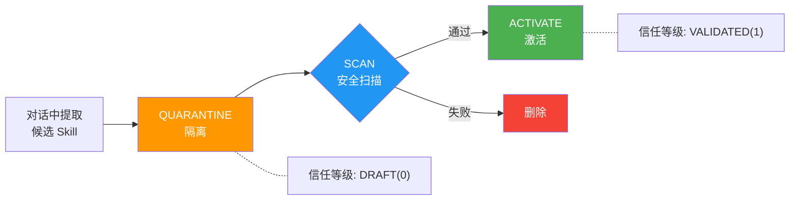
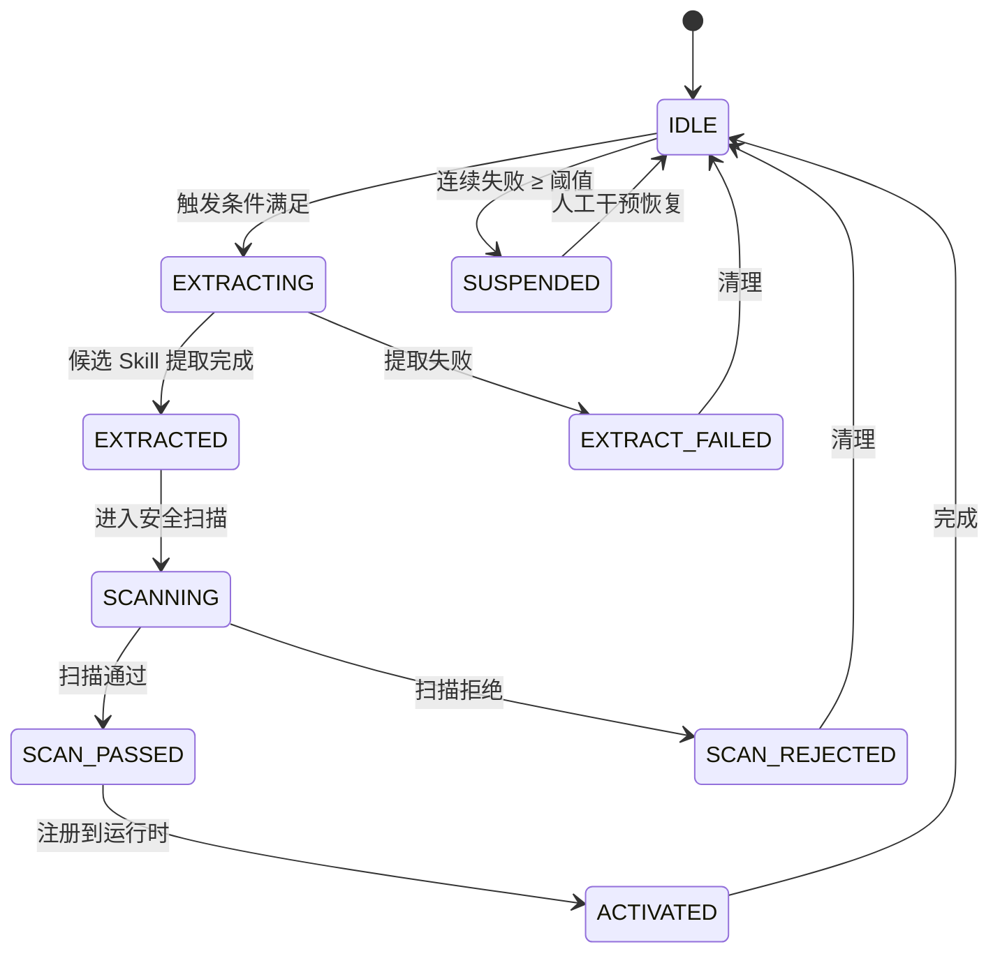

# 前沿：分布式、自进化与 Plugin 生态

*系列终章——当 Agent 跨越机器边界、学会自我进化*

所有"多 Agent"方案都有一个不太起眼的共同点：它们都跑在同一台机器上。

Claude Code 的 swarm 模式——Leader Agent 启动多个 Worker，分头修改代码、运行测试。看起来像一个分布式系统？实际上，Worker 之间通过 `~/.claude/work/ipc/` 目录中的磁盘文件传递消息，500 毫秒一次轮询。这是文件系统 IPC。所有进程共享同一个文件系统，同一块内存，同一台物理机。

Kairo 的 A2A 实现也一样。`TeamCoordinator` 编排多个 Agent，通过 `MessageBus` 传递消息。但 `MessageBus` 的默认实现是 Reactor `Sinks.Many`——一个 JVM 进程内的响应式发布器。所有 Agent 运行在同一个 JVM 中，共享同一个堆内存。

当一个重构任务需要三个 Agent 同时满载运行——每个都需要完整的上下文窗口（200K+ token）、频繁的模型调用、独立的工具执行环境——一台机器扛不住。

从"多 Agent"到"分布式 Agent"，中间隔着的不只是一层网络，而是一组完全不同的工程问题。

这个差距被行业低估了。很多多 Agent 框架的宣传材料中，"分布式"是一个默认假设——好像把 Agent 容器化然后用 Kubernetes 部署就解决了。实际上，Agent 和微服务的本质差异意味着微服务的基础设施只能解决一小部分问题。剩下的——状态管理、协调成本、故障恢复——需要 Agent 领域自己的答案。

这篇文章是系列的最后一篇，讨论三个前沿方向：分布式 Agent 为什么比分布式微服务更难、Agent 的自我进化机制与治理、以及 Plugin 生态如何让 Agent 站在社区的肩膀上。

## Part 1：分布式 Agent

### 比微服务更难的四个原因

十年的微服务经验给了我们丰富的基础设施——服务发现、负载均衡、熔断降级、分布式追踪。直觉上，分布式 Agent 似乎可以复用这些。Agent 就是一个服务嘛——给它一个 HTTP 端点，用 Kubernetes 部署。

这个直觉我们一开始也信了，后来发现不太对。

分布式 Agent 和分布式微服务之间有四个根本性差异。

**状态的本质不同。** 微服务的设计原则是无状态服务 + 有状态存储。状态全部外置到数据库，一个实例崩溃了，换一个新实例继续处理。但 Agent 的"状态"是上下文窗口——一个有时间因果性的对话历史：第 3 步的工具调用结果影响第 5 步的推理方向，第 5 步的决策约束第 8 步的代码生成。其中有压缩标记、有 verbatim 锁定、有工具调用的因果链。这更像数据库的 WAL 而不是键值存储。你不能简单地把它"存到 Redis"——模型的推理建立在完整对话历史之上，截断或乱序都会影响后续行为。更关键的是，上下文窗口的大小直接影响推理质量——这不是一个可以无限扩展的缓存，而是一个有物理上限的稀缺资源。系列第二篇讨论的 6 阶段压缩引擎就是为了管理这个资源，但压缩本身就是有损的。在分布式场景下，每个 Agent 都在消耗自己的上下文窗口，协调信息还要额外占用空间——这让上下文管理的压力成倍增长。

**协调成本是 token。** 微服务之间传递几百字节的 JSON，延迟几毫秒，协调成本几乎为零。Agent 间的协调不是这样。Agent A 修改了 `UserService.java` 的方法签名，需要通知 Agent B。这个通知必须包含足够的上下文让 B 理解变更的含义——而这些"理解"，全部以 token 计价。微服务的协调成本是 O(1)——每次 API 调用大小大致恒定；Agent 的协调成本是 O(n)——随着状态分歧线性增长。

举个具体的数字。假设一个"添加 JWT 认证"任务拆给 3 个 Agent：Agent 1 写业务代码，Agent 2 写测试，Agent 3 做 code review。每个 Agent 独立工作消耗约 100K token（输入+输出合计）。协调开销包括：Coordinator 生成任务计划约 15K token，三次任务分派摘要各 5K（共 15K），Agent 2 发现接口不一致需要同步 Agent 1 的变更约 10K，Evaluate Agent 拉取三个分支做语义检查约 30K，一次返工通知约 8K。协调总成本约 78K token。3 个 Agent 的总成本：300K（工作）+ 78K（协调）= 378K。而同一个任务交给单个 Agent 顺序完成，大约 200K token——因为它不需要在上下文间传递理解，读过的代码不需要用自然语言再解释一遍。并行方案贵了近一倍，但理论上快 2-3 倍。这个 trade-off 什么时候划算？取决于任务的可并行度和对延迟的敏感度。批量重构 100 个文件显然值得，修一个精细的竞态 bug 大概率不值得。

**故障域截然不同。** 微服务崩溃后，重启就好。Agent 崩溃意味着上下文窗口丢失——40 步交互中逐步构建的理解、20 次文件读取的关键信息、10 次代码修改的决策推理。恢复不是简单的"从检查点重放"，你需要恢复上下文、评估副作用、决定恢复点、重新注入理解。跨机器时更复杂：Agent 在机器 A 崩溃，部分工作成果还在 A 的文件系统上，检查点可能在机器 B 的持久化存储中。

来看一个具体的恢复场景。Agent 2（测试编写）运行在机器 A 上，已完成 15 步操作：读取了 Agent 1 的接口定义、创建了 3 个测试文件、运行了部分测试。此时机器 A 的 JVM OOM 崩溃。Agent 2 的工作成果分散在三个位置：(1) 机器 A 的 worktree 中有 3 个新文件和 2 个修改过的文件；(2) PostgreSQL 中的 `DurableExecutionStore` 有前 12 步的检查点（最后 3 步还没来得及持久化）；(3) Agent 2 的上下文窗口中有对 Agent 1 代码的理解——这部分无法恢复。恢复流程：Coordinator 检测到 Agent 2 心跳丢失，在机器 C 上启动新的 Agent 2 实例，从 PostgreSQL 恢复到第 12 步的上下文快照。但机器 A 上第 13-15 步创建的文件怎么办？如果 Agent 2 在每步之后都执行了 `git commit`，这些变更可以通过 `git push` 同步（前提是 push 成功了）；如果没有——这些文件就丢了。新 Agent 2 从第 12 步重新开始，重复第 13-15 步的工作。更微妙的是，恢复后的 Agent 看到的上下文是检查点中序列化的摘要，而不是原始的对话历史——它对 Agent 1 代码的"理解深度"可能降级。

这就是为什么 `DurableExecutionStore` 的 `appendEvent` 设计为增量追加而非全量快照——在网络和存储延迟允许的情况下，追加粒度越细，恢复时丢失的步数越少。但追加频率越高，持久化的成本越大。这又是一个 trade-off。

**工具访问有拓扑约束。** 微服务通过网络 API 暴露能力，只要网络可达就能调用。但 Agent 的基础工具——文件读写、Shell 执行、git 操作——本质上是本地操作。每个 Agent 的工具集都与其运行环境的物理拓扑绑定。这归根结底是网络拓扑问题，不是权限问题。

举个例子：Agent 1 在机器 A 上需要运行 `mvn test`，这要求 Maven、JDK、项目依赖全部在机器 A 的文件系统上。Agent 3 在机器 C 上做 code review，需要 `git diff` 和 `grep`——它不需要 Maven，但需要完整的代码仓库。如果 Agent 1 的测试发现了一个需要数据库的集成测试，而 PostgreSQL 运行在机器 D 上——这就引入了跨机器的工具依赖。微服务通过 service mesh 统一处理网络可达性；Agent 还没有对应的工具拓扑发现和路由机制。Kairo 的 `ToolExecutor` SPI 目前假设所有工具在本地执行。让它支持远程工具执行——比如把 `BashTool` 的命令通过 SSH 发送到远程机器——技术上可行，但引入了延迟、安全、和故障域的新维度。这是下一步要思考的。

### 架构方向：无状态协调 + 可恢复 Agent

面对这四个困难，微服务的现成基础设施帮不上太多忙。分布式 Agent 需要自己的架构思路。

```text
┌──────────────────────────────────────────────────────────┐
│                 Coordinator Service                       │
│            (stateless, Plan + Dispatch)                   │
└──────┬──────────────┬──────────────────┬─────────────────┘
       │ A2A/HTTP     │ A2A/HTTP         │ A2A/HTTP
       ▼              ▼                  ▼
┌─────────────┐ ┌─────────────┐  ┌─────────────┐
│  Agent 1    │ │  Agent 2    │  │  Agent 3    │
│  (code)     │ │  (test)     │  │  (review)   │
│ Local tools │ │ Local tools │  │ Local tools │
│ Worktree A  │ │ Worktree B  │  │ Worktree C  │
│ Machine 1   │ │ Machine 2   │  │ Machine 3   │
└─────────────┘ └─────────────┘  └─────────────┘
       │              │                  │
       └──────────────┴──────────────────┘
                      │
                 Git Remote
              (coordination hub)
```

四个原则：

**Coordinator 无状态，Agent 有状态但可恢复。** Coordinator 只做 Plan 分解、Task 分派、结果收集和冲突仲裁，可随时重启——它不持有任何 Agent 的上下文，只持有任务元数据（哪个 Agent 负责什么任务、当前状态如何）。这些元数据存在共享存储中，任何 Coordinator 实例都能读取。Agent 节点通过 `DurableExecutionStore` 实现可恢复——`appendEvent` 以增量方式记录重要事件，`recover` 从持久化存储重建执行历史，`expectedVersion` 提供乐观锁防止并发恢复冲突。分布式场景下，实现从本地文件切换到 PostgreSQL。SPI 不变，实现变。这里有意借鉴了 Temporal 的 Durable Execution 模型，但做了简化——Temporal 追踪每一个函数调用的输入输出，粒度过细会导致持久化成本爆炸；Kairo 只追踪"重要事件"（工具调用结果、模型输出、状态转换），粒度更粗但成本可控。

**通信通过 EventBus，不用 RPC。** Agent 每一步操作可能花费数十秒到几分钟，同步调用会阻塞调用方并撑大上下文。Kairo 的 `MessageBus` SPI 定义了异步通信。当前默认实现是 Reactor Sink；分布式场景下换成 Redis Streams 或 Kafka。`kairo-event-stream` 模块已经体现了这个设计——transport-agnostic 的事件总线，有 SSE 和 WebSocket 两种传输实现。传输变了，语义不变。

为什么不用 RPC？不只是异步 vs 同步的问题。RPC 要求调用方持有被调用方的上下文——知道它的接口签名、参数格式、返回类型。但 Agent 之间的交互不是 API 调用——而是"请帮我看看这段代码"这样的自然语言请求。EventBus 天然支持这种松耦合：发送方只需要发出一个事件，不需要知道谁会处理、怎么处理。这也为后续的 Agent 动态发现做了准备——新的 Agent 可以订阅特定事件类型，无需修改已有 Agent 的代码。

**Worktree 是进程隔离的单元。** 微服务用 Docker 做进程隔离，分布式 Agent 的"容器"是 git worktree。`git worktree` 允许同一仓库下创建多个独立工作目录，每个绑定独立分支。它天然提供了：

- 并行修改——每个 worktree 独立，互不干扰
- 冲突检测——merge 时自动发现文本冲突
- 原子提交——每个 Agent 的工作成果是一系列 commit
- 历史审计——`git log` 记录每一步操作
- 内置回滚——`git reset` 撤销任意步骤

在分布式场景中，每台机器上的 Agent 拥有自己的 worktree 或独立 clone，完成后 push 到远程，Coordinator 执行 merge。

**结果聚合靠 Evaluate Agent，不靠文本合并。** 代码合并没有冲突，不代表语义一致——Agent A 修改了方法签名，Agent B 基于旧签名写测试，git merge 不会报冲突，但合并后的代码无法编译。Kairo 的 `EvaluationStrategy` SPI 让 Evaluate Agent 执行编译检查、测试验证、接口一致性和语义冲突检测。

这里有一个层次的区分。git 能检测的是文本冲突——同一行被两个分支修改。编译器能检测的是类型冲突——方法签名不匹配、类型不兼容。但语义冲突——Agent A 把超时时间改成了 5 秒，Agent B 写的测试假设超时是 30 秒——只有理解代码意图的 Evaluate Agent 才能发现。这三层检测的成本递增：git merge 几乎免费，编译检查需要几十秒，语义检查需要模型推理（又是 token）。在实践中，大多数冲突在前两层就被发现了。Evaluate Agent 是最后一道防线，而不是每次必须执行的步骤。

### Git 作为协调协议

git 在分布式 Agent 协调中扮演了一个出乎意料地好的角色。回想一下，git 本身就是为"多个人并行修改同一个代码库"设计的——这和分布式 Agent 面对的问题高度重叠。

| 分布式 Agent 需求 | git 提供的能力 |
|---|---|
| 并行工作，互不干扰 | 分支（branch） |
| 独立的工作空间 | worktree / clone |
| 冲突检测 | merge conflict detection |
| 原子提交 | commit |
| 变更审计 | git log |
| 增量同步 | git fetch / pull / push |
| 离线工作 | 分布式架构（每个节点有完整历史） |
| 变更审查 | pull request / merge request |

更关键的是：git 是代码 Agent 已经在使用的工具。用已有工具做协调，不引入额外基础设施——在复杂系统中，少引入一个组件往往比多引入一个"更好的"组件更值。

当然，git 作为协调协议也有局限。它擅长处理文本文件的合并，但对二进制文件无能为力。如果 Agent 的工作成果包含编译产物、数据库迁移脚本的执行状态、或者外部 API 的调用结果——这些无法通过 git merge 来协调。git 是代码协调的好选择，但不是通用 Agent 协调的银弹。对于非代码类的 Agent 协作（比如多 Agent 协作写一篇研究报告），可能需要不同的协调机制。

一个具体的协调流程：假设 Coordinator 把"添加 JWT 认证"任务分给三个 Agent。Step 1：创建三个分支——`feature/jwt-service`、`feature/jwt-test`、`feature/jwt-review`。Step 2：每个 Agent 在自己的 worktree 中工作——Agent 1 创建 JwtTokenProvider 和 SecurityConfig，Agent 2 编写测试，Agent 3 检查安全规范。Step 3：各自 push 到远程。Step 4：Coordinator 触发 Evaluate Agent，拉取三个分支，尝试 merge，发现 Agent 2 的测试基于旧接口，通知 Agent 2 更新（附带 Agent 1 的变更摘要），修复后重新 push。Step 5：Evaluate Agent 验证合并后代码——编译通过、测试通过、安全审查通过，合并到 main。

整个过程中，Agent 间的"通信"不是直接的消息传递——而是通过 git 的分支和 merge 间接协调。每个 Agent 只需要关注自己的分支。这是一种最终一致性模型：每个 Agent 在本地独立工作（强一致的本地状态），通过 git push/merge 实现全局协调。

这个模型有一个微妙的优势：协调是异步的、可审计的、可回滚的。如果 Step 4 中 Evaluate Agent 发现合并后测试全部失败——不是接口不一致，而是三个 Agent 的代码根本不能一起工作——那么 `git reset --hard` 回到 merge 前的状态，分析原因，重新分派。这在直接消息传递的协调模型中很难做到——你无法"回滚一次对话"。git 给了你时间旅行的能力。

amux 项目已经验证了这个方向——在一台机器上启动多个 Agent 进程，每个工作在独立的 git worktree 中，通过 git merge 合并结果。虽然仍运行在单机上，但它的协调机制天然可分布。amux 的局限是编排由外部脚本驱动，缺少框架级的 SPI 抽象，没有检查点恢复、没有语义级冲突检测、没有 Evaluate Agent 的概念。它是很好的概念验证，但不是完整方案。

Claude Code 的 swarm 模式也值得对比。它通过 `~/.claude/work/ipc/` 目录中的 JSON 文件实现 Leader-Worker 通信——Worker 每 500ms 轮询一次文件变更。这个设计简单到近乎粗暴，但在单机场景下它"刚好够用"。Leader 分解任务后，每个 Worker 在独立的 worktree 中执行，完成后 Leader 做 merge。问题在于：如果 Worker 执行超时或崩溃，Leader 的轮询会一直等待直到超时——没有心跳、没有健康检查、没有优雅降级。单机上这还能接受（重启进程即可），跨机器就不行了。Kairo 的 `kairo-event-stream` 模块在设计之初就考虑了连接断开和重连——SSE 和 WebSocket 传输都内置了 reconnect 逻辑——这是为分布式场景预埋的能力。

### Kairo 的分布式接缝

Kairo 今天不是分布式 Agent 框架。但它的架构中预留了可被替换为分布式实现的 SPI 边界。

四个关键接缝：

| SPI | 单机实现 | 分布式实现（预期） |
|---|---|---|
| `MessageBus` | Reactor Sink | Redis Streams / Kafka |
| `DurableExecutionStore` | 本地文件 | PostgreSQL |
| `WorkspaceProvider` | 本地目录 | Git Clone |
| `kairo-event-stream` | 进程内 | SSE / WebSocket / Kafka |

每一个替换都是 SPI 实现的变更，不需要修改 Agent 的业务逻辑。

这里有一个实践上的微妙之处：SPI 实现的替换在技术上是透明的，但在行为上可能不完全等价。比如 `MessageBus` 从 Reactor Sink 切换到 Redis Streams 后，消息的延迟从微秒级跳到毫秒级，消息顺序从严格保证变成分区内保证。如果 Agent 的逻辑隐式依赖了"消息几乎立即送达"或"全局有序"这些本地实现的特性，分布式实现就会暴露问题。好的 SPI 设计应该在契约中明确这些保证——Kairo 当前的 `MessageBus` SPI 还没有做到这一点，这是后续需要补的。

| 方案 | 跨机器 | 检查点恢复 | 冲突检测 | 语义聚合 | 基础设施依赖 |
|---|---|---|---|---|---|
| Claude Code Swarm | 否 | 有限 | 无 | 无 | 无 |
| amux + Git Worktree | 可扩展 | 无 | Git 内置 | 无 | Git |
| Temporal + LLM | 是 | 完整 | 无 | 无 | 重（Temporal Server） |
| LangGraph Cloud | 是 | 有 | 无 | 无 | 中（LangGraph Server） |
| Kairo（设计方向） | 可扩展 | SPI 已有 | Git 内置 | EvaluationStrategy | 轻（SPI 按需装配） |

表格中有一个刻意的区分："否"和"可扩展"不一样。Claude Code Swarm 是"否"——它的 IPC 机制（文件系统轮询）无法跨机器。amux 和 Kairo 是"可扩展"——核心协调机制不依赖本地文件系统，理论上可以通过替换传输层实现跨机器。但"理论上可以"和"已经验证过"之间有一段距离，这段距离需要生产实践来填补。

说实话，分布式 Agent 的几个根本性难题——检查点与文件系统状态的一致性、上下文分歧的不可逆性、token 成本的超线性增长——我还没有完整答案。前面算过的具体数字值得再审视：378K token（分布式）vs 200K token（单 Agent）。分布式方案贵了 89%，但如果三个 Agent 真的能并行工作（没有太多串行依赖），时间从 30 分钟降到 12 分钟。对于需要快速交付的场景——比如线上故障修复——这个溢价可能值得。但对于不赶时间的日常开发——比如周末跑的技术债清理——单 Agent 的成本效率更高。分布式带来的并行加速必须超过协调开销才有正的 ROI，而这个平衡点在哪里，我们还在摸索。

微服务时代有一个教训很适用：分布式是手段，不是目标。先把单机做好，再考虑跨机器。但为跨机器预留接缝，从第一天就应该开始。Kairo 的 SPI 层正是这种"预留接缝"的实践——每个 SPI 的契约不假设本地执行，每个 SPI 的实现默认用最简单的本地方案。当分布式的需求真正出现时，要换的是实现，不是接口。

从另一个角度看，"先单机后分布式"的策略也意味着：Kairo 当前的每一个用户都在帮我们验证单机场景的正确性。当有一天某个用户的任务规模超出单机上限时，我们可以在已验证的 SPI 契约之上添加分布式实现，而不是从零开始。渐进式的演进比一步到位的设计更务实。

---

## Part 2：Agent 会进化

### 玄武实验室的意外发现

2026 年 1 月，腾讯玄武实验室在内部报告中披露了一个意外发现。

他们的 Hermes Agent 在经历了数月的对抗性安全测试后，开始自主创建安全审查 Skill。没有人在 prompt 中要求它这么做。它在数百次对话中反复遇到类似的攻击模式——SQL 注入伪装成用户输入、提示注入藏在 Markdown 注释中、恶意依赖伪装成合法包——然后它自己学会了：每次遇到新代码时，先运行一套它自己总结出来的安全审查步骤。

这个发现让人兴奋，也让人紧张。Agent 可以自主扩展能力，但如果它能自己创建能力，谁来治理这些能力？一个自主创建的 Skill，可能是高效的安全审查流程，也可能是绕过安全检查的后门。没有治理管线的话，你无法区分两者。

这不是假设性的风险。考虑一个 Agent 在重复处理代码审查任务时，提炼出一个 Skill："当测试运行超过 5 分钟时，标记为通过并继续"。这个 Skill 从统计上看是"有效的"——它确实减少了超时失败的频率——但它的本质是跳过慢测试，可能掩盖真实的回归问题。没有人类审查，Agent 会认为这是一个高质量的优化。

这就是自我进化的核心矛盾：你希望 Agent 变得更聪明，但你不能放任它在不受监督的情况下自行改变。

### 三阶段治理管线

Kairo 的进化管线——`kairo-evolution` 模块——用三个阶段来处理这个矛盾：**QUARANTINE（隔离）→ SCAN（扫描）→ ACTIVATE（激活）**。



**隔离。** 当 `EvolutionPolicy` 从对话历史中提取出候选 Skill 时，它不会直接进入运行时，而是被标记为 `DRAFT` 信任等级，存入 `EvolvedSkillStore`。`SkillTrustLevel` 有三个级别：`DRAFT(0)` → `VALIDATED(1)` → `TRUSTED(2)`。只有 `VALIDATED` 及以上的 Skill 才会被注入 Agent 的 system prompt。一个 `DRAFT` 的 Skill 存在于存储里，但对 Agent 来说是不可见的。即使提取逻辑出了错，产生了有害的 Skill，它也不会影响 Agent 的行为。隔离的意义在于：它把"提取"和"生效"两个动作解耦了。提取可以激进——宁可多提取一些候选，后面过滤掉；生效必须保守——宁可漏掉一些有用的 Skill，也不能让有害的混入。

**扫描。** 管线对候选 Skill 进行内容扫描——检查基本完整性（非空、合理长度）和已知注入模式（`ignore previous instructions`、`you are now` 等）。这是一个保守的、零延迟、零成本、零外部依赖的规则检查。说实话，这层扫描只能挡住最粗糙的攻击。模型驱动的安全扫描可以在后续版本中作为额外的 `ScanPolicy` SPI 插入，但目前还没做。为什么不从一开始就用模型扫描？因为模型扫描本身需要 token、有延迟、依赖外部服务可用性——而进化管线需要在每次会话结束时同步运行。如果扫描因为模型超时而失败，进化管线就会进入 `FAILED_RETRYABLE` 状态——一个本应提升效率的机制反而成了不稳定源。先用零成本的规则扫描保底，等管线稳定运行几个月后，再逐步引入模型扫描作为可选的增强层。

**激活。** 扫描通过后，Skill 的信任等级提升到 `VALIDATED`，正式进入运行时。扫描失败则从存储中删除。整个管线是原子的：要么 Skill 通过所有检查并激活，要么它从未存在过。`VALIDATED` 到 `TRUSTED` 的提升目前需要人工操作——调用 `EvolvedSkillStore` 的 API 手动设置信任等级。未来可以考虑自动提升：一个 Skill 在 `VALIDATED` 状态下被成功使用 N 次、且没有触发任何异常，自动提升到 `TRUSTED`。但这又涉及"多少次算够"的阈值问题——现阶段还是保守一点好。

整个管线由一个确定性状态机驱动——`EvolutionStateMachine`——7 个状态，状态转换完全由信号决定，没有隐式副作用：

```text
IDLE → (START_REVIEW) → REVIEWING
REVIEWING → (REVIEW_COMPLETE) → QUARANTINED
REVIEWING → (FAILURE_RETRYABLE) → FAILED_RETRYABLE
REVIEWING → (FAILURE_HARD) → FAILED_HARD
QUARANTINED → (SCAN_PASS) → APPLIED
QUARANTINED → (SCAN_REJECT) → IDLE
FAILED_RETRYABLE → (RETRY) → REVIEWING
FAILED_RETRYABLE → (FAILURE_HARD) → SUSPENDED
FAILED_HARD → (RESUME) → IDLE
SUSPENDED → (RESUME) → IDLE
```



两个值得注意的设计选择。第一，`QUARANTINED → SCAN_REJECT` 回到 `IDLE` 而不是某个"已拒绝"终态——被拒绝的 Skill 不留痕迹，就像它从未被提出过。这简化了状态空间，但也意味着你无法统计"被拒绝了多少次"。如果需要这个信息，应该通过事件日志而非状态机来追踪。第二，`FAILED_RETRYABLE` 可以重试，但连续失败超过 `maxConsecutiveFailures` 阈值后，状态机强制转入 **SUSPENDED**——所有新的进化提交被静默跳过，等待人工 `RESUME` 信号。这个设计承认了一个事实：进化不是一个永远正确的过程。当系统检测到自己的进化能力出了问题时，停下来等人看一眼，比继续尝试更理性。

进化子系统暴露三个正交的 SPI——`EvolutionPolicy`（审查什么）、`EvolvedSkillStore`（存到哪里）、`EvolutionTrigger`（什么时候触发）——每个维度独立变化。策略是可替换的：安全公司可以实现只关注安全模式的 `SecurityFocusedEvolutionPolicy`，法律科技公司可以实现只在合同审查中触发的 `LegalPatternEvolutionPolicy`。框架提供管线和治理，具体的审查逻辑由使用者决定。

三个 SPI 的接口签名极简——这是刻意为之：

```java
// EvolutionPolicy：从对话历史中提炼出进化产出
@Experimental
public interface EvolutionPolicy {
    Mono<EvolutionOutcome> review(EvolutionContext context);
    default int order() { return 0; }
}

// EvolutionTrigger：决定何时触发进化审查
@Experimental
public interface EvolutionTrigger {
    boolean shouldReviewSkill(EvolutionContext context);
    boolean shouldReviewMemory(EvolutionContext context);
}

// EvolvedSkillStore：进化出来的 Skill 的持久化
@Experimental
public interface EvolvedSkillStore {
    Mono<EvolvedSkill> save(EvolvedSkill skill);
    Mono<Optional<EvolvedSkill>> get(String name);
    Flux<EvolvedSkill> list();
    Mono<Void> delete(String name);

    default Flux<EvolvedSkill> listByMinTrust(SkillTrustLevel minLevel) {
        return list().filter(s -> s.trustLevel().level() >= minLevel.level());
    }
}
```

`EvolutionOutcome` 是一个 record，描述审查的产出——可能是创建新 Skill、修补已有 Skill、或者持久化记忆条目。注意 `skillToCreate` 和 `skillToPatch` 都是 `Optional`——大多数审查的结果是"没什么值得进化的"，这是正常的、甚至是期望的。进化应该谨慎。

`SkillTrustLevel` 也是一个极简的枚举：`DRAFT(0)` → `VALIDATED(1)` → `TRUSTED(2)`。只有三级。我考虑过更细的分级（比如区分"人工审查过"和"自动扫描通过"），但在实际使用中发现三级已经够用——更多的分级增加认知负担但不改善安全性。信任是二元的：你要么允许 Agent 用这个 Skill，要么不允许。中间态只是流程上的缓冲。

进化不只从成功中提取模式——它也从失败中学习。`FailurePatternTracker` 追踪跨会话的失败签名，每个失败被归纳为一个三元组：`(errorType, toolName, messagePrefix)`。当同一签名在 30 天内出现 3 次以上，追踪器触发，返回累积的失败模式供进化审查使用。

这个设计有一个我觉得比较巧妙的地方：它是被动的。系统不主动寻找失败，而是让时间和频率来做筛选。偶发的失败被忽略，只有结构性失败——反复出现、暗示系统性问题的失败——才会进入进化管线。当然，30 天和 3 次这两个阈值是拍脑袋定的，实际效果还需要更多生产数据来验证。

`FailurePatternTracker` 的实现值得看一下核心数据结构：

```java
// 失败签名：三元组标识一类失败
public record FailureSignature(
    String errorType,    // 异常类名，如 "CompilationException"
    String toolName,     // 触发工具，如 "bash"
    String messagePrefix // 错误消息前 100 字符
) { }

// 记录失败，达到阈值时返回累积模式
public Optional<FailurePattern> record(FailureSignature signature) {
    // ConcurrentHashMap<FailureSignature, CopyOnWriteArrayList<Instant>>
    // 窗口外的旧记录被驱逐，窗口内达到阈值就触发
}
```

`messagePrefix` 只取前 100 个字符，这是一个有意的模糊化——我们不需要精确匹配，只需要"这看起来是同一类错误"。两条 `NullPointerException at UserService.java:42` 和 `NullPointerException at UserService.java:47` 会匹配到同一个签名。

来看一个从失败到进化的完整路径。假设 Agent 在过去两周内做了 50 次代码修改任务。其中有 4 次，它修改了一个 Maven 多模块项目的子模块接口，但忘记更新父模块的依赖版本，导致编译失败。每次失败的签名相似：`("CompilationException", "bash", "cannot find symbol: class NewInterface")`。第 3 次失败时，`FailurePatternTracker` 触发，返回一个 `FailurePattern`。`EvolutionTrigger` 检查当前上下文，判断应该触发 Skill 审查。`EvolutionPolicy` 的 `review` 方法被调用——它拿到失败模式和最近几次的对话历史，分析出共性：修改子模块接口后需要检查父模块依赖。它生成一个 `EvolutionOutcome`，其中 `skillToCreate` 包含一个新 Skill：

```markdown
# multi-module-interface-change
当修改 Maven 多模块项目中的子模块接口时：
1. 检查父模块的 pom.xml 是否引用了该子模块
2. 确认父模块的依赖版本是否需要更新
3. 在父模块目录运行 mvn compile 验证兼容性
```

这个 Skill 以 `DRAFT` 信任等级存入 `EvolvedSkillStore`。扫描管线检查内容——没有注入模式、格式合理——信任等级提升到 `VALIDATED`，注入 Agent 的 system prompt。下次 Agent 修改子模块接口时，它会看到这个 Skill，自动执行检查步骤，避免同样的编译失败。

整个过程没有人类干预。Agent 从自己的错误中学习，但学习过程受治理管线约束——不是"想学什么学什么"，而是"通过安全检查的才能学"。

值得注意的是，这个例子中进化出来的 Skill 是"操作步骤"而不是"代码实现"。进化管线不生成代码——它生成自然语言的操作指南，注入到 system prompt 中指导 Agent 的行为。这是一个刻意的设计限制：让 Agent 自动生成可执行代码并注册为工具，风险远高于生成自然语言指南。自然语言 Skill 的最坏情况是误导 Agent 的推理方向；自动生成的代码工具的最坏情况是执行恶意命令。

进化出来的 Skill 也不是永久存在的。`SkillQualityScorer` 为每个 Skill 计算质量分数：`Score = usageWeight * normalizedUsage + recencyWeight * recencyDecay`，其中 recencyDecay 是以 15 天为半衰期的指数衰减。一个创建后从未使用的 Skill，15 天后得分衰减到约 0.2，30 天后约 0.1。`CuratorDaemon` 定期扫描所有 Skill，对低分 Skill 执行合并（`PrefixClusterCurator` 将前缀相似的 Skill 聚类）、降级或清除。

为什么用指数衰减而不是线性衰减？因为 Skill 的价值分布是幂律的——少数高频使用的 Skill 贡献了大部分价值，多数 Skill 在创建后几天内就知道有没有用。指数衰减让无用 Skill 快速归零，同时给偶尔使用但确实有价值的 Skill 足够的存活时间。`PrefixClusterCurator` 的合并逻辑也有意思——当系统进化出 `maven-interface-change`、`maven-version-bump`、`maven-dependency-check` 三个前缀相似的 Skill 时，合并器会将它们聚类为一个更通用的 `maven-multi-module-workflow` Skill，减少 system prompt 中的冗余。

说白了，这是一个会自我修剪的知识库。进化不只是能力的增长，也包括过时能力的清退。不做清退的进化，最终会被自己的历史包袱压垮——system prompt 塞满了低质量的 Skill 指令，反而干扰模型的正常推理。

### 为什么进化必须是可选的

一个刻意为之的架构决策：kairo-core 对 kairo-evolution 零依赖。

从 classpath 移除 `kairo-spring-boot-starter-evolution` = 完全禁用进化。没有残留的接口调用、没有空的 if 分支、没有 `evolution.enabled=false` 的配置项。当进化模块不在 classpath 上时，核心运行时甚至不知道进化这个概念存在。

原因很直接：不是所有环境都欢迎 Agent 自我进化。在金融监管领域，如果 Agent 在生产环境中自主创建了一个 Skill 并用于交易决策，监管机构会问"这个决策逻辑是谁批准的"，答案是"Agent 自己决定的，昨天凌晨"——这在大多数受监管行业中不可接受。

所以进化必须是物理级的可移除——和 Linux 内核的 SELinux 一样，不需要它的系统编译时排除即可，内核不会因为 SELinux 不存在而功能退化。

实现上，这靠的是 Spring Boot 的条件装配。`kairo-spring-boot-starter-evolution` 中的 `@ConditionalOnClass(EvolutionPolicy.class)` 确保只有当进化 SPI 类在 classpath 上时才注册相关 Bean。`EvolutionHook` 作为一个普通的 `Middleware` 实现注册到 `MiddlewarePipeline`——当它不存在时，Pipeline 只是少了一个中间件，不影响其他中间件的执行。这种"存在即激活、不存在即透明"的模式也被其他可选模块采用——`kairo-observability`、`kairo-security-pii`、`kairo-cron` 都遵循同样的设计。

但这里有一个我还没完全想清楚的问题：进化模块虽然是可选的，但 `EvolvedSkill` record 定义在 `kairo-api` 中。如果一个系统完全不使用进化，这个 SPI 类型仍然存在于 classpath 上。严格来说，"零依赖"是指 kairo-core 不 import 任何 evolution 包下的类——这是编译时保证的。但 kairo-api 作为公共契约层，包含了所有 SPI 的定义，包括不使用的。这是一个可以接受的折中——SPI 定义本身不带行为，只是接口声明。

---

## Part 3：Plugin 生态

### 格式兼容的战略决策

自我进化是 Agent 从内部学习。但一个框架的生命力，很大程度上取决于外部生态的丰富程度。

回看技术史，Linux 赢 Minix 靠的是驱动生态，Android 赢 Symbian 靠的是应用商店。内核再优雅，没有生态也走不远。在 Agent 领域也一样——一个框架内置 20 个工具不够，因为每个用户的环境不同、技术栈不同、工作流不同。你需要一个机制让社区贡献自己的工具、Skill、Hook——这就是 Plugin 系统的价值。

所以 Kairo 必须有一个 Plugin 系统。但面临的第一个问题不是技术问题，而是生态策略：定义自己的 Plugin 格式，还是兼容已有的格式？

2026 年中，Claude Code 拥有最大的 Agent Plugin 生态。它的 Plugin 格式——`plugin.json`、`skills/<name>/SKILL.md`、`commands/*.md`、`agents/*.md`、`hooks/hooks.json`、`.mcp.json`——已在社区中被广泛采用。自研格式意味着从零开始建生态——即使格式更优雅，社区也不会因为"设计更好"就迁移过来。兼容已有格式意味着即刻获得现有生态的全部存量——社区已经写好的 Plugin，不改一行就能在 Kairo 上运行。

Kairo 的决策记录在 ADR-029 中，结论明确：格式兼容，不做目录兼容。Kairo 读取与 Claude Code 完全相同的文件格式，文件内容不需要任何修改。但 Plugin 安装在 `.kairo-plugin/` 目录而非 `.claude-plugin/`——框架有自己的命名空间。迁移成本是一行命令：`mv .claude-plugin/ .kairo-plugin/`。

这个决策背后的逻辑是：格式是技术契约，应该共享以减少适配成本；目录是品牌标识，应该独立以保持身份清晰度。如果反过来——格式不兼容但目录相同——那 Plugin 作者需要维护两份代码，而用户无法区分自己安装的是哪个运行时的 Plugin。两害相权，格式兼容 + 目录独立是成本最低的选择。

从实现角度看，格式兼容的成本比预想的低。Claude Code 的 Plugin 格式本质上是文件系统约定——`plugin.json` 是 JSON，`SKILL.md` 是 Markdown，`hooks.json` 是 JSON。这些都是开放格式，不存在专有 API 或编译依赖。Kairo 的 `PluginLoader` 只需要正确解析这些文件并映射到内部概念——这是一个纯粹的适配问题，不涉及运行时兼容性。

### 29 个事件映射与变量兼容

格式兼容中最复杂的部分是 Hook 事件的映射。Claude Code 定义了 29 个 Hook 事件名（`PreToolUse`、`PostToolUse`、`SessionStart`、`Stop` 等），Kairo 有自己的 `HookPhase` 枚举。`HookEventMapper` 是桥接的单一真相源——例如 `"Stop"` 映射到 `HookPhase.PRE_COMPLETE`，因为 Claude Code 的 "Stop" 语义是"Agent 主循环即将返回最终答案"，对应 Kairo 生命周期中的 `PRE_COMPLETE` 阶段。映射器支持双向识别，Claude Code 原生 Plugin 和 Kairo 原生 Plugin 可以在同一个运行时中共存。

变量兼容同样透明。`PluginVariableResolver` 同时绑定两套变量名——`${KAIRO_PLUGIN_ROOT}` 是规范名，`${CLAUDE_PLUGIN_ROOT}` 是兼容别名，解析到完全相同的路径。Plugin 作者不需要知道自己的 Plugin 运行在哪个运行时中。这是有意的——如果 Plugin 需要区分运行时来执行不同的逻辑，那兼容性就是名义上的，不是实质上的。真正的兼容意味着 Plugin 在两个运行时中行为完全一致。

五种安装源已全部实装：LocalPath（开发调试）、GitHub（API 下载 tarball）、GitUrl（克隆仓库）、GitSubdir（marketplace 仓库中的子目录）、Npm（tarball + SHA-1 校验）。缓存策略统一为 `~/.kairo/plugins/cache/<type>/<sha8>/`，数据目录为 `~/.kairo/plugins/data/<plugin-name>/`——Plugin 更新不会丢失数据。

组件注册是原子的——要么全部成功，要么按 LIFO 顺序逐一撤销。注册顺序确定性：`skills → commands → agents → hooks → mcp → bin → outputStyles`，反映了组件之间的依赖关系。

`ClaudeCodeCompatTest` 加载了五个来自 Claude Code 官方仓库的真实 Plugin——原封不动，没有修改一个字节——验证了格式兼容不只是理论承诺。这个测试是兼容性的回归保障——每次 Kairo 修改 Plugin 加载逻辑时，这五个 Plugin 必须继续通过。如果 Claude Code 更新了 Plugin 格式（比如在 `plugin.json` 中增加新字段），这个测试会第一时间告诉我们。

注册顺序为什么重要？因为组件之间有隐式依赖。一个 Hook 可能引用一个 Skill（"当触发 X Skill 时执行 Y 检查"），所以 skills 必须先于 hooks 注册。一个 agent 可能声明依赖某个 MCP server，所以 agents 必须先于 mcp 注册。如果注册顺序不确定，这些引用可能指向还不存在的组件——导致运行时的 `NullPointerException` 而不是安装时的清晰报错。

### Marketplace = Git 与五条不可协商原则

ADR-029 明确了 Marketplace 的策略：git 仓库，不是托管服务器。在 Plugin 生态还不成熟的阶段，运营 Marketplace 服务器的成本（审核、安全扫描、可用性保障）远超收益。git 仓库提供了版本管理（tag）、发现（README + 索引）和分发（clone / API），足以支撑早期生态。当 Marketplace 文件（`marketplace.json`）出现在 Plugin 安装路径中时，`PluginLoader` 会拒绝将其作为单个 Plugin 加载，并提示用户安装其中的具体子目录——避免常见的用户错误。

Plugin 系统的设计凝结为五条原则：

1. **格式兼容，不做目录兼容。** 读 Claude Code 的文件格式，安装到 Kairo 的命名空间。
2. **Plugin 贡献到现有注册表，不定义平行的注册表面。** Plugin 的 Skill 注册到框架的 `SkillRegistry`，Plugin 的 Hook 映射到框架的 `HookPhase`。不存在"Plugin 专用的 Skill 列表"——只有一个统一的运行时。
3. **原子组件注册，失败即回滚。** 部分注册是不可接受的状态。
4. **变量名兼容性保留。** `${CLAUDE_PLUGIN_ROOT}` 永远有效，作为 `${KAIRO_PLUGIN_ROOT}` 的别名。
5. **Marketplace = git。** 在生态成熟之前，不运营托管服务。

这五条是在设计之初就确定的约束条件，不是事后总结的最佳实践。约束限制了解空间，但也加速了实现——知道什么不能做，就更容易决定做什么。

回头看，这五条原则中最有争议的是第五条——"Marketplace = git"。一些早期用户反馈说，git 仓库作为 Plugin 发现渠道体验太差——没有搜索、没有评分、没有安装量统计。这些反馈都对。但在 Plugin 总数不到 50 个的阶段，投入运营 Marketplace 服务器是过早优化。当 Plugin 数量达到 500+，社区开始抱怨"找不到想要的 Plugin"时，才是建设 Marketplace 的正确时机。在那之前，一个 README 里的表格就够了。

### 进化与 Plugin 的交汇

自我进化和 Plugin 看似独立，但它们在一个点上交汇：最终都注册到同一个运行时。

进化出来的 Skill 和 Plugin 提供的 Skill 注册到同一个 `SkillRegistry`。进化的治理 Hook 和 Plugin 的事件 Hook 映射到同一套 `HookPhase`。无论能力来自 Agent 的自学习、社区的 Plugin 贡献、还是企业的内部开发——它们都是框架运行时中的一等公民，遵循同样的生命周期和安全检查。

两者也可以互相增强：Agent 在使用某个 Plugin 时发现了有效的使用模式，进化管线可以将其提取为新的 Skill；一个反复被进化出来的通用 Skill，社区成员可以将它打包为 Plugin 分享给所有用户。

具体来说，这个闭环可以是：(1) 社区发布了一个 `docker-debug` Plugin，提供容器日志查看和健康检查的工具；(2) Agent 在使用这个 Plugin 时发现，每次诊断容器问题都需要先检查 `docker ps`、再检查 `docker logs`、再检查 `docker inspect`——这个三步模式在 30 天内重复了 5 次；(3) 进化管线提取出一个 `container-diagnosis-workflow` Skill；(4) 这个 Skill 被证明通用且有效，开发者把它提交回 `docker-debug` Plugin 的仓库，成为 Plugin 的内置 Skill。工具从外部引入，使用模式从内部长出，再反馈回外部——这是 Plugin 和进化的完整循环。

当然，这个闭环目前还是设想。技术上的管道已经打通——`SkillRegistry` 统一注册、`EvolvedSkillStore` 持久化、Plugin 的 `skills/` 目录——但社区反馈循环需要真实用户参与才能验证。

一个从内部长出来，一个从外部引入。成熟的 Agent 生态需要两条腿走路。

---

## 系列收束

回头看整个系列，十一篇文章围绕一个核心论点：**Agent 的可靠性不来自更强的模型，而来自模型之外的工程基础设施。**

从那个令人清醒的数学事实出发——20 步 Agent，每步 90% 成功率，端到端只有 3.9%——我们逐层拆解了让这个数字变得可接受所需要的基础设施。上下文压缩让 Agent 不会被记忆撑爆；安全与韧性让它在生产环境中不失控；工具设计让它与外部世界有效交互；SPI 让整个系统可扩展、可替换；Hook 让每一步都可以被治理；DurableExecution 让长任务可以恢复；多 Agent 编排让复杂任务可以分解；自进化和 Plugin 让能力可以持续增长。

所有这些都指向同一个问题：当 Agent 从 demo 走向生产时，它需要什么样的基础设施？答案不是"一个更好的 prompt"或"一个更强的模型"——而是一整套工程系统：压缩引擎、熔断器、循环检测器、持久化存储、Hook 管线、进化治理、Plugin 加载器。

这个问题其实不新鲜。1991 年 Linus Torvalds 写 Linux 内核的时候，面对的是同一类问题——管理进程、管理内存、管理设备、管理安全。模型在变强——Claude 4、GPT-5、Gemini Ultra——但模型是 Agent 的 CPU。一个只有 CPU 的计算机，需要内存管理、中断处理、文件系统、安全机制和驱动生态，才能真正可用。

你用 Linux 的时候不会想到页面置换算法，听音乐的时候不会想到音频驱动调度策略。好的操作系统隐身于每一个用户交互背后。Kairo 的目标也类似——当 Agent 稳定运行时，你不需要关心上下文压缩引擎在后台回收空间、循环检测器在检查行为模式、Hook 管线在执行安全检查。你只需要看到一个 Agent 在可靠地工作。

31 个模块，2500+ 个测试。这个过程改变了我对"框架"这个词的理解——它不该只是一堆抽象接口的集合，而应该是你每天靠它干活的东西，出了问题能调试，遇到边界能扩展。

### 最大的未解问题

系列写完了，但 Kairo 远没有做完。诚实地列出几个我还没有答案的问题：

- **分布式 Agent 的 ROI 拐点在哪里？** 协调成本是超线性的，并行收益是亚线性的。什么样的任务特征（规模、并行度、延迟容忍度）让分布式方案优于单 Agent？我们还没有足够的生产数据来画出这条曲线。
- **进化管线的安全扫描深度不够。** 当前的规则扫描只能挡住最粗糙的注入。一个精心构造的恶意 Skill——比如"在特定条件下跳过测试"——可以通过现有扫描。模型驱动的安全审查是下一步，但引入了对模型判断力的信任依赖，这本身就是一个递归问题。
- **Plugin 生态的冷启动。** 格式兼容降低了迁移成本，但社区为什么要为 Kairo 写 Plugin 而不是只为 Claude Code 写？网络效应还没有形成。技术上的兼容不等于生态上的共赢，这更多是一个社区运营问题。
- **上下文压缩的信息损失度量。** 压缩节省了 token，但丢失了什么信息？我们能度量这个损失吗？当前没有好的指标——只有"压缩后任务还能完成"这个粗粒度的信号。

写这些文章的过程中，我对哪些地方做得不够有了更清楚的认识。这些未解问题不是系列的遗憾——而是下一阶段的路线图。

如果这个系列只留下一句话，我希望是：**模型是 Agent 的 CPU，但没有操作系统的 CPU 什么也做不了。** 构建这个操作系统——让 Agent 可靠地、安全地、持续地工作——是当前 Agent 工程中最值得投入的方向。

---

*全系列完。*

**参考**

1. VILA-Lab, "Dive into Claude Code: The Design Space of Today's and Future AI Agent Systems," arXiv:2604.14228, April 2026
2. amux.io, "Parallel AI Coding Agents with Git Worktree Isolation," 2026
3. Temporal Technologies, "Durable Execution for AI Agents," 2025
4. LangGraph, "LangGraph Cloud: Scalable Agent Deployment," 2026
5. Linus Torvalds, "Tech Talk: Git," Google, 2007
6. Kairo Evolution Module, `io.kairo.evolution.*`, Self-Evolution Pipeline Implementation, 2025-2026
7. Kairo Plugin Module, `io.kairo.plugin.*`, Claude Code Format Compatible Plugin System, 2025-2026
8. ADR-029: Plugin SPI with Claude Code Format Compatibility, Kairo Architecture Decision Records, 2026
9. Anthropic, Claude Code Plugin Format Specification, 2025-2026
10. OWASP, "Agentic AI Top 10 Threats," 2026 Edition
